This is an annotated version of a talk I gave at [dbt Coalesce 2022](https://coalesce.getdbt.com/) in New Orleans on October 18, 2022 — you can watch the [video](https://www.youtube.com/live/EYdb1x1cO9U) or flip through the [original slides](https://docs.google.com/presentation/d/1H2fVa-I4D8ibanlqLutIrwPOVypIlXVzEITDUNzzPpU/). It's about how data scientists accidentally fall into analytics engineering, and a few things that make the landing softer.

The takeaway: there are **two cultures of data science** — the tidyverse worldview, focused on turning raw data into insight, and the modern data stack worldview, focused on serving clean data to end users — and data scientists fall into analytics engineering when their one-off analysis work quietly becomes a data-serving job. Borrowing the structure of "accidental X" books, the talk first helps you **spot that gap**, then offers three survival tips for **filling it**: a run-it-locally path to learning dbt (jaffle_shop_duckdb), snapshots as a concrete entry point into what "data modeling" even means, and freshness + exposures for tracking data in and data out.



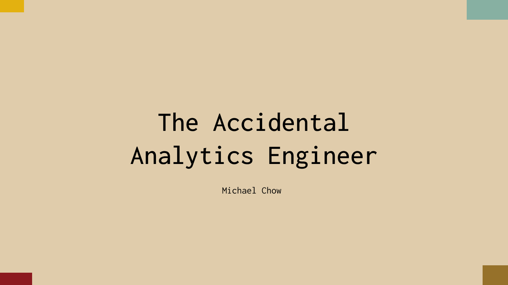

Thanks for having me — I'm so excited to be at Coalesce. It feels a little freaky to be immersed in a culture where analytics engineering is first nature to people. But because analytics engineering has emerged over the last several years, I'd imagine a lot of people in this room just sort of realized one day that they had fallen into it — or crossed into it from data engineering, data science, or software engineering.

I'm really interested in this idea of how people end up picking up skills, and what happens at that crossover when you pick up a new one.

Part of my inspiration for this talk was a series of books about what to do when you realize you need to do something else. One that I really like is **[The UX Team of One](https://rosenfeldmedia.com/books/the-user-experience-team-of-one/)**, which threads the needle between being short enough to read in a frenzy overnight and having enough content to fill in the basic jobs of UX. Another is **Project Management for the Unofficial Project Manager** — you join a team or project and realize that for it to succeed, you might have to step up and be the project manager.

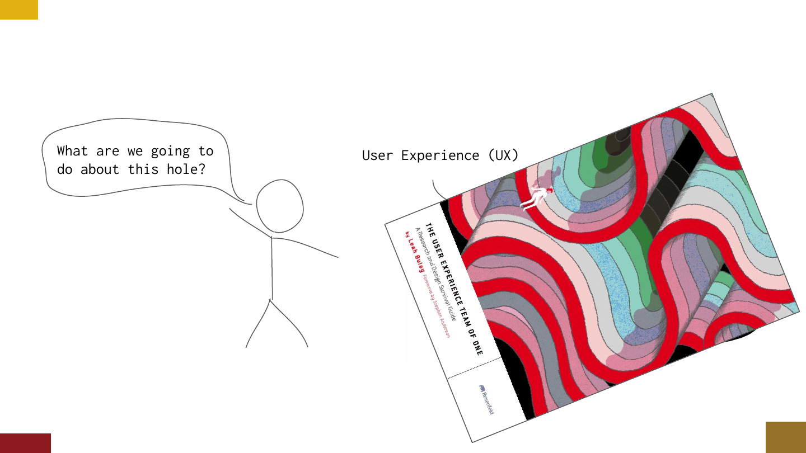

These books follow a really interesting format. They often spend the first third just describing the **gap** you might see — how do you even spot the UX gap in a project? Then the rest of the book covers how to **fill it**: what do you do once you recognize it, and what are the basic things you need to patch it?

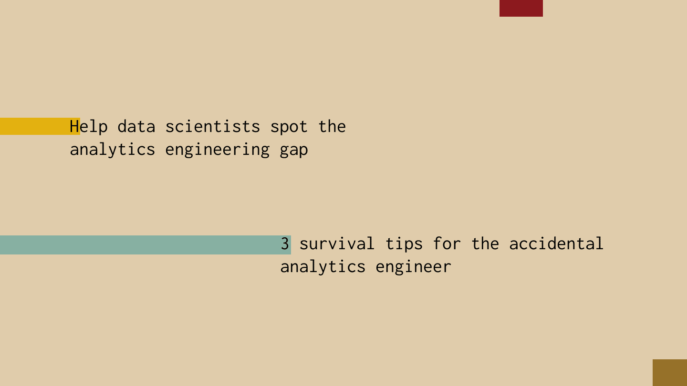

So in this talk I want to discuss helping data scientists spot the analytics engineering gap, and then give three quick survival tips for the accidental analytics engineer — the person who found themselves near the edge of that hole, or who tumbled into it a little bit.

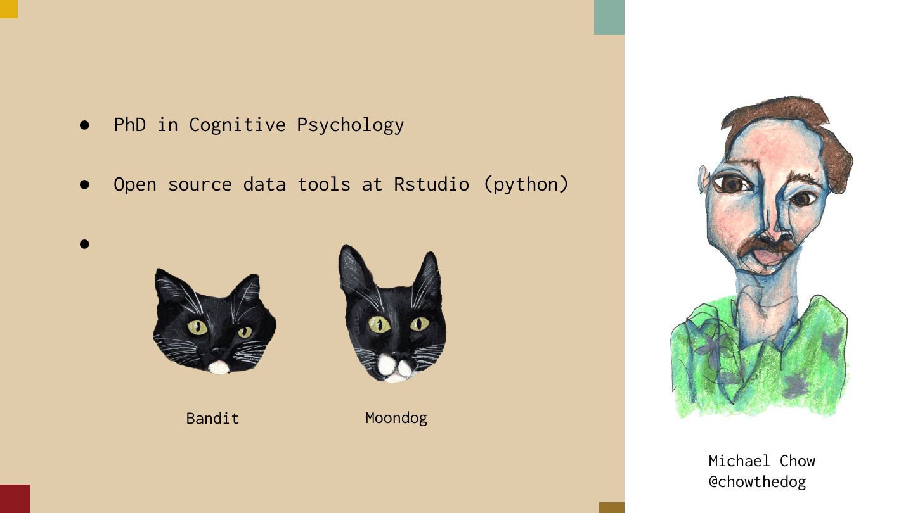

For some background: my name is Michael Chow. I did a PhD in cognitive psychology studying human memory. I work full-time on open source data tools at RStudio, which has about 40 engineers dedicated to open source — the weird thing is I work on all Python tools, so I spend a lot of time bouncing between the Python and R worlds.

As a bonus, I have two beautiful cats, Bandit and Moondog. One of them is especially sassy — I'll let you decide which. As a cognitive psychologist working on tools, I'm really interested in how **skills, strategy, and tools** interact to solve data problems.

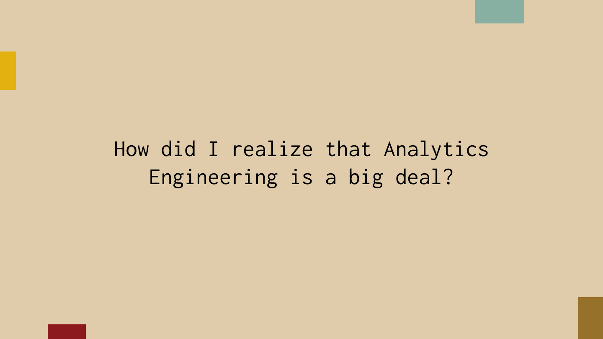

So one big question: how did I realize that analytics engineering is a big deal? The short answer is that I didn't. The longer answer is that I sort of ramped up to diving into this hole.

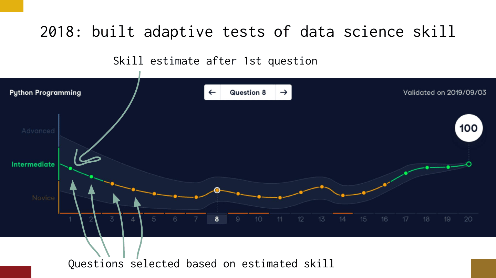

In 2018 I was working as a data scientist at an education company on adaptive tests of data science skill — tests where, after each question, they estimate your skill level and use that to pick a good next question. This work was maybe 30% modeling, 70% user and product analytics.

The weird thing was that it was also *about* data science, so I interacted with a lot of data scientists in R and Python and got to watch them work and tease out problems. The one weird thing I spotted was that our R users were *weirdly fast* at data analysis.

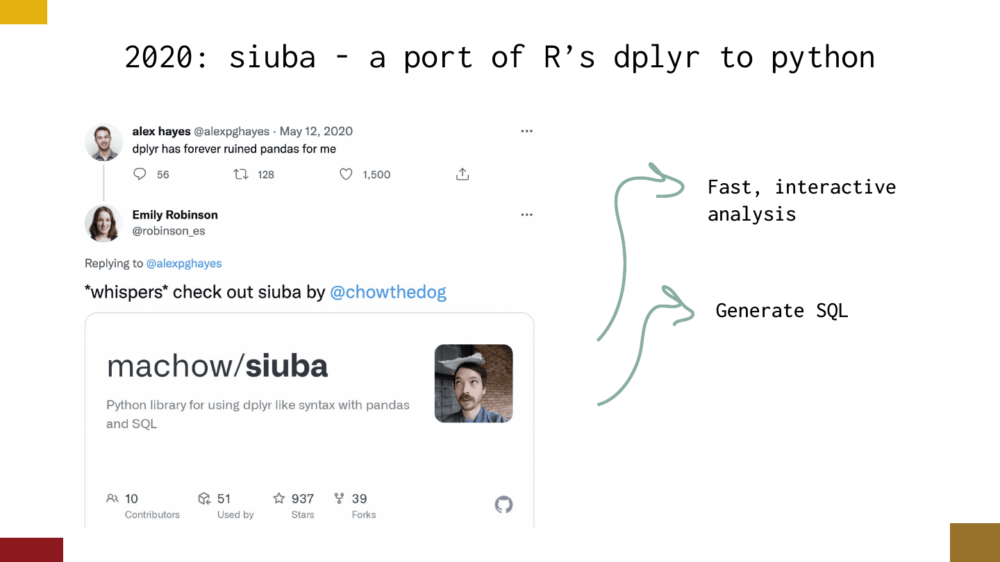

In 2020 I worked on **[siuba](https://github.com/machow/siuba)**, a port of the R library [dplyr](https://dplyr.tidyverse.org) to Python, partially because I noticed this weird sentiment — one person said "dplyr has forever ruined pandas for me." That really caught my attention. I think [pandas](https://pandas.pydata.org) is a great library that does really important jobs, but I was interested in what this tool was doing for that person, and why they loved it so much.

I built siuba with two goals: fast, interactive analysis, and being able to generate SQL — so users can use the same code to query a database. It's super weird.

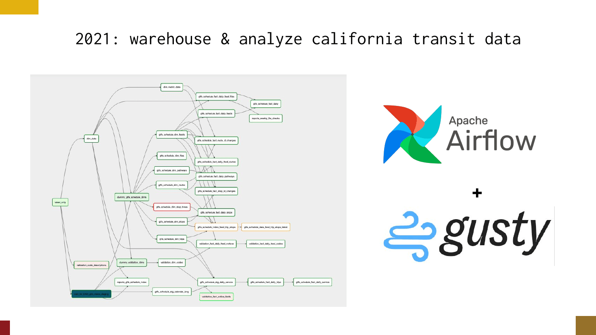

Flash forward to 2021, which is where I hit the hole. I switched to working on warehousing and analyzing transit data in California. I was feeling good — I'd hit analytics, I'd done some modeling — so I made a natural choice: I did a lot of SQL transformations, and the tool I reached for was **[Airflow](https://airflow.apache.org)**, with a little help from a tool called [gusty](https://github.com/pipeline-tools/gusty).

This is a lot of SQL and a big Airflow DAG, and it worked pretty well. It was pretty sane. But as we scaled up the team, I started to notice this workflow was pretty crazy for bringing in an analytics engineer. [dbt](https://www.getdbt.com) has a community of 40 or 50 thousand people — they're not exactly gunning to take over this Airflow DAG. I realized I had basically fallen into the pit of analytics engineering.

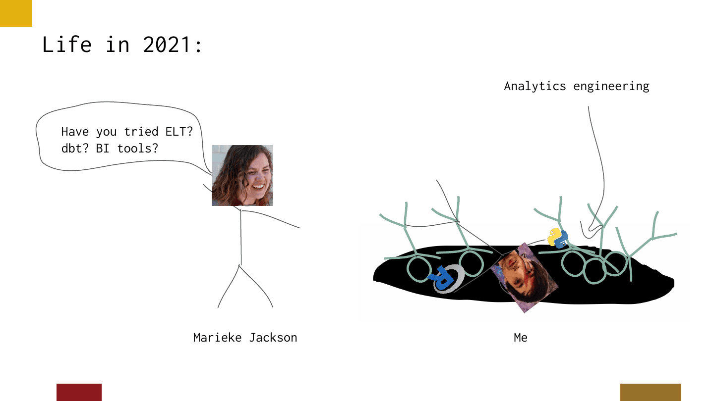

I wasn't totally unaware. I had a good friend, Marieke Jackson, who had warned me about this with little gentle nudges — "have you tried ELT? dbt? BI tools?" — and she really helped me see the bigger picture.

As I looked around the hole, I noticed a lot of other people in it. Not here — looking out at this crowd, I feel like you're all analytics engineers — but as I went to conferences like PyCon and rstudio::conf, I started asking people if they'd heard of dbt or ELT. It sounds absolutely crazy here, because we're immersed in it, but while a lot of people had heard of dbt, there was a real lack of familiarity. So I felt at least among friends in this pit. And honestly, dbt has blown my mind — now I can't stop thinking about why I fell in that pit, and why people fall into it in general.

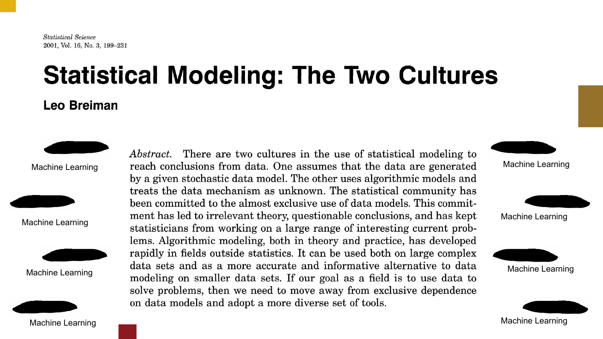

I think the answer goes back to a paper called **[Statistical Modeling: The Two Cultures](https://doi.org/10.1214/ss/1009213726)** by Leo Breiman. It's a great paper about how classical statistics and machine learning are two separate strands of statistics — two cultures. What I love about it is that it's an attempt to identify the hole — the machine learning hole — that you'll miss and fall into if you cling to the classical world.

I realize it sounds crazy here, but having gone to PyCon and rstudio::conf, I can't help feeling like there are two cultures of data science out there too.

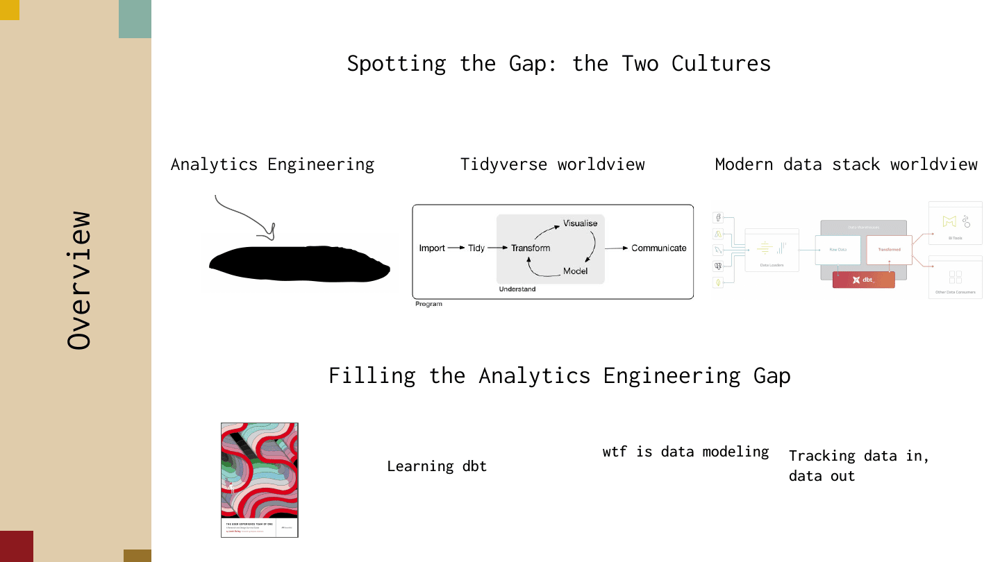

A year from now you can probably delete this talk — there will be one culture, analytics engineering, or maybe it's already eaten the world. But going to conferences produced this impression in me, so I want to dig into these two cultures to really define the gap: I'll talk about the **tidyverse worldview** and the **modern data stack worldview**. Both have really strong virtues and values, but they hit different dimensions of data work.

I'll then loop around to filling the gap, focusing on three areas that would have been really helpful for me: thoughts on learning dbt as a first encounter, what data modeling even is (I found the term very confusing, though that was mostly on me), and a concept that struck me as really important for data science people to know — how people track data in and data out using dbt.

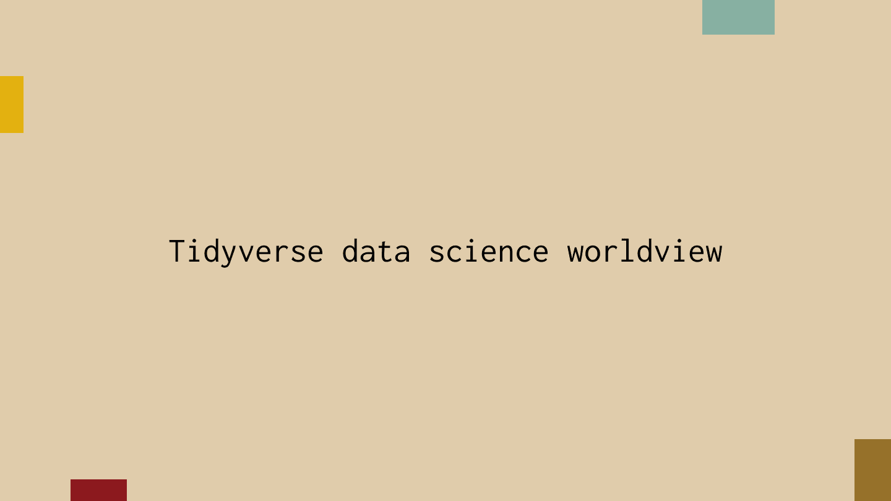

Let's talk about the data science worldview according to the tidyverse.

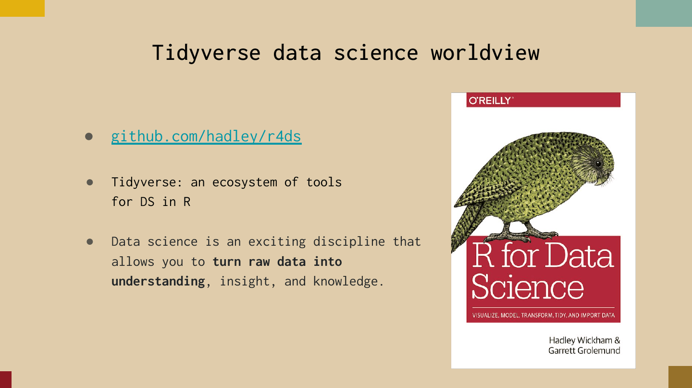

This worldview is laid out in the book **[R for Data Science](https://r4ds.hadley.nz)** by Hadley Wickham and Garrett Grolemund. The tidyverse is an ecosystem of tools for doing data science in R, and the book has a really important definition that zooms in on what they focus on: "data science is an exciting discipline that allows you to turn **raw data into understanding**, insight, and knowledge." The key is this idea of taking raw data and producing some kind of insight people can latch onto.

The book also has a nice workflow diagram. You start by importing the data — something on a bucket, a CSV, data you're querying from a warehouse — then you tidy it into a consistent format for analysis. Then you engage this arc of understanding: you transform the data, visualize it, and model it, going around the cycle until you hit a useful insight. In other words, you produce a hundred bad plots until you find your one good one. (Visualizing is 80 bar charts; the bar chart of modeling is logistic regression.) Then you work on communicating that insight out. It's a really powerful workflow, and the book shows you how to do it end to end.

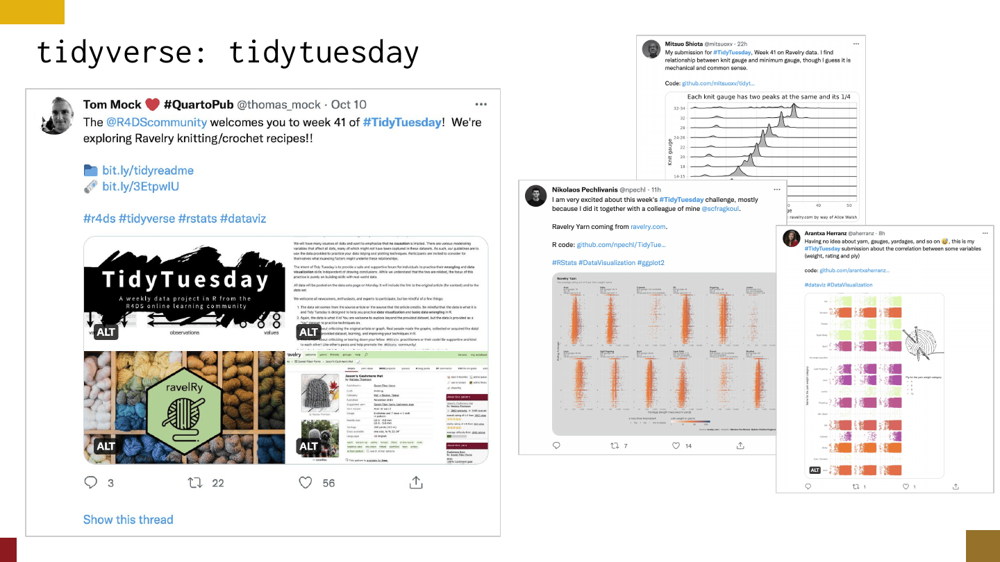

A lot of really cool things surface in the tidyverse around this workflow. One is **[TidyTuesday](https://github.com/rfordatascience/tidytuesday)**: every week a person named Tom Mock uploads a dataset to a GitHub repo and tweets it out, and then a bunch of people analyze the data and share their analyses and results. It's a pretty cool way to see this kind of data science in action and compare your approach with other people's.

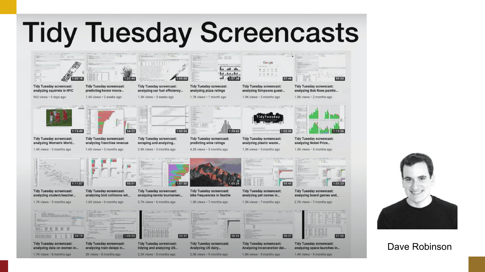

There's a person named [Dave Robinson](https://www.youtube.com/@safe4democracy) who took it to another extreme and live-streamed himself analyzing the data once a week for an hour. You can go on YouTube and see what it looks like to go from never having heard of a dataset to reports and dashboards. It's a deep culture of analyzing and sharing.

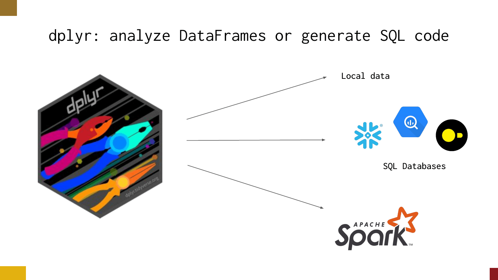

The other secret weapon they have is **dplyr** — a tool to analyze data frames or hit SQL databases. It's the backbone of what a lot of people in the tidyverse use to analyze data.

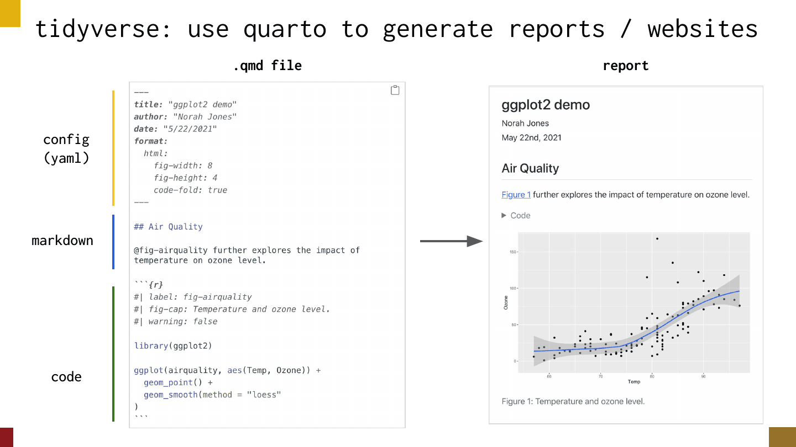

The last piece, for communicating out, is **[quarto](https://quarto.org)**. R users love writing their analyses in text files where you have config up top, then markdown for narrative mixed with code cells for producing outputs — a text notebook — and the result looks like a polished report.

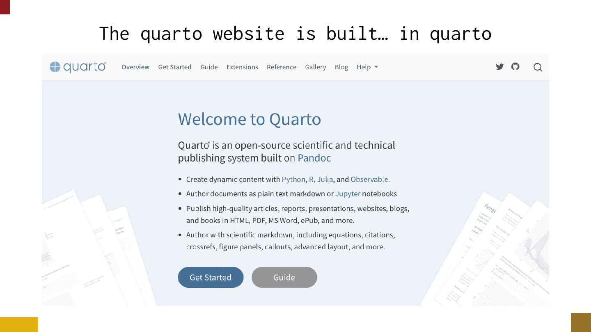

The freaky thing is that quarto can also build websites. The quarto website is built in quarto, and lots of people have their personal websites or blogs in quarto. It's a very end-to-end toolchain.

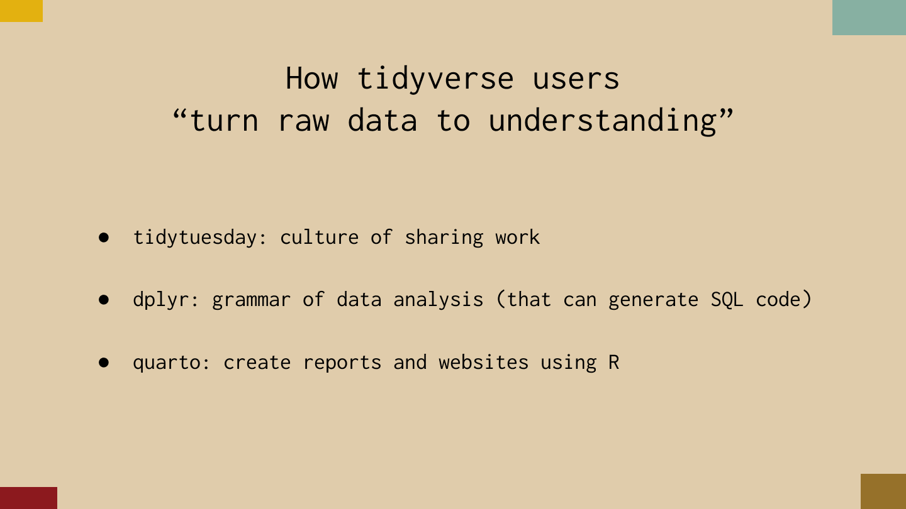

Just to circle back: tidyverse users love to turn raw data into understanding, there's this culture of sharing work (I've got to stop calling things weird), there's dplyr for analyzing the data, and quarto for communicating it out as a report, website, or slides. That's the tidyverse worldview: raw data to insights.

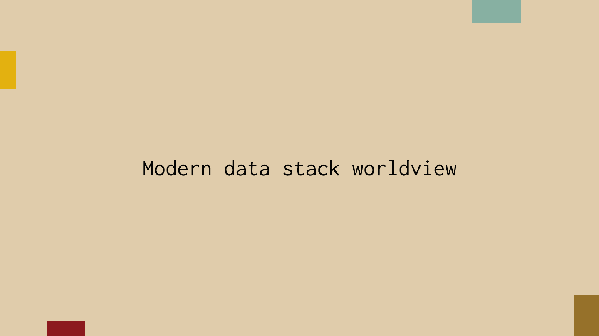

On the other hand, you have the modern data stack. I feel like I'm in a shark tank here, defining the modern data stack as the person in the room who's less familiar with it.

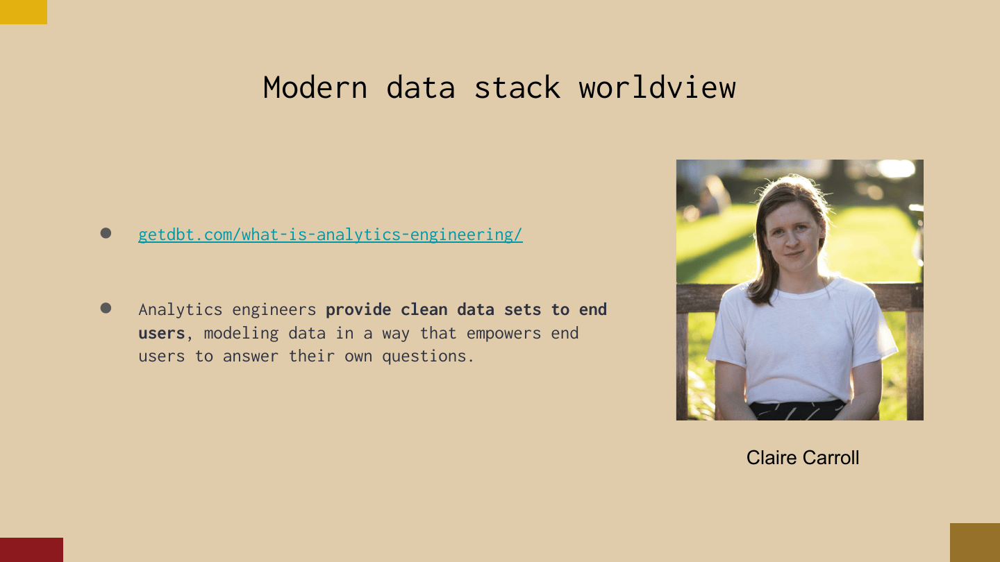

There's a [nice definition in the dbt docs](https://www.getdbt.com/what-is-analytics-engineering), by Claire Carroll: analytics engineers **provide clean data sets to end users**, modeling data in a way that empowers end users to answer their own questions. I think that's huge. If the tidyverse is about raw data to insights, this idea of cleaning data and *giving it to someone* is the crux of where these frameworks start to differ.

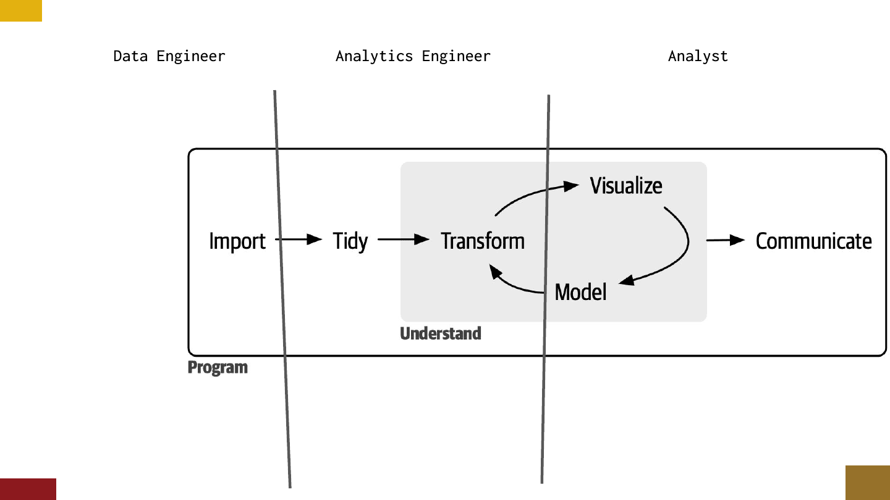

But there's a lot of overlap. If you squint your eyes, you can see the modern data stack in the tidyverse workflow: the data engineer ensures that import — ingest, extract and load — happens cleanly, an analytics engineer focuses on tidying and transforming, and analysts at the end do the visualizing, modeling, and communicating. You sometimes see this tension, too — or opportunity — of analysts wanting to reach back and transform.

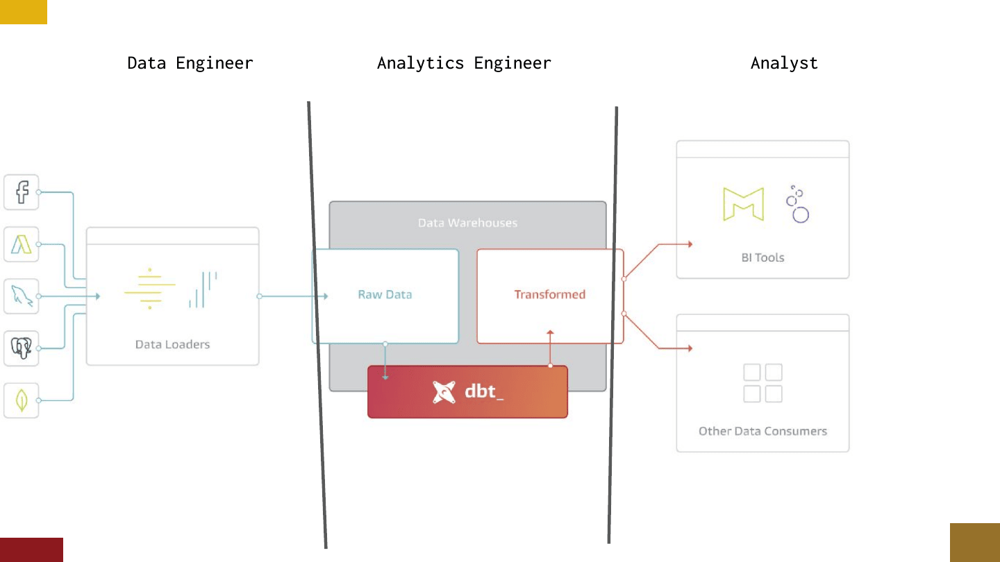

To take it one step further, you can superimpose the modern data stack diagram right on top: data loaders on the left, dbt transforming data in the warehouse in the middle, and at the end BI tools and other data consumers. (I think I'm an "other data consumer," but I'm not sure.)

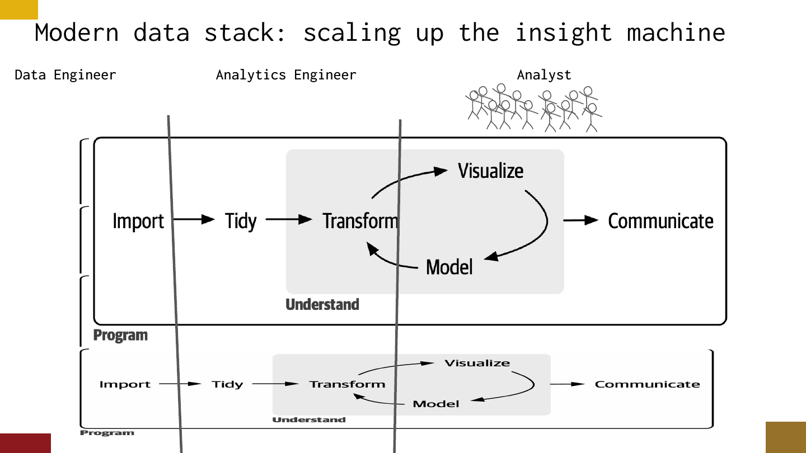

These aren't equivalent, though. The big value of this perspective, and the specialization of these jobs, is that people analyzing data tend to see this workflow as a one-off — I need to take this data and produce this insight. Analytics engineers know it isn't a one-off: there's a whole bunch of this happening in an org, and if you don't have someone maintaining sanity in the tidy-and-transform layer, things are going to spiral out of control real fast. And there might be an army of analysts at the end, in which case it would be really bad if the tools weren't friendly.

One thing that really opened my eyes was seeing the sheer amount of thought that's gone into BI tools, and that analytics engineers put into both transforming the data and making sure it plays well with those tools. So to lay out the two cultures: tidyverse people are interested in pulling raw data and producing understanding — they carry their homes on their backs, with a single toolchain they can run on a laptop and a website up on GitHub super fast. Modern data stack people are *so good* at scaling up this function, and they know how to split responsibilities. At the expense of sounding obvious, the tell is whether you're focused on serving data to end users.

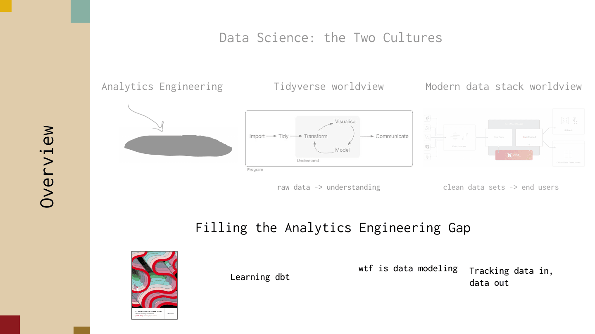

That's the gap, and what I realized is that problems turn into needing to serve data *so fast* — if you don't have an analytics engineer in your organization, you're probably in big trouble. For filling the gap, there are a few things that would have made it easier for me to get started — things I found really helpful to run past people at conferences who hadn't heard of dbt.

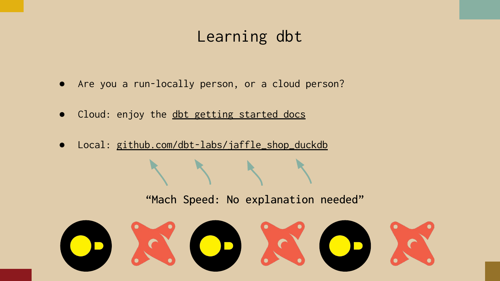

First, for learning dbt: to me a big difference between these two groups is whether you're a **run-locally person or a cloud person**. If you're a cloud person, you're set — the dbt docs have you. You can set up a BigQuery account and fly through them.

If you're a run-local person, the **[jaffle_shop_duckdb](https://github.com/dbt-labs/jaffle_shop_duckdb)** repo is super helpful. Mach speed: no explanation needed. It's all about using duckdb to run the dbt demos locally. For the people at PyCon and rstudio::conf, this is mana from heaven for hitting the docs.

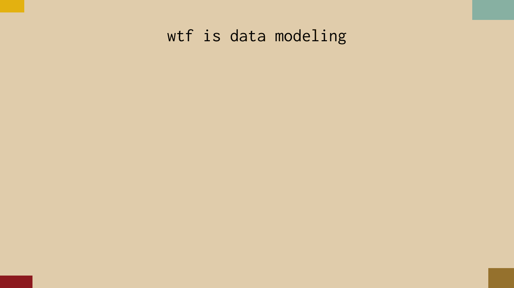

For the second part — what is data modeling? As a cognitive psychologist who has done psychological models, and a person who does statistical models, I was so confused about what exactly *data* modeling is. But you hear it all the time. (Now that dbt has Python models it's a little more confusing, because now you just don't know.)

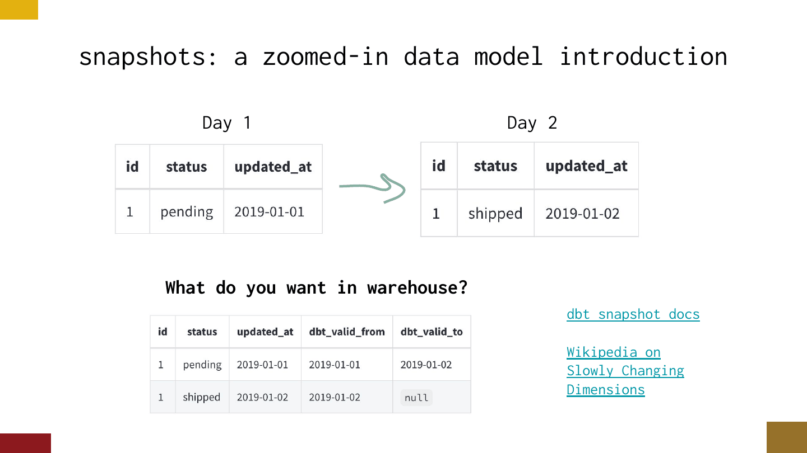

A really nice introduction to data modeling, for me, was **[snapshots](https://docs.getdbt.com/docs/build/snapshots)**. I know data modeling covers a broad set of things, but snapshots are a nice, slightly scary introduction that tells people they need to take it seriously — and it highlights the freaky amount of thought analytics engineers have put into these problems.

The gist: on day one, a record in an app database has status "pending." On day two it gets updated to "shipped." In analytics land, wouldn't it be so nice if our warehouse just had *both* records? The concept is really simple, the docs break it down nicely, and it's a good introduction to the language around **slowly changing dimensions** — which, I was surprised to find, not a lot of people at other conferences had heard of. It's probably close to the hip of everyone here, but it's a great thing to introduce to classical data scientists or ML people.

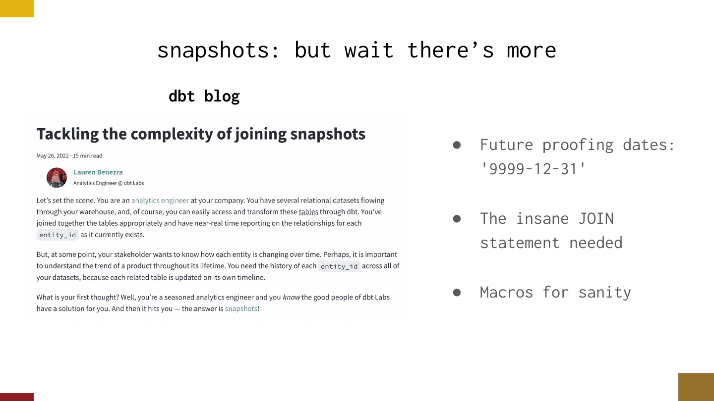

I love snapshots because it's "but wait, there's more" — it gets crazier. Have you tried to *join* a snapshot, though? dbt has a great blog post on this. There's all this weird stuff: should we future-proof the dates somehow — would there be value in adding a date from the year 9999? Look at this crazy join statement you're going to have to use. And then, finally, a macro that just restores sanity.

For a person who wasn't too familiar with analytics engineering, this is nice because you can grasp it, but it also goes freaky deep and has weird problems in it.

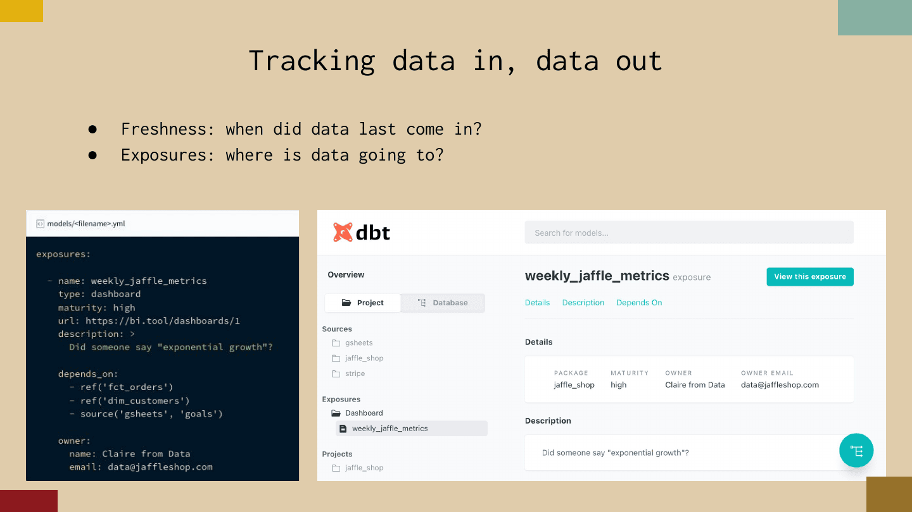

The last thing I'll hit on quickly is a couple of simple concepts that end up being really powerful, both about how data comes into and goes out of a DAG. The first is **freshness**: when did data last come in? The second is **exposures**: where is data going to go?

If you're like me, you've been in a lot of orgs where people didn't know the answers to these questions. And at conferences where these concepts are foreign, I don't think that's a bad thing — people focused on analytic work are sometimes more focused on communicating out than on the big-time data tracking that analytics engineers do. I probably don't need to sell you on it, but it's so simple to do and so convenient to have when you have dozens of analysts emailing their notebooks around and you want to know what will break if you change things.

So, to recap: we talked about spotting the gap — this idea of two cultures of data science — and then filling in the analytics engineering gap with some small things that helped me get started.

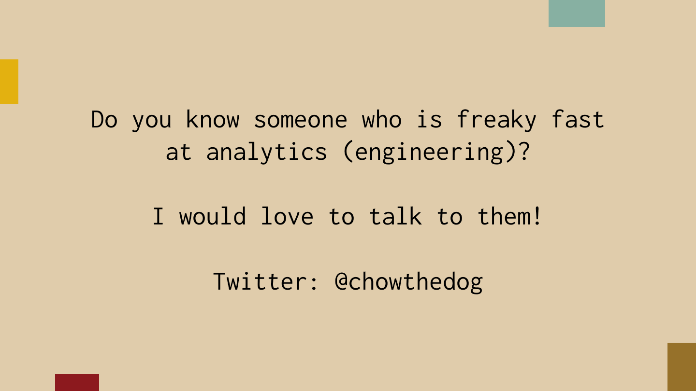

The last thing I want to say: if you know someone who's **freaky fast** at analytics or analytics engineering, I would love to get in touch with them. As a person really interested in how R and Python users analyze data they've never seen before, I'd love to see — TidyTuesday style — how fast analysts can go, and how different BI strategies let people move quickly. Feel free to reach out on Twitter at [@chowthedog](https://twitter.com/chowthedog); I can send my calendar. I think there's a lot to surface there about what analysts do and which strategies really work for them.

Thanks for listening — and thanks to a bunch of people who contributed to this talk, especially the MLOps team at RStudio, Krista Adams who did a ton of design for it, and Chris Cardillo of Astronomer, who provided a ton of feedback.
