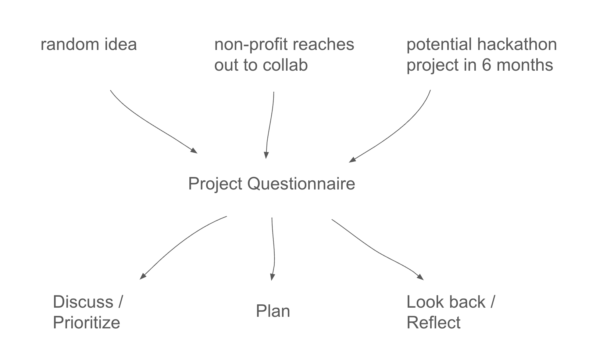

Over the past 5 years—while helping create projects at Code for Philly and sitting on organizing committees for events—I’ve often reached for the [Code for Philly Project Questionnaire](https://docs.google.com/document/d/14_ca80-Ph9_WNyD99uXd2JuVZkCxEPqxEbtKjqo_mig/edit?usp=sharing).

In this post, I want to discuss what makes the questionnaire so useful, and the different situations I’ve ended up using it in.

Here are some quick numbers on project questionnaires filled out over the years:

- **[Code for Philly](https://codeforphilly.org/) projects**: 25 questionnaires for projects related to bail funds, covid dashboards, etc... (See [this article](https://technical.ly/civic-news/code-for-philly-2020-shifts/) discussing the projects we focused on in 2020).
- **[Philly Legal Hackathon (2022)](https://www.inquirer.com/news/philadelphia-social-justice-hackathon-coding-law-school-drexel-temple-villanova-penn-20221028.html)**: 8 questionnaires for the event. Several were created by partners from non-profits, who then attended the event. These projects were pitched to participants on the first day of the event.

### The Project Questionnaire

The [questionnaire](https://docs.google.com/document/d/14_ca80-Ph9_WNyD99uXd2JuVZkCxEPqxEbtKjqo_mig/edit?usp=sharing) starts with these prompts:

> 
> 
> - Idea Name
> - Describe the idea. What is the overall **mission and objective** of the project?
> - What’s your **organization’s mission**? Why do you care about this idea?
> - Can you rank the **top three goals** of the project?
>     1. ...
>     2. ...
>     3. ...
> - Who are the top **target beneficiaries** (users, stakeholders, etc) of the project? **What do you hope they gain** from the value your project delivers?

These questions may seem obvious to people experienced in managing projects. But I find that without the questionnaire big pieces get left out. Without it, people often omit information about stakeholders, exactly who benefits from success, and how they benefit.

The questionnaire was created for Code for Philly by then co-director [Rich McMillen](https://www.linkedin.com/in/richmcmillen). Code for Philly uses it to jumpstart collaborations between technical folks and non-profits. Projects are the lifeblood of Code for Philly, and the questionnaire helped us streamline project ideation and creation.

### Project questionnaires create an idea-to-action hourglass

A project questionnaire is useful because it creates an hourglass shaped workflow. That is, it takes a lot of different kinds of inputs (from random ideas to meetings with non-profit partners), and maps them onto a common format (the questionnaire), which then gets used across a range of activities.

Note that there are two important features of the hourglass workflow:

- **Establishes pre-work**. If I have an idea, the project questionnaire tells me the info I need in order to make my case. (E.g. if I don’t know who the stakeholders might be, I need to find out).
- **Scales to lots of new ideas**. It’s easier to discuss and plan for a lot of new ideas when they’re in the same format (E.g. easy to compile a list of stakeholders across projects).

Importantly, it’s just a google doc, which most people are familiar with. This makes it easy to send, copy, and share.

### Ways to use it

- **Energy conservation**. When someone mentions a half-formed idea to you, ask them to fill out the questionnaire. They have a chance to make their case, and you can stop thinking about it until then.
- **Showing interest**. When you have a meeting with a project you want to support, fill out the questionnaire and send it to them after. They’ll see you were really listening, and can correct things you got wrong.
- **Scaling a team**. When you have a bunch of people scouting ideas, use the questionnaire to conform everything into a common format (e.g. before prioritizing, planning, etc..).

### Last thoughts

If you’re not currently using a project questionnaire in your organizing, give [Code for Philly’s Project Questionnaire](https://docs.google.com/document/d/14_ca80-Ph9_WNyD99uXd2JuVZkCxEPqxEbtKjqo_mig/edit?usp=sharing) a try. I haven’t thought much about refining this questionnaire, because I find the hardest part of organizing is not the questionnaire itself—but all the other activities that go on around it!
