This is an annotated version of a talk I gave with [Rich Iannone](https://github.com/rich-iannone) at PyCon US 2024 in Pittsburgh, about making beautiful, publication quality tables in Python with [Great Tables](https://posit-dev.github.io/great-tables/). You can grab the [original slides](https://github.com/rich-iannone/presentations/blob/main/2024-05-17-Pycon-talk-GT/GT_talk_Pycon.pdf) from Rich's presentations repo. There are two recordings of the talk: a cleaner [re-recording on the Posit YouTube channel](https://youtu.be/M5zwlb8OzS0) (embedded below) and the [live PyCon recording](https://youtu.be/08yLWPpFdo4).

The takeaway: a display table is a **data visualization**—it deserves the same design care as a chart, and it belongs in your reproducible code workflow rather than pasted together in Excel. The talk makes that case in three parts: first, what beautiful tables from the wild do well (highlighting, in-table bars, heat maps); then the **key ingredients** for building one—**structure**, **format**, and **style**—walked through step by step with Great Tables; and finally, advanced design considerations—nanoplots (tiny plots inside table cells), coloring, and formatting.



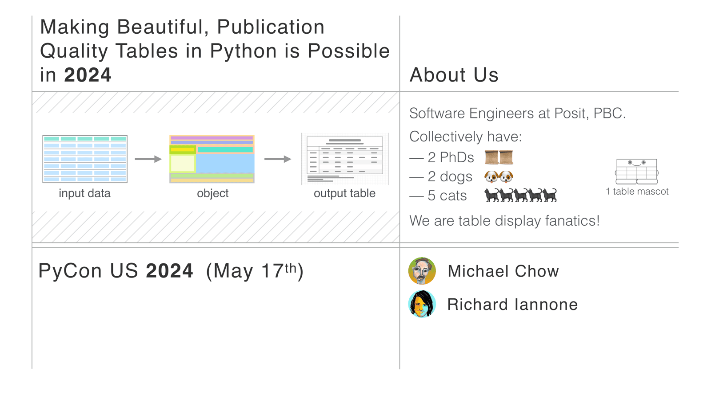

Hey everybody. I'm Michael Chow, and this is Rich Iannone. We wanted to talk about how making beautiful, publication quality tables in Python is possible in 2024—and we're really hoping that by the end you don't just think they're possible, but a total delight.

For a little background: we're software engineers at Posit, PBC, and between the two of us we have two PhDs, two dogs, and five cats. We are fanatics of table display. (We each have two and a half cats. That's the joke.)

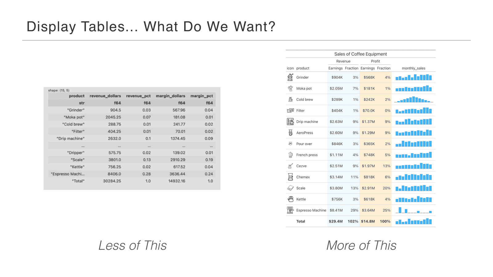

What do we mean by display tables? Less the table on the left—a raw [Polars](https://github.com/pola-rs/polars) DataFrame. If you're a data frame plumber, a data scientist working on the data, that view makes sense: the column names have underscores, you can see the column types, you can see the nitty-gritty raw values. That table kind of has its guts hanging out for analysis.

We mean more the table on the right—a table you might send to someone to convey something about the data. This is a coffee equipment sales table, and we'll be walking through it throughout the talk.

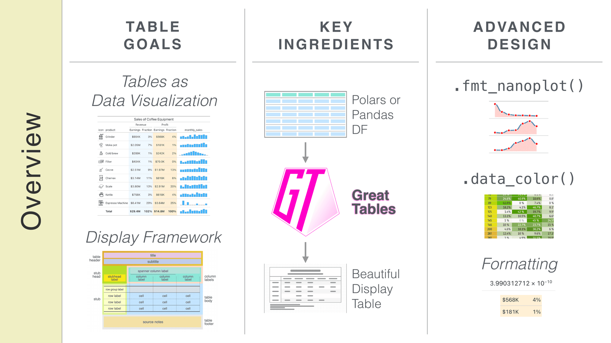

Here's where we're going: first, **tables as data visualization**; then the **key ingredients** for creating a beautiful display table; and last, some more **advanced considerations** when designing tables for display.

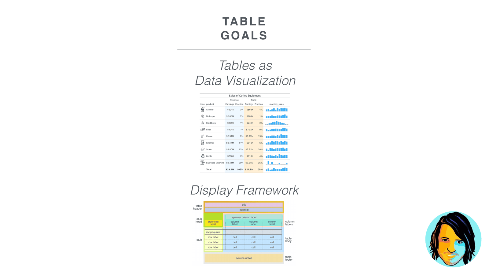

Rich kicked things off with the first part of the talk: our table goals.

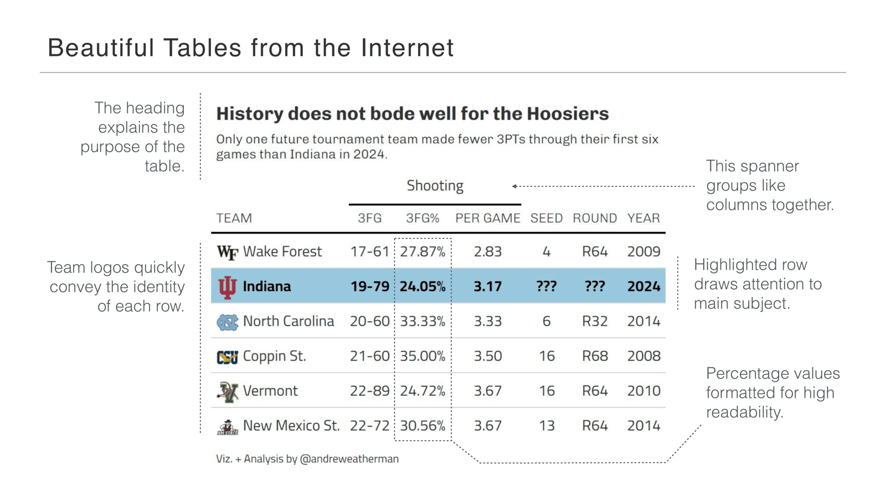

Let's start with a few beautiful tables from the internet. This one is visually stunning, and it has all the parts I like in a table. Look at the header—it's just a title and subtitle, but it explains the purpose of the table before you see anything else. There's a **spanner**: a label above a group of columns that gives the table structure. The team logos quickly convey the identity of each row. The percentage values are nicely formatted for readability.

And the really cool thing: the second row is highlighted, drawing attention to the main subject of the table. That's a key part of a data visualization—it gives you focus and drives you to the insight fast.

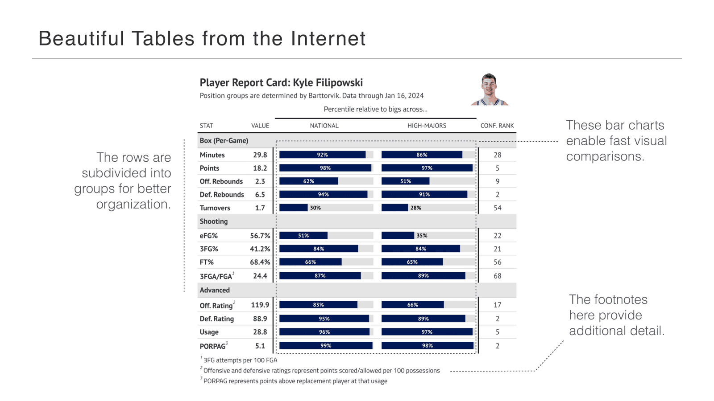

Here's another table from the same author. What grabbed me is that there are bar charts inside the table, front and center, and they enable really fast comparisons between values. The percentages alone wouldn't be so readable—but here we have both: bars plus the precise values.

There are lots of rows, but the author subdivided them into little groups for better organization. If you want to focus on the box scores, or the shooting stats, or the advanced stats, you can take them one bit at a time without the entire table overwhelming you. And there's a footer with footnotes providing additional detail—it didn't have to go in the surrounding text, it could go right in the table.

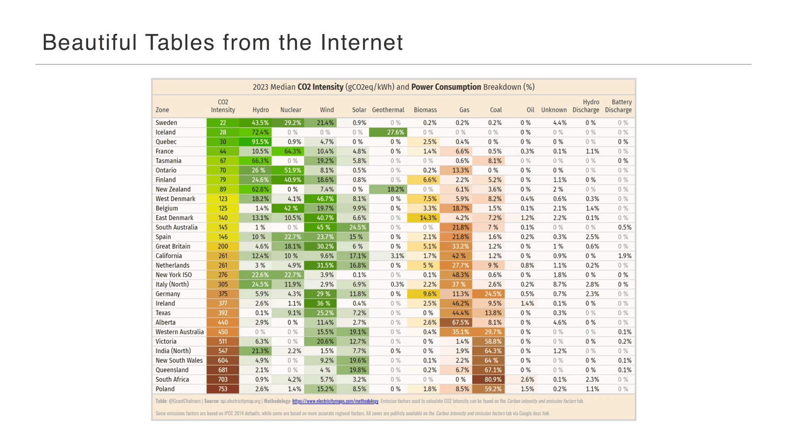

A third beautiful table from the internet. This is a big one—a lot of numbers—but there's essentially a heat map in the table. The color tells you what the values are without you having to parse each and every one; you get an idea just from the colors presented.

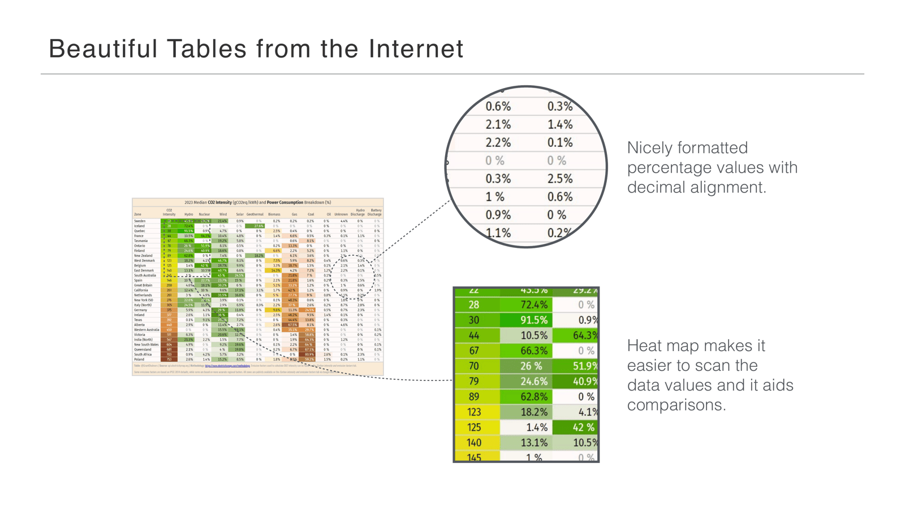

Besides the heat map, there are more good things here: nicely formatted percentage values, and if you look closely, the percentages have decimal alignment, which makes for easy reading. And the heat map, like I said, helps you scan the values and aids comparisons without reading every single number.

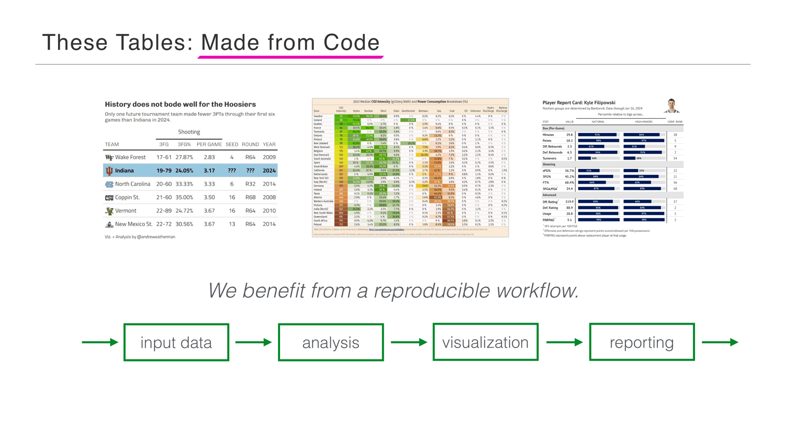

The really cool thing about these tables: they're not made in Illustrator or some graphics program. They're made from code. The benefit is a **reproducible workflow**—you go from input data to analysis to visualization and straight on to reporting. You don't have to dump your data out into another tool; you have one continuous, reproducible workflow.

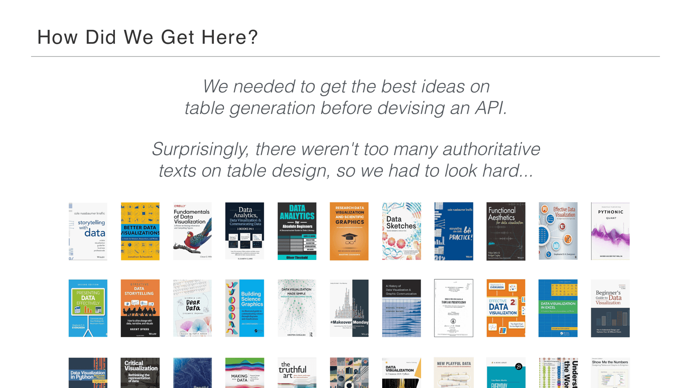

So how did we get to the point of making tables from code? We had to design an API—but before that, we needed to gather the best ideas on table generation. Surprisingly (and this was a little upsetting), there weren't many authoritative texts on table design at all. These books are great for everything else, but we had to look really, really hard.

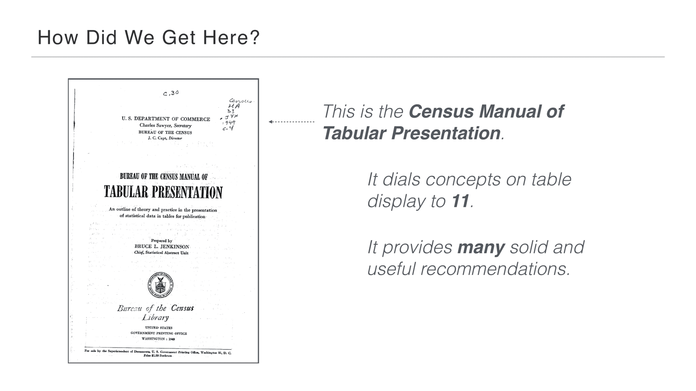

Luckily we found one book that was great. It's a pretty old one: the **[Census Manual of Tabular Presentation](https://www2.census.gov/library/publications/1949/general/tabular-presentation.pdf)**. It dials the concepts on table display to 11, and it provides many solid and useful recommendations—nearly 300 pages of just table stuff.

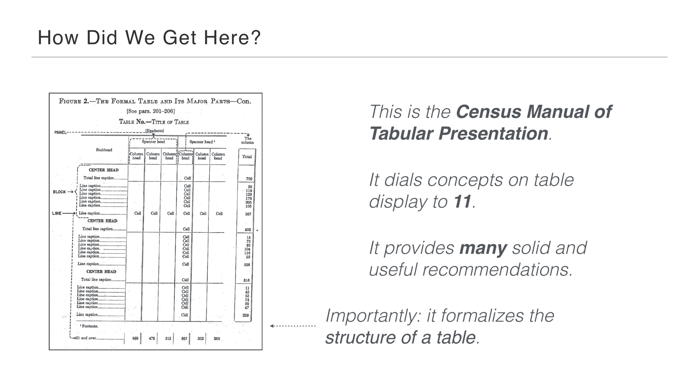

Most importantly, it formalizes the structure of a table right away. You don't have to go far—it's Figure 2 of the whole book. It gets right down to showing you what the different parts of a table are called, how they're structured, and what they do.

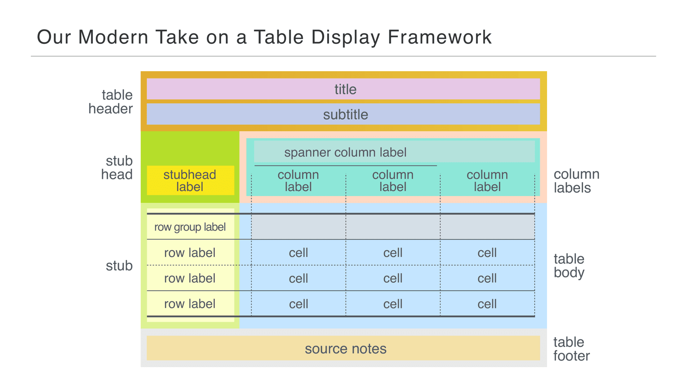

These were really great ideas, so we adapted them into a more modern take on a table. We have the table header, the stub, the table footer, and all the other parts—and we gave them names, which was super important.

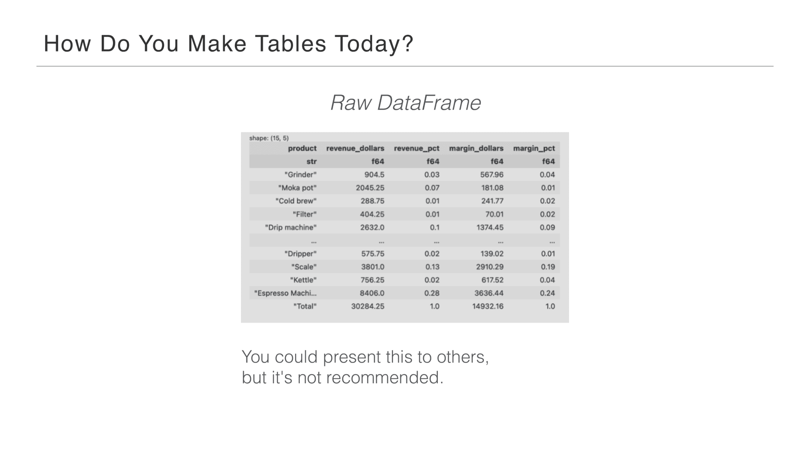

So how do you make tables today? You could take a raw data frame and present it to other people as-is: here you go, this is my result. Not really recommended—it doesn't look great, it doesn't even show all the data. It's a bit raw.

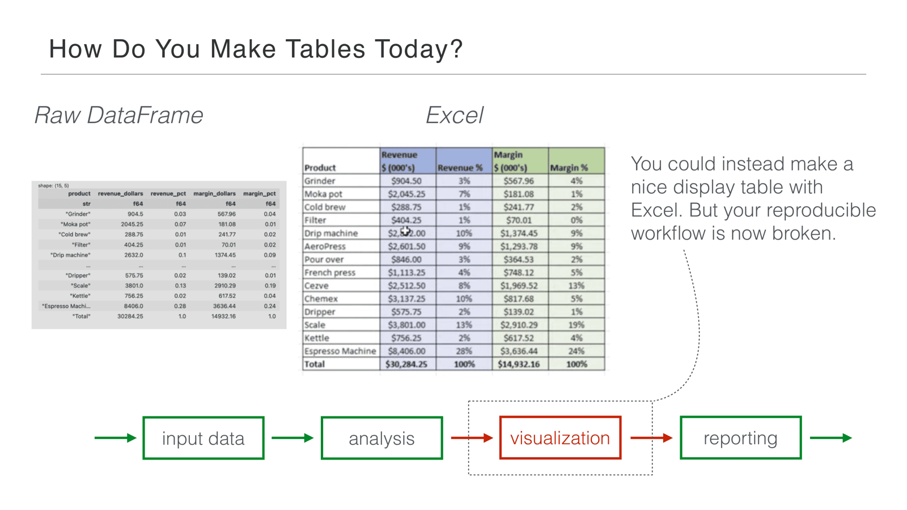

Another approach—what a lot of people do, and I'm guilty of this—is to bring your data to Excel and make the table there. The problem is that now your workflow isn't reproducible; it's broken. You got the table done, but at the expense of the reproducible workflow.

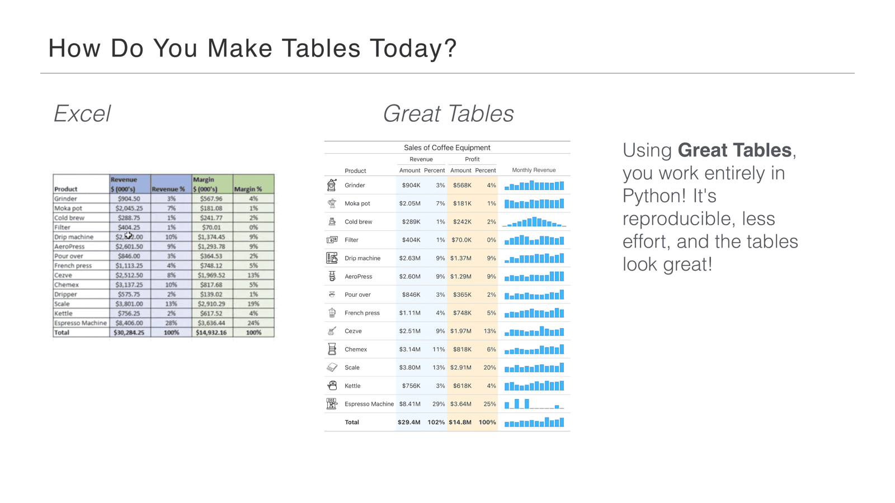

Our idea: use an API like **Great Tables** and work entirely in Python. It's reproducible, probably less effort overall, and the tables look really good. You're not losing anything by keeping it in Python—you're gaining a lot.

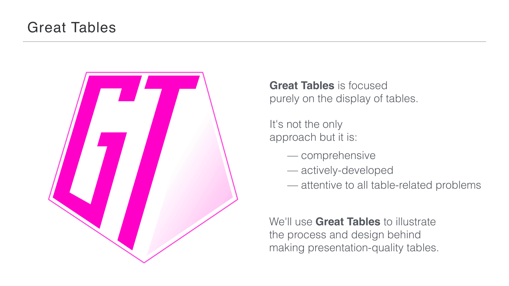

Great Tables is our package, and it's focused purely on the display of tables—that's its only concern. It's definitely not the only approach in Python, but we promise it's comprehensive, actively developed, and tries to go deep on all table-related problems. Throughout the rest of the talk we used Great Tables to illustrate the process and design behind making presentation quality tables.

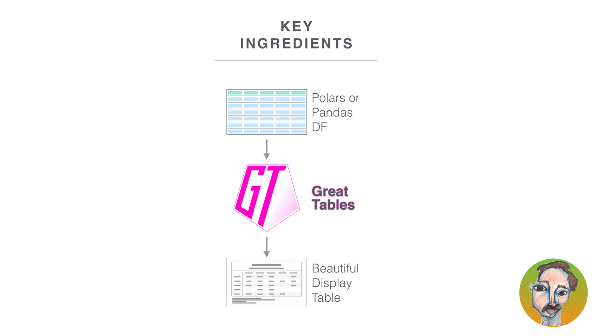

From here, I took over to walk through the key ingredients of making a great table.

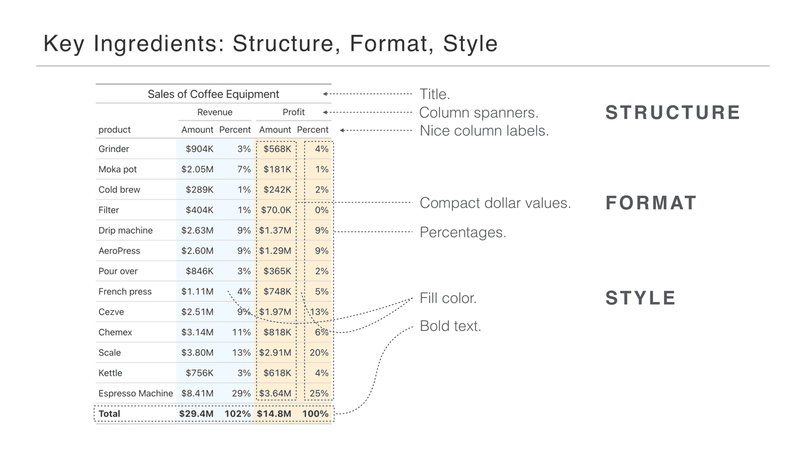

I'll walk through how to go from a plain data frame to a beautiful display table. The three key ingredients are **structure**, **format**, and **style**.

**Structure** is adding parts to the table that sit outside the data itself: here we've added a title, and column spanners that go over the column labels and give grouping information. We've also cleaned up the column labels—no underscores, title case, easier to read. **Format** is changing the actual data values: notice the compact dollar values, using K for thousands and M for millions (common in some domains, like government tables), and the percentages cleaned up to whole numbers with a percent sign. **Style** covers things like filling the background of the revenue columns blue and the profit columns papaya whip, and bolding the bottom row to emphasize that it's a total.

I do want to emphasize that one of the percentage columns sums to 102%, which is not a Great Tables problem—it's a Michael Chow problem. I screwed up the data before the talk. Hopefully it's not too distracting; I just want to own that before you drag me through the internet for my terrible addition skills.

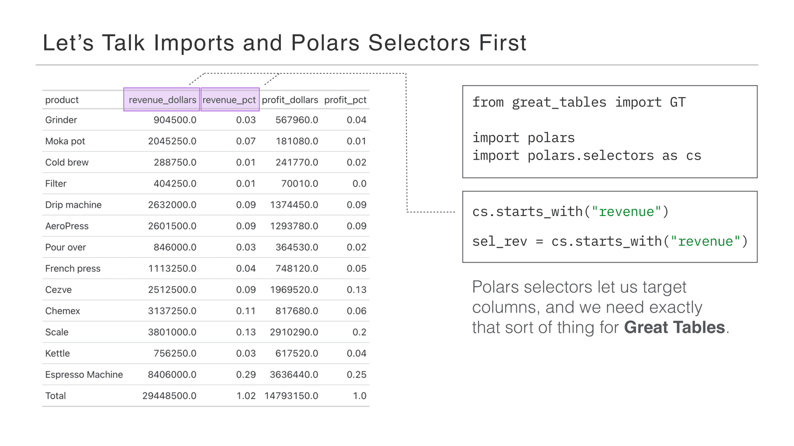

We'll go through the ingredients step by step in code, but first some imports and a little Polars explanation. From Great Tables we import the `GT` object—that's what we use throughout to build tables. We'll use Polars DataFrames, and one thing worth flagging up front: **Polars selectors** (`import polars.selectors as cs`). Selectors let us pick groups of columns really easily—we can say things like `cs.starts_with("revenue")` to choose all the columns that begin with revenue. It's a really convenient tool we'll use throughout the examples.

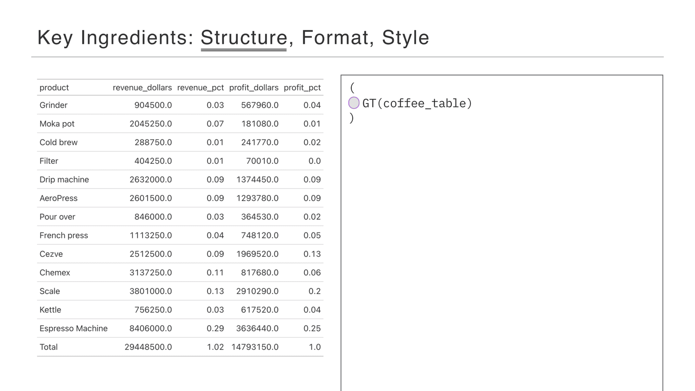

Starting with structure: this is the plain table output from `GT(coffee_table)`, and we're going to add some parts to it.

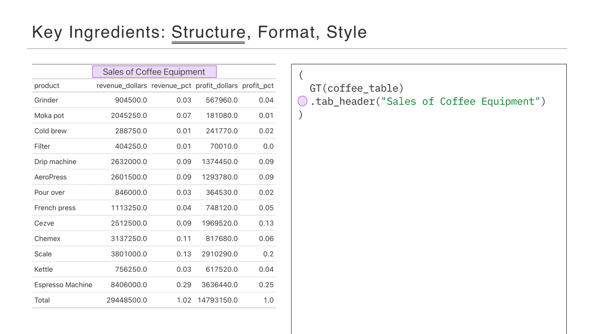

The first part is `tab_header`, which adds a simple title. It's a really small piece, but probably the most important part of the table: in the information hierarchy, the title says what people are even looking at. If someone has three seconds to figure out what's going on, it's the most important piece of information.

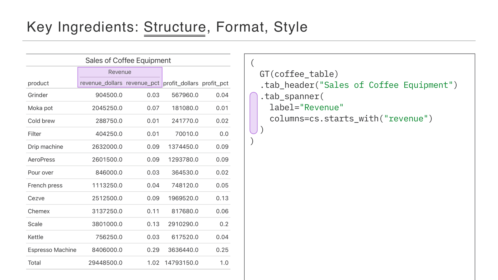

Next is `tab_spanner`—a label over a group of columns. Here we put a "Revenue" spanner over the revenue columns so people can see they're grouped.

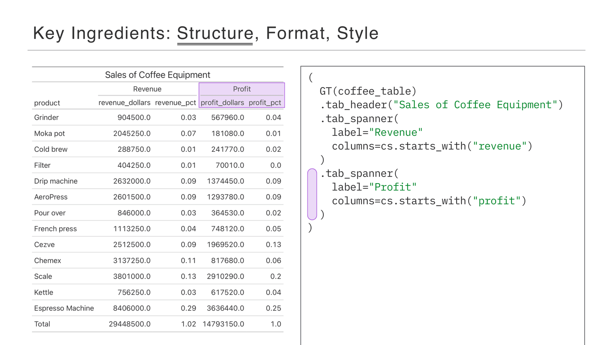

And we do the same for the profit columns, giving them a similar spanner.

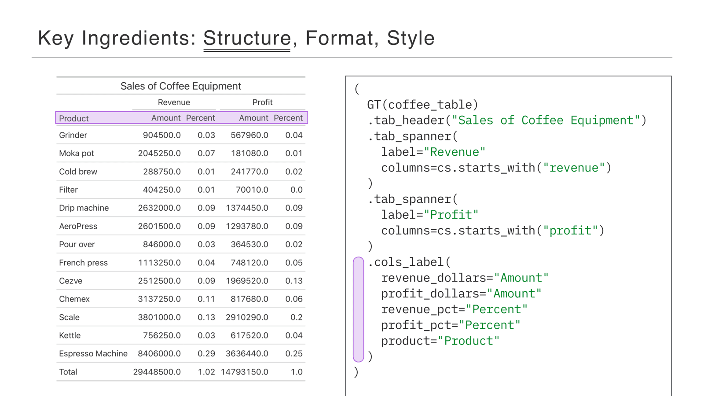

To finish off the structure, we rename the columns. Before, the column names repeated words like "revenue" that we now have in the spanners, so we clean them up. People see "Revenue" in the spanner and "Amount" in the column label—now things are quick to read.

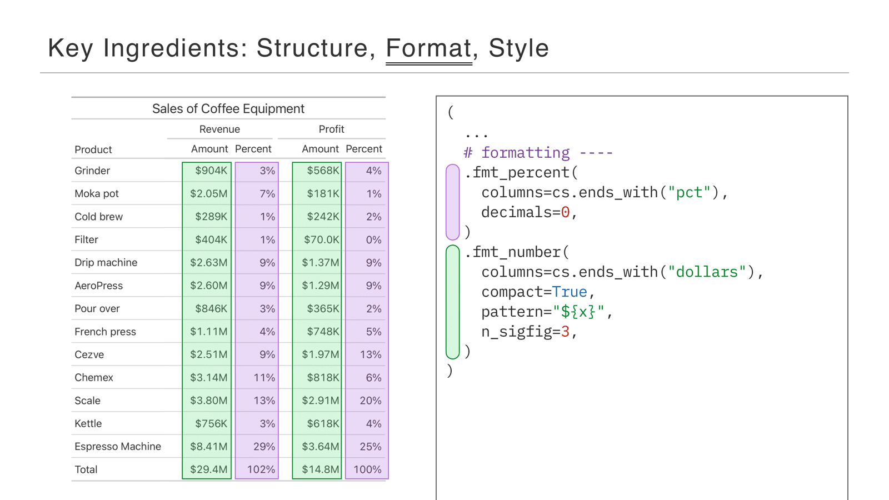

The next ingredient is format, using the methods that start with `fmt`. First, `fmt_percent`: we use a Polars selector to get all the columns ending in `pct`, and we cut out their decimals—the columns flagged in purple are now formatted as whole-number percentages. Second, `fmt_number`: this is what makes the numbers compact, so instead of being written out with all their zeros, they're shortened with K for thousands and M for millions.

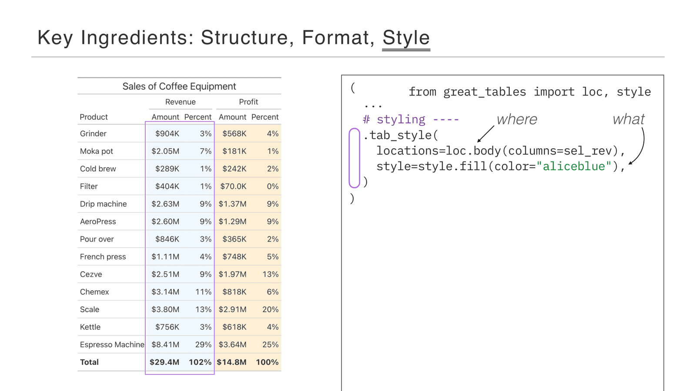

The last ingredient is styling, using the `tab_style` method. The key is that `tab_style` takes two arguments: **location**—where in the table you want to apply the style—and **style**—the actual styling you want to do. It's the *where* versus the *what*.

In this example we style the body: `loc.body` means the actual data in the table, and we select the revenue columns. `style.fill` fills the background—in this case Alice Blue—to make the revenue columns group together visually.

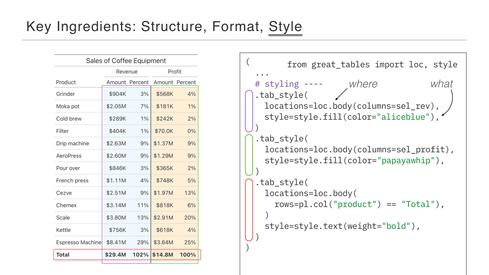

In green, we apply it again to profit, giving those columns a papaya whip background. The last piece is a little different: instead of targeting columns, we target a row. The `rows=` argument uses a Polars expression—a little piece of data analysis—to filter out the bottom row of the table for styling, and `style.text` makes it bold. The key here is that there's a whole range of styles you can apply to a variety of places.

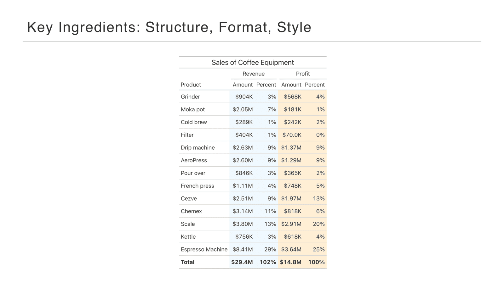

And that's the basics of structure, formatting, and style: a plain unstyled data frame, through Great Tables, to a table that's ready for display.

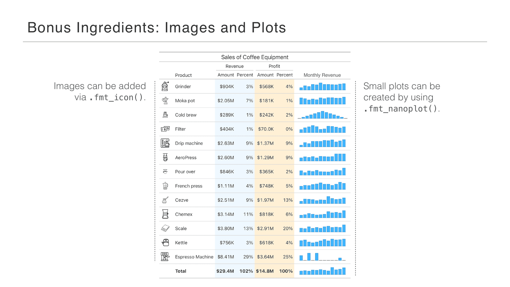

One other exciting piece: we can add images and plots. On the left we've added images with `fmt_icon`—really nice because people can pick out a specific product, like filters, really fast visually. On the right are **nanoplots**—those tiny bar charts—which display little trends in the table. They're powerful because they combine the quick insight and trend-spotting of a traditional plot with the compactness of a table.

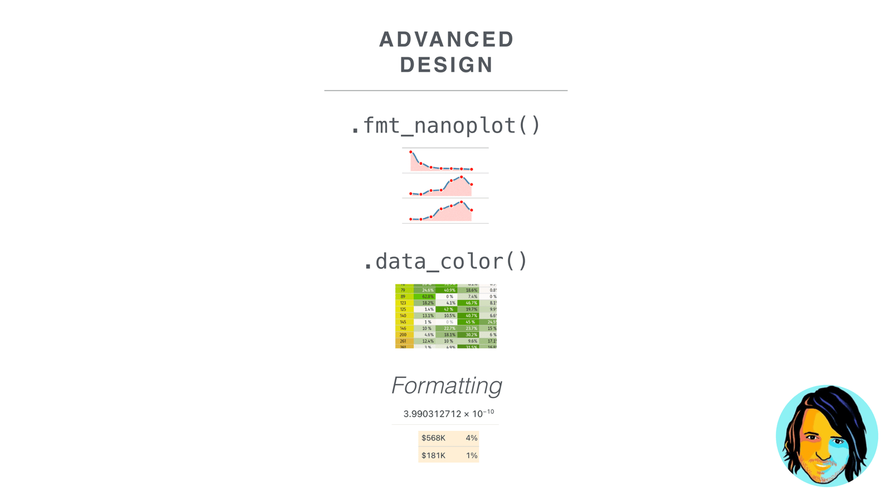

Next, Rich covered the advanced designs: nanoplots, coloring, and formatting.

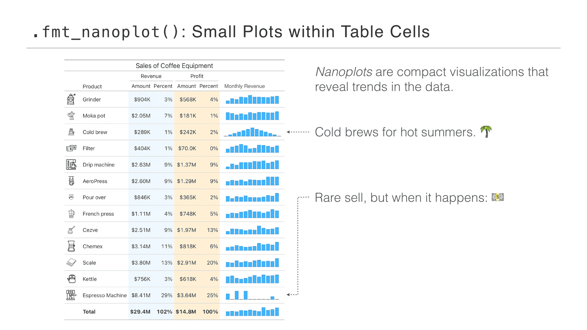

I want to talk about one method we have in the package that's really quite nice: `fmt_nanoplot`. I like to call nanoplots small plots within table cells—really compact visualizations that reveal trends in the data. They're quite fun to use, too.

For instance, you might notice right away that the cold brew row is a little strange—you can just see the pattern: it increases in summer to a maximum, and other parts of the year aren't so great. And espresso machines seem to have intermittent sales: some months are fantastic, other months have zero. You get that right away with this bar plot version of nanoplots—better than just numbers by themselves, for sure.

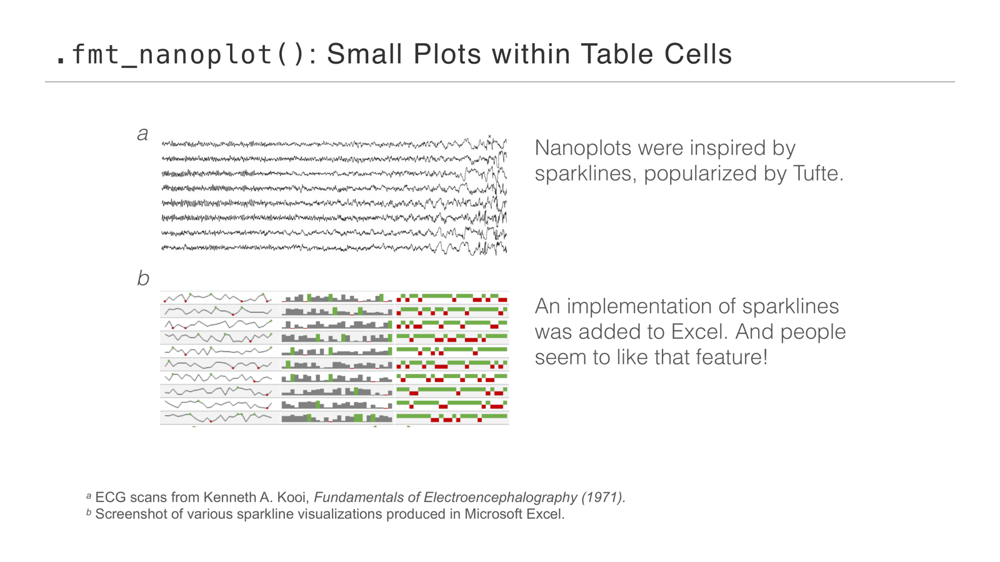

Why did we make this method? Nanoplots were inspired by **sparklines**, popularized by Tufte. If you didn't hear of them that way, you probably know them from Microsoft Excel—there's an implementation there, and people really like that feature. Sparklines are really cool, and Excel shows they work well in tables.

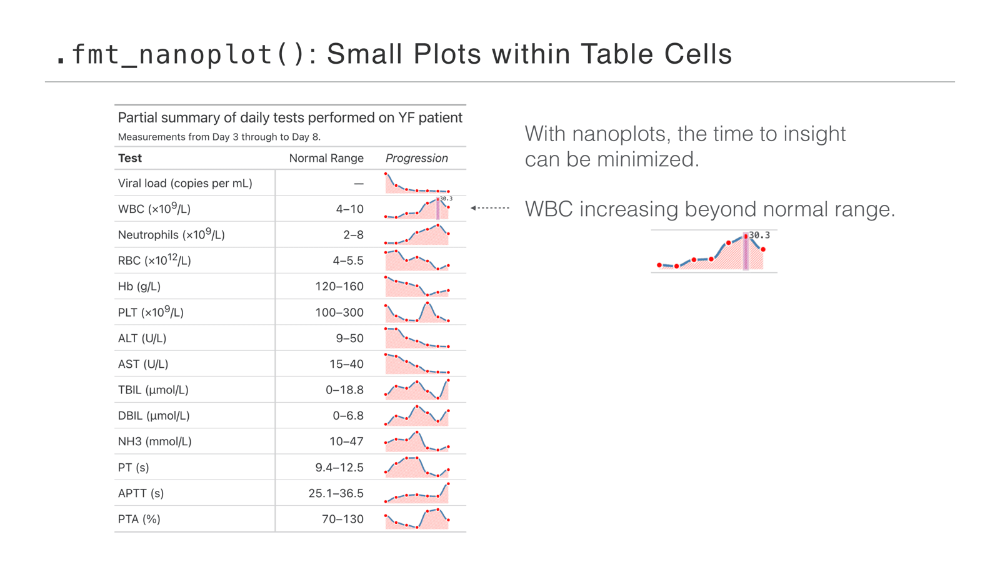

Here's a different, line-based version of a nanoplot. In a table like this you want your time to insight to be minimized. This is a table of daily tests performed on a patient—measurements from day three to day eight—and you can see the progression of the different lab tests day after day. Some trends go up, some go down. Look at WBC, the white blood cell count: it's increasing beyond the normal range. A little scary—but the point is you can see that right away with the nanoplot.

Nanoplots are also interactive: you can hover over different points and get a readout. You can either just look, or explore a little. Inviting that interactivity was something we wanted from day one.

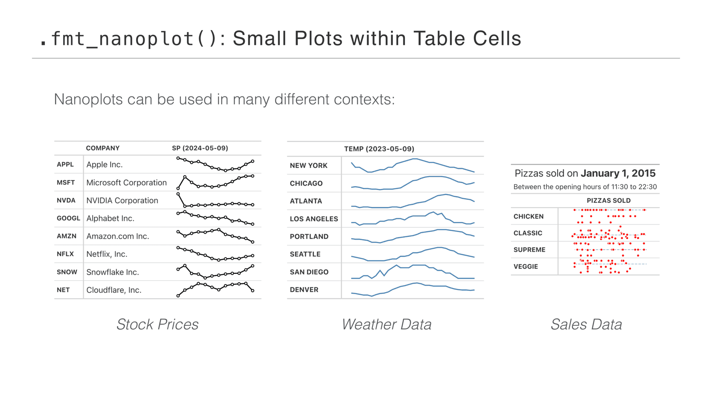

They're really flexible too—they can be styled in many different ways, so they work in many contexts. Stock prices: nanoplots are pretty good for that sort of thing. Weather data: you can compare temperatures across lots of places. And you can make scatter-style plots—sales throughout a day, say—and hover the values to see how sales played out.

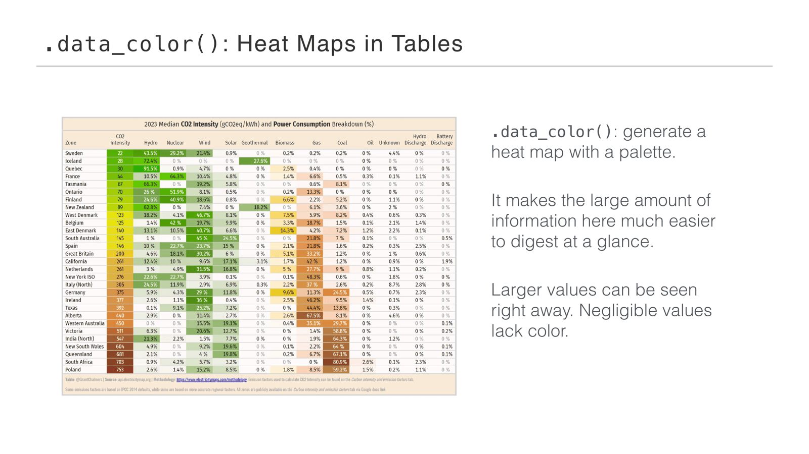

Another big thing in Great Tables is `data_color`, which lets you create heat maps in tables. Here's the table we showed earlier—it's generated with Great Tables. `data_color` generates a heat map with a palette of your choosing, and it makes the large amount of data much easier to digest at a glance. You don't just look at a wall of numbers: large values pop out right away, and negligible values lack color because the low end is faded out. Really easy to parse.

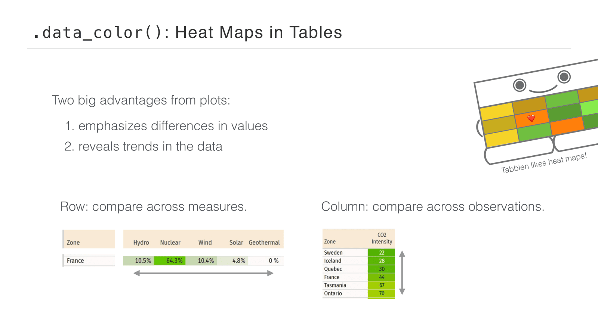

The two big advantages we get from plots in tables: **emphasizing differences in values** and **revealing trends in the data**. Within a row, you can compare across measures—just scanning the France row shows you its energy mix right away. Looking up and down a column, you can compare values across observations: CO2 intensity increases as you go down the table, so you can see the relative ranking.

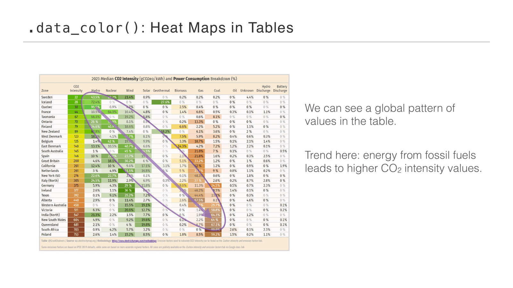

And globally, we can see a pattern across the whole table—a trend moving from the top left to the bottom right. It boils down to: energy from fossil fuels leads to higher CO2 intensity values. That's how the table is organized, but the coloring lets you see the extent of how it plays out.

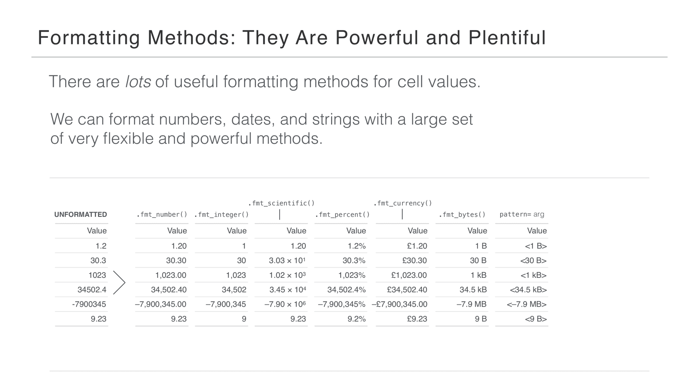

Another big part of Great Tables is the formatting methods—we saw some in Michael's demonstration. They're really powerful, and there are quite a few. Take an unformatted column of values: with `fmt_number` you get a fixed number of decimal places and grouping separators in the large part of the number, making it easier to read. If you don't care about the decimal part, `fmt_integer` rounds for you and keeps the separators—great for counts. If your values are extremely large or very small, `fmt_scientific` gives you scientific notation. `fmt_percent` handles percentage values. With `fmt_currency` you can provide any currency code, and Great Tables understands how to format it—the number of decimal places and the currency sign to use. We run pretty deep on formatting: there's even `fmt_bytes`, which turns a number into a byte size. And the formatting methods share common arguments, like `pattern`, which lets you decorate a formatted value with any string literals around it.

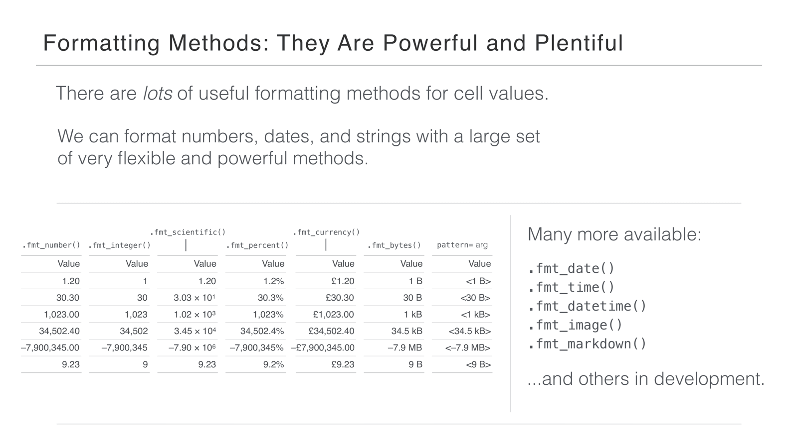

There are many more available—you can format dates and times, add images, format text as Markdown—and there are more in development, because it's a pretty fundamental part of the package.

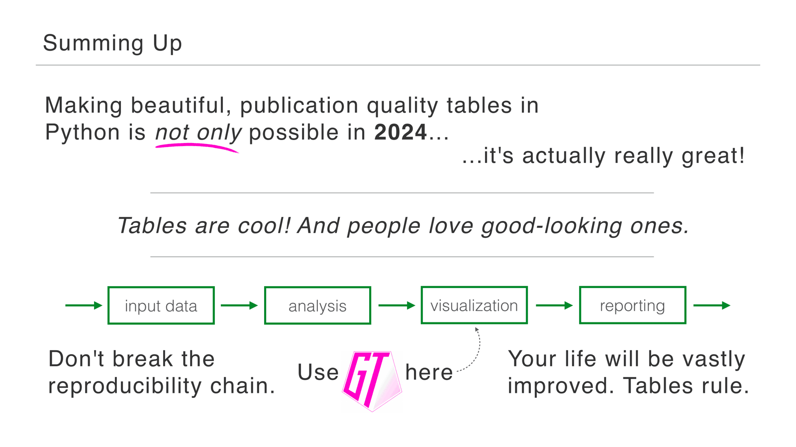

To sum up: we hope we made the case that making beautiful, publication quality tables in Python is not only possible in 2024—it's really great. We think tables are really cool, and we're pretty sure people love good-looking tables. Sending a polished table is a chance to make a great first impression; it tells people the work is worth paying attention to. And there's so much at your disposal in Great Tables to help group information, highlight things, and bring out the best in your data.

We also talked about the reproducibility chain: you've already worked hard to make sure your data, analysis, and visualizations are in Python. The nice thing about Great Tables is you don't have to pluck your data out into Excel—you can keep going with your Python scripts and have one single tool chain from input data to reporting.

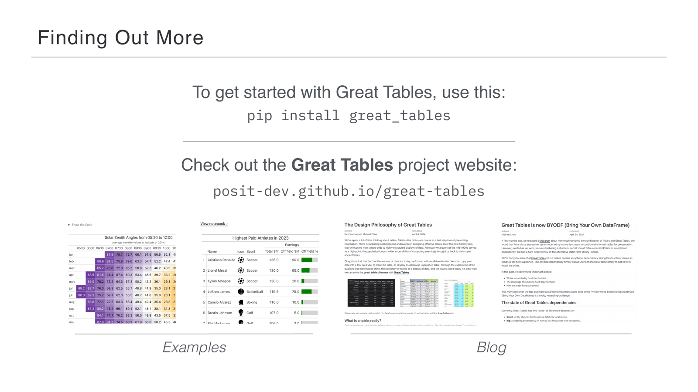

The best way to get started is `pip install great_tables`. We have a website—[posit-dev.github.io/great-tables](https://posit-dev.github.io/great-tables/)—that we've tried to fill with a lot of examples. Along the way we've also blogged about the core problems we've been chipping away at, so hopefully there are a lot of nice nuggets there about table display and the things we've learned.

Thanks so much—we hope you have a lot of beautiful table use cases to throw Great Tables at. Keep making those tables.
