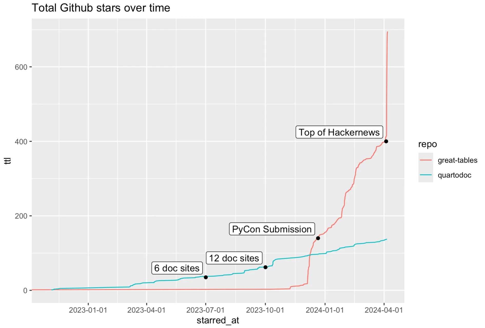
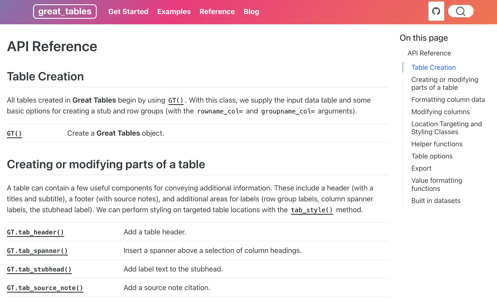
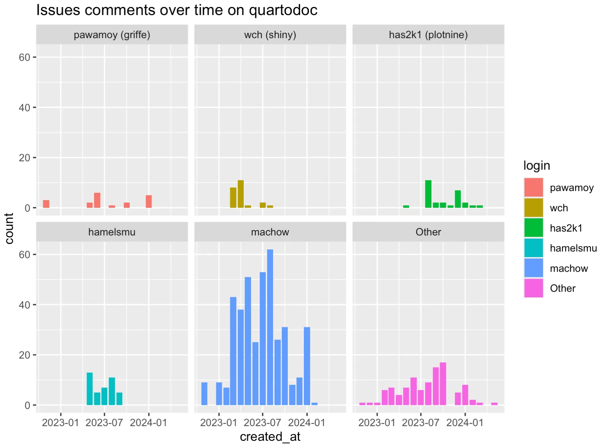
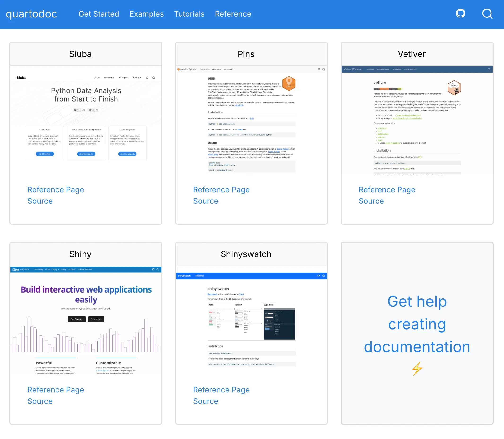
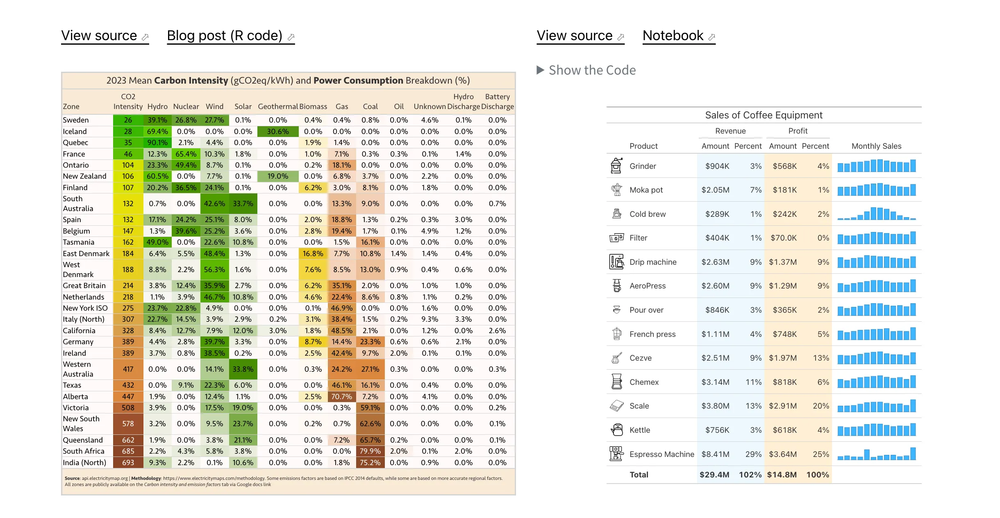
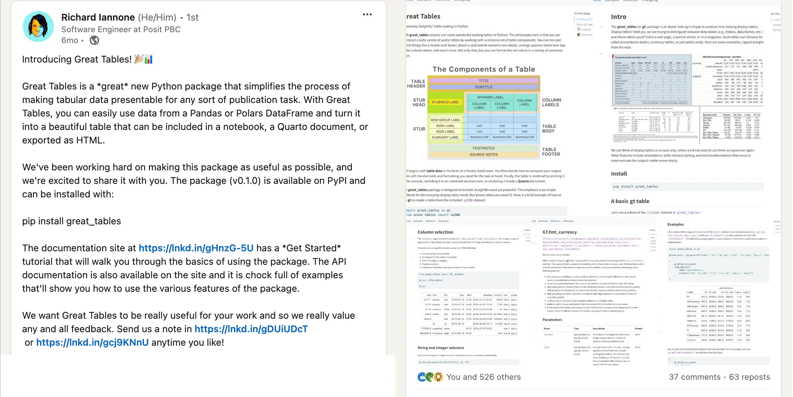
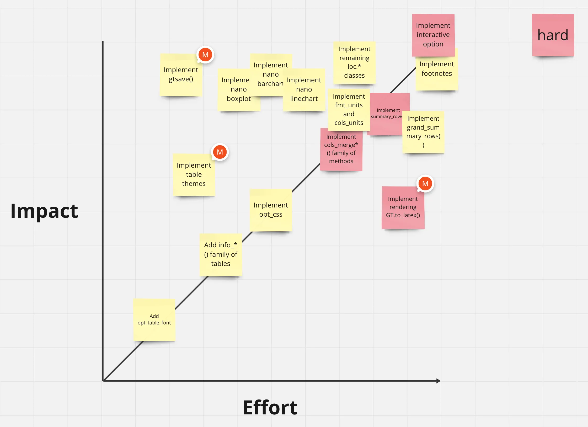
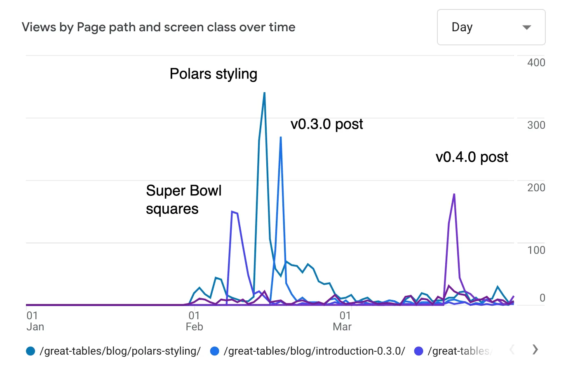
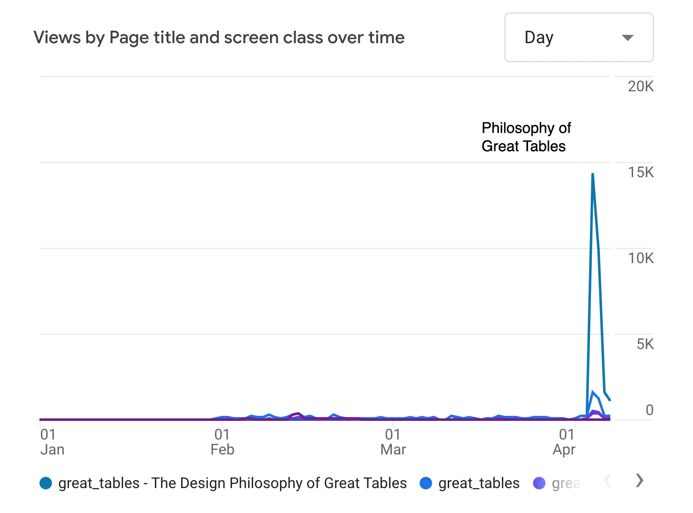

Recently, I wrapped up two years working on the Open Source team at Posit. This last year was largely spent getting two open source tools—[quartodoc](https://github.com/machow/quartodoc) and [Great Tables](https://github.com/posit-dev/great-tables)—off the ground.

The two packages have very different audiences.

- quartodoc feels **developer focused**. It creates API documentation for other packages, so its users are package developers. This audience is smaller, but willing to put in a lot of work to get what they need.
- Great Tables feels **analyst focused**. It creates beautiful tables for publication, which matters across a wide range of industries (e.g. Pharma, business, analytics generally).

In this blog post, I’ll review the big things I focused on each quarter, how they went, and what I learned in the process. The big focuses are shown in the graph below, which plots github stars over time, with big milestones marked at the end of each quarter.

### One big thing per quarter (OBTPQ)

In general, I tried to focus on nailing one big thing per quarter:

- **Q2 quartodoc:** used for 6 documentation sites (and many issues resolved).
- **Q3 quartodoc:** used for 12 documentation sites, including big ones like [ibis](https://ibis-project.org/) and [plotnine](https://plotnine.org/).
- **Q4 Great Tables:** Released, talk submitted & accepted at PyCon US.
- **Q1: Great Tables:** Philosophy of Great Tables post on the [top of hacker news](https://news.ycombinator.com/item?id=39933833).

Note that we didn’t explicitly plan to be on top of hackernews, something that probably involved a lot of luck. Rather, we focused a lot on goals around adoption and communication, hoping that some Big Thing would surface.

There were other bits tucked in-between Big Things, like giving a talk at posit::conf called [Siuba and duckdb: Analyzing Everything Everywhere All at Once](https://youtu.be/j4B7ui5f5Xo?si=T9zQpTMKCcCmhgAC). I’m also partial to this [BYODF (Bring Your Own DataFrame) blog post](https://posit-dev.github.io/great-tables/blog/bring-your-own-df/).

I was fortunate to pair program a bunch with two people: [Hamel Husain](https://hamel.dev/) (quartodoc) and [Rich Iannone](https://github.com/rich-iannone) (co-developer on Great Tables). It’s also worth mentioning Curtis Kephart, who helped us take communication on Great Tables to the next level.

## quartodoc

quartodoc is a tool that enables python libraries to generate an API Reference page. Basically, developers using [quarto](https://quarto.org/) to document their python library can use quartodoc to create the API Reference page.

For example, here’s the Reference page of the library Great Tables:

Notice that the API Reference page is documenting key classes (like `GT()`) and methods (like `GT.tab_header()`).

The value of quartodoc is that it builds on top of quarto—a tool that makes it easy for data workers to create reports, slides, and websites. I needed quartodoc because documentation for my tools are 90% general website, and 10% API Reference. This means that quarto makes the main part easy, and quartodoc makes the last bit possible.

For quartodoc, I wanted to focus first on a **minimum viable audience.** My reasoning was that generating this kind of API Reference has a surprising number of tricky steps. Moreover, everyone I talked to wanted different behaviors and documentation site structures.

Rather than seeking a general audience, I first needed [early adopters](https://seths.blog/2020/09/crossing-from-the-early-adopters-to-a-larger-group/)—people who were willing to kick the tires, surface issues, and find better ways of doing things.

### quartodoc issue comments over time

The rollout of quartodoc is nicely illustrated in issue comments over time, shown below.

The x-axis is the date, and the y-axis is number of comments. Each facet and color is a specific github user (with magenta in the lower right being all other commenters grouped together). Note three interesting dynamics:

- **pawamoy** (top-left) commented regularly throughout development. He’s maintains griffe, which quartodoc uses to fetch function information and docstrings. He often came to the rescue on bits needed upstream, or to help with puzzling situations.
- **wch** (Winston Chang; shiny team) left a ton of comments early on, after they had adopted quartodoc. This was critical for getting quartodoc ready for the big time!
- **has2k1** (Hassan Kibirige; plotnine) started leaving comments later, once we started working on supporting bigger packages like plotnine and ibis.

Together these people reflect help from upstream packages, feedback from early adopters (shiny), and then feedback from big packages after a broader rollout (plotnine).

### (Q2): the first 6 doc sites

For Q2 we focused on setting up getting 6 packages using quartodoc. This involved parts:

- **Round out support** for packages like siuba, pins, and shiny that had deployed with quartodoc.
- **Get off the ground** packages like vetiver, shinyswatch, and varioius folks that showed up.

**Rounding out support**. While we had deployed the shiny API docs in the previous quarter, there were a ton of extra cases to consider. It’s worth noting two members of the shiny team opened 42 issues on quartodoc as we worked on shiny’s API Reference. This was the best early adopter outcome I could hope for 😅.

The two biggest pieces were reducing the build time and supporting interlinks—automatic linking between API entries.

**Supporting new packages**. I also worked on migrating a few more documentation sites to quartodoc—including pins (which I maintained), and shinyswatch (which the shiny team maintained).

At the end of this quarter I filmed a 10 minute screencast on getting started with quartodoc, and then headed to SciPy’s annual conference. There, I ran into the ibis team, who ended up switching to quartodoc over the next quarter.

<iframe src="https://www.loom.com/embed/fb4eb736848e470b8409ba46b514e2ed?sid=aab77d60-3183-4989-907b-0cc2ff63e677" frameborder="0" webkitallowfullscreen mozallowfullscreen allowfullscreen style="position: absolute; top: 0; left: 0; width: 100%; height: 100%;"></iframe>

### (Q3): wiring up the ibis and plotnine docs

**ibis docs**. While at SciPy, I ended up spending a good chuck of time with the ibis team. Since their tool is similar to siuba, in that it translates to SQL, we have a ton of shared interests. They mentioned not liking how hard it is to execute python code on their doc site, which used mkdocs. While sitting with them at Allen Downey’s talk, I attempted a port-ibis-docs-to-quartodoc speedrun, which went surprisingly okay.

After the conference, I put up two quick resources:

- a [prototype of their docs in quartodoc](https://github.com/machow/ibis-docs-demo)
- a screencast covering todo items and differences between sites (shown below).

<iframe src="https://www.loom.com/embed/39e0be6bf6db4db58db02bc0e9cb5dbc?sid=8e904427-f01e-4e05-9c9b-fce118f1fbd2" frameborder="0" webkitallowfullscreen mozallowfullscreen allowfullscreen style="position: absolute; top: 0; left: 0; width: 100%; height: 100%;"></iframe>

In the end, the ibis team worked incredibly fast. I mean scary fast. I mean that what I thought might get chipped away at over a month or more was done in a week. Dang y’all!

TODO: turn below into a single sentence.

**plotnine docs**. Similar to working with ibis, I also put up a demo site for plotnine (https://github.com/machow/plotnine-docs-demo). Plotnine’s author, Hassan, was very interested in getting the look and feel of the plotnine docs exactly right. As a result, he ended up opening a ton of issues on quartodoc, upstream on griffe, and even contributed useful changes to quartodoc.

## Great Tables

For the next two quarters I shifted focus to Great Tables, a python library for the display of tables. The easiest way to get a feel for what Great Tables does it to check out the [Examples page](https://posit-dev.github.io/great-tables/examples/). Here are two entries:

Notice that the tables look very different from normal DataFrame outputs. They’re structured, formatted, and styled for presentation. Here, the most important piece is conveying information to an audience (e.g. your boss; people in your field).

The magic behind Great Tables is a developer named Rich Iannone. He’s gone surprisingly deep on two facets of tables:

- **Domains** where tables get shared a lot (e.g. pharma, sports, analytics, academia)
- **Frameworks** for describing tables (e.g. the 1949 Census Manual of Table Display)

What stuck out to me most though was that his R library for table styling (gt) had a surprisingly dedicated following. For example, Tom Mock uses gt in his example laden post [“10+ Guidelines for Better Tables in R”](https://themockup.blog/posts/2020-09-04-10-table-rules-in-r/). gt established a powerful grammar for communicating table display.

When planning my next six months, I wrote this pitch for putting time on Great Tables:

> Normally, when porting a tool from R to python there are a dozen alternatives to compete with. As a result, it can be hard turning need into demand. I think getting gt-python out is a no-brainer: gt fans were crawling all over themselves at posit::conf() to meet Rich, and **there’s no python alternative**.

In the following sections I’ll discuss how we approached each quarter, which loosely corresponded to **submitting to PyCon**, and accidentally shooting a **3,000 word blog post to the top of hacker news**.

## Great Tables (Q4): initial release, pycon talk accepted

**Architecture review and quick refactor.** Before kicking off general Great Tables plans, I spent 2 weeks reviewing an existing python prototype Rich had been chipping away at.

Two things stood out in the prototype:

- **data**: 15 hefty data classes, holding information about table titles, row organization, and more.
- **actions**: 200+ functions for activities like adding structure, formatting values, and styling parts.

Moreover, the data and actions were combined in a big class called `GT`, which ended up inheriting from 15 parent classes (1 per data class, with actions on the data class). In general, inheriting from 15 classes is often a sign you should use the bridge pattern.

Overall, the refactor gave us two things:

- **encapsulation**: functions and methods had much less access to things they didn’t need.
- **DataFrame agnostic**: while refactoring, I split out all DataFrame logic to its own module. This let us quickly add Polars support!

<iframe src="https://www.loom.com/embed/32431dd0e62d4d69b0778abfb8b71962?sid=6d5a791d-3f48-40ef-8370-5e36372d76b0" frameborder="0" webkitallowfullscreen mozallowfullscreen allowfullscreen style="position: absolute; top: 0; left: 0; width: 100%; height: 100%;"></iframe>

**Submitting to pycon.** With the refactor out of the way, we set a goal of submitting a talk to PyCon US 2024. Our reasoning was…

- The deadline was 13 December, which gave us 6 weeks of sprint time.
- It forced us to release, document, and communicate Great Tables early
- Submitting a talk proposal made us articulate “what about this is so surprising and special?”

In order to make the most of our time, we made a User Story Map that segmented our work into 3 slices (which we hoped we could nail in 2-week sprints). We identified folks within Posit who could be early users.

<iframe src="https://www.loom.com/embed/96cffbc05ee24b59a63d72b91a2c50da?sid=d59a46d8-ce60-4f50-93b1-529056d6ee5e" frameborder="0" webkitallowfullscreen mozallowfullscreen allowfullscreen style="position: absolute; top: 0; left: 0; width: 100%; height: 100%;"></iframe>

By December 4th we were ready to roll out Great Tables to the world, with a v0.1.0 release and LinkedIn post!

The post received 526 reactions on LinkedIn, which seemed like a strong signal people wanted Rich’s freaky table brain styling tables for display in python.

After that, it was time to submit to PyCon. We each wrote up separate drafts, and then reviewed them together. Rich came up with the title “Making Beautiful, Publication Quality Tables in Python is Possible in 2024”, and we used his draft as the starting point!

## Great Tables (Q1): philosophy of Great Tables blog post

We found out we had been accepted to PyCon in early February, which kicked off a flurry of activity. It wasn’t until May, which gave us two 6-week planning cycles.

The first cycle finished at the end of Q1, so I’ll focus only on it. We focused on two areas:

- **Feature prioritization**: using an impact / effort matrix to plan features
- **Communication:** making a content schedule with Curtis Kephart, which accidentally spun out into a 2-week push on writing “The Philosophy of Great Tables”.

**Feature prioritization.** Using an impact / effort matrix exposed a lot of low hanging fruit for Great Tables. In order to create the matrix, we wrote out big issues on github with the label `epic`. These are issues that essentially unlock something fairly big and useful (e.g. there might be 100 issues on a repo, and only 10 to 20 epics).

Then, I created sticky notes for each one in Miro, so Rich could move them onto the Impact vs Effort graph (shown below).

Note that more impactful epics are higher, and more effortful are to the right. There are two aspects of this graph I find useful. First, low effort tasks can often be used as **filler** between bigger work. Second, things above the line reflect epics where there’s **outsized impact**, relative to effort involved.

For example, Rich reckoned implementing `ggsave()` as low effort and high impact (i.e. low hanging fruit). We ended up coloring especially hard things in red, for things whose implementation might be tricky.

Another surprising piece was that Rich suspected rendering latex required a lot of effort, but didn’t impact a lot of people. He knew we needed to get to it eventually, because the people who use it benefit deeply, but we suspected it should come after PyCon.

**Communication.** We wanted equal focus between development and communication around Great Tables this quarter. To this end, we linked up with one of our favorite Posit folks, Curtis Kephart, and planned out a content schedule. This contained posts we committed to writing, people he planned to reach out to, and desired outcomes like expanding the Examples gallery.

Overall, I found it super helpful! We ended up writing 6 posts on the Great Tables blog over the quarter, and chatting with a bunch of folks curious about our tool. Below are views over time for the 4 most successful posts of the quarter.

Note that there were largely three kinds of posts:

- **Interesting use cases**: exploring the betting game [Super Bowl squares](https://posit-dev.github.io/great-tables/blog/superbowl-squares/).
- **Explanations**: why [using Polars with Great Tables](https://posit-dev.github.io/great-tables/blog/polars-styling/) blew our minds.
- **Release updates**: showing the best parts of each release. E.g. [v0.3.0 styles](https://posit-dev.github.io/great-tables/blog/introduction-0.3.0/) and [v0.4.0 nanoplots](https://posit-dev.github.io/great-tables/blog/introduction-0.4.0/).

However, the most surprising result came when Rich took up the call from Curtis to lay out the “Philosophy of Great Tables”. A task Curtis guessed would be quick, but that Rich turned into a 2 week long writing adventure, that shot to the top of Hacker News on April 4th:

The Philosophy of Great Tables ended up a 3,000+ word epic on the 10,000+ year history of tables—from tablets used at the Temple of Enlil at Nippur, to the midcentury tables featured in the US Census Manual of Table Display, and on the spreadsheet-esque tables of VisiCalc. Rich pulled the content from some freaky-table-scholar part of his brain, and gave me permission to aggressively edit. It took roughly 2 weeks of regular pairing on writing and edits.

See this short post on how I approached editing with Rich.

The bones of the article were good, so much of my focus editing was on three pieces:

- **Narrative structure**: we reviewed the traditional [three act structure](https://en.wikipedia.org/wiki/Three-act_structure) and [hero’s journey](https://en.wikipedia.org/wiki/Hero%27s_journey). In this post the hero is the reader (or tables themselves). The status quo is upset when they realize how badass tables could be. Throughout time tables continue to rise to the occasion, but VisiCalc upends this by derailing 10,000 years of progress. This is resolved by Great Tables restoring tables to their original glory.
- **Continuity**: Making clear why each paragraph/section followed the previous one
- **Brevity**: I shortened a lot of sentences.

Surprisingly, we got a lot of mileage out of copying whole drafts into Miro for editing. This allowed me to zoom super far out, and flag extra big paragraphs, and to discuss breaking up text with lists or images.

## Summary
