This is an annotated version of a talk I gave at SciPy 2025 in Tacoma, WA, in July 2025. You can watch the [video](https://youtu.be/lHCOVqCZRFw) or view the [original slides](https://docs.google.com/presentation/d/149UwdljTilauGPm0AXkROm9ArTcMfBfOVxgxaEnjSbQ/). The talk is about user guides—what they do that API references can't, and the two key pieces to focus on for getting one right: **onboarding** and **grazing**.

The takeaway: an API reference alone strands newcomers in a sea of 40+ functions, and a user guide fixes that by being concrete and right-sized. Getting one right comes down to two jobs: **onboarding**—giving people a *simplest whole task*, a worked example that shows the big pieces fitting together—and **grazing**—structuring the guide (especially its sidebar) so experienced users can come back and sample just the piece they need. The talk develops both through three case studies: Plotnine (the simplest whole task and the *detail spiral*), FastAPI (*frontloading* prerequisites and working backwards from a running app), and R for Data Science (*backwards chaining*).



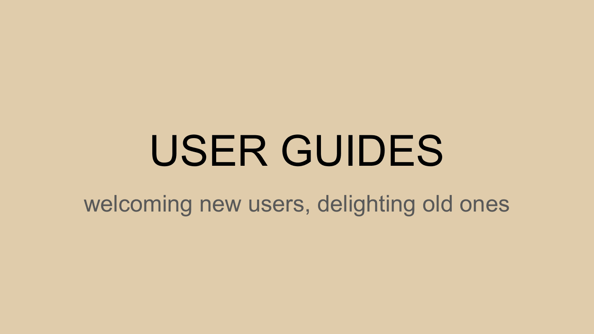

I'll be talking about user guides, and this idea of welcoming new users and delighting old ones. I have to admit I didn't love the idea of calling some people "old users"—so if you know a better word, I'm all ears. Experienced users? We got it.

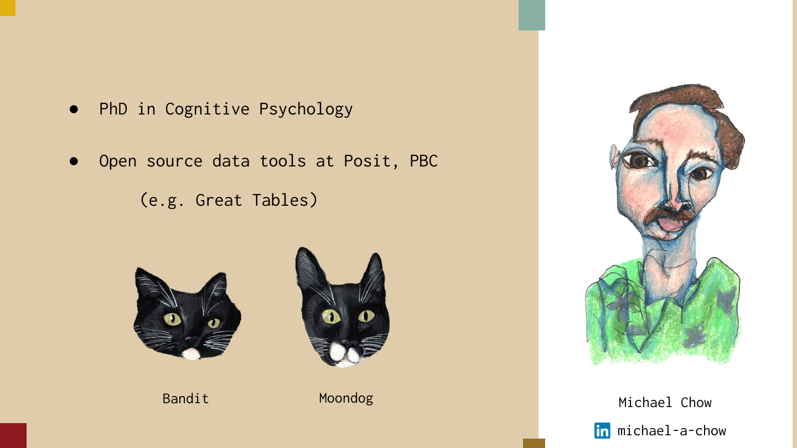

A little background on me: I did a PhD in cognitive psychology, and I work on open source data tools at Posit, PBC—mostly Python tools. One tool I maintain is called [Great Tables](https://posit-dev.github.io/great-tables/), which is all about displaying tables for publication. Aside from that, I have two beautiful cats, Bandit and Moondog. One is very sassy, one is a real goober, and I'll let you decide which is which.

I'm really excited about user guides. Part of it is that as a cognitive psychologist, I'm really interested in how people pick up new skills. And as a software developer, I'm interested in my responsibility in shaping how people should use a tool—being sure they can use it to do the range of things I hope they can do with it.

A lot of open source developers build tools because we think they give people a new or better way to approach a problem. User guides are the bridge from that hope inside our brain to people putting our tools to use.

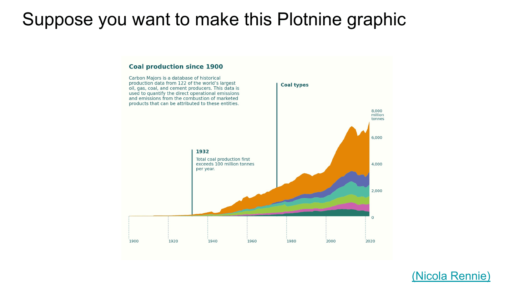

To motivate this talk, I want to bring up a scenario. I work a bit on the documentation for **[Plotnine](https://plotnine.org)**, a Python plotting library. Suppose you saw this graphic (by [Nicola Rennie](https://nrennie.rbind.io)) and you wanted to reproduce it. An interesting question is: how would you go about that?

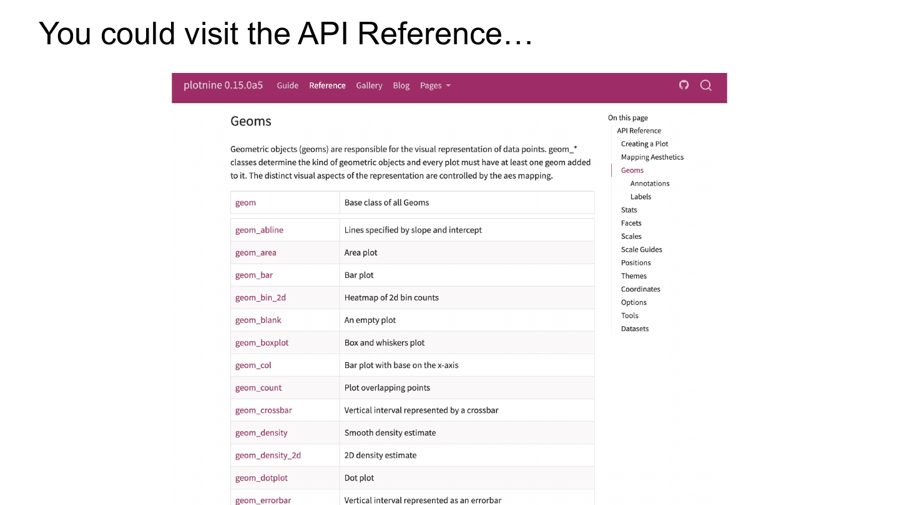

On the one hand, you could crack open Plotnine's API reference, and you might see something like this—a list of a bunch of functions you could use. But this isn't even the whole story. If we zoom out a little bit, there are more functions.

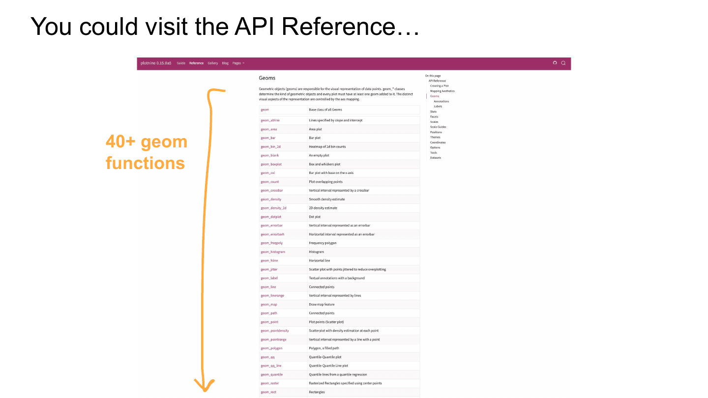

If we just keep zooming, there are 40+ of these. They're called geoms.

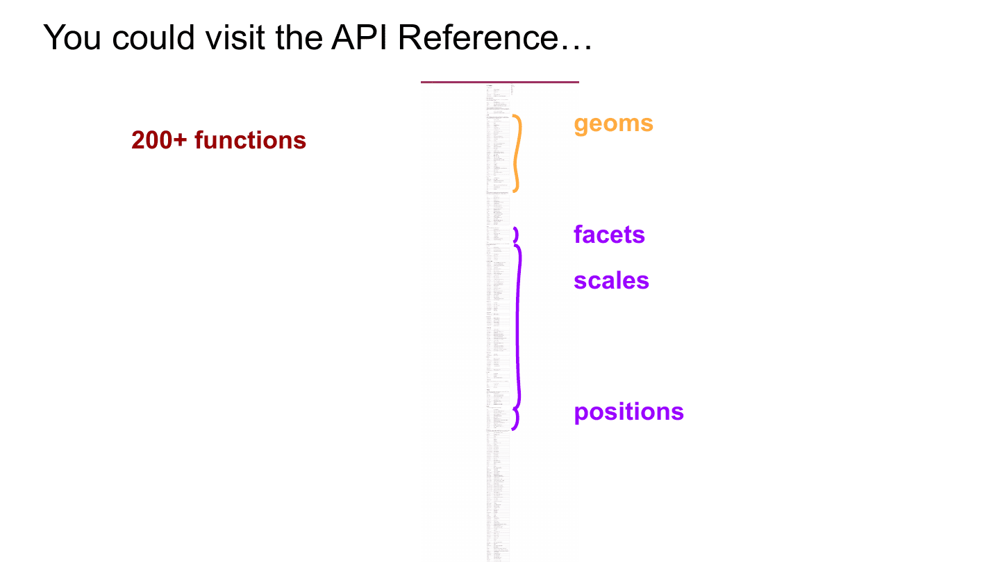

But wait, there's more. If we keep going, what you're going to see is this. Geoms are this little piece of the API reference, and there are a lot of other kinds of things—facets, scales, positions. Obviously these all went into the plot you're trying to create. But this would be a really tough place to start. You would just be wading around for a long time, super confused.

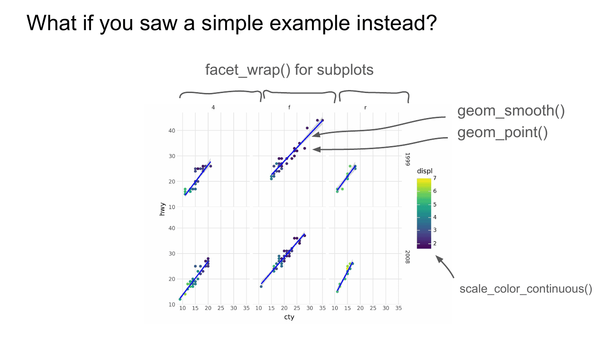

But what if you saw a simple example instead? A really simple plot that uses some key pieces of Plotnine. It could use `facet_wrap()` to create subplots, which helps set up a sense for how Plotnine puts things together. It could mention that `geom_smooth()` puts that blue line in each subplot, and `geom_point()` puts the points there. And we could point out that `scale_color_continuous()` is what makes the color bar go from blue to yellow.

This is really helpful because it's a minimal example that gives you a sense for how some of the pieces of Plotnine fit together—so you can navigate things like the API reference to do what you want.

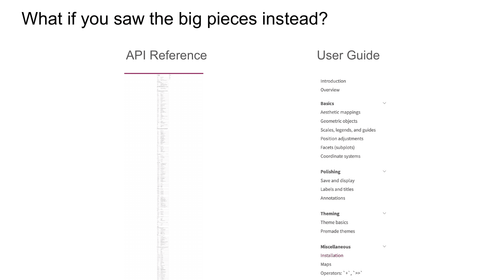

I also wonder: what if you saw the big pieces? Rather than that API reference—squint your eyes, I mean, it's all there—what if you saw something like this? This is about 16 pages that just summarize the big pieces of Plotnine and help you get a sense for how all of it fits together.

These are really important jobs, and they're essentially what a user guide does.

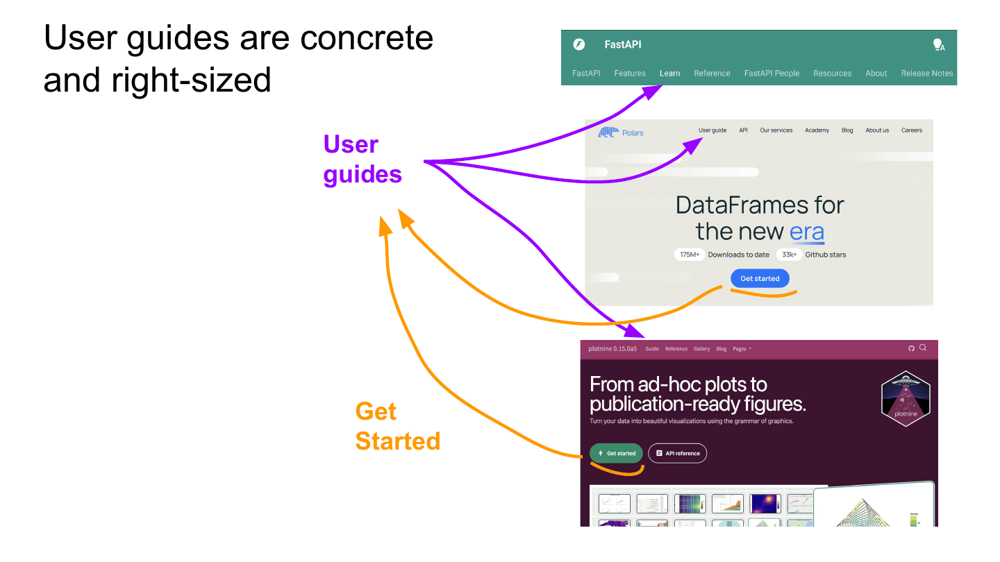

A user guide is **concrete** and **right-sized** for getting into a tool. And user guides are all over—you might know them by a lot of names. In [FastAPI](https://fastapi.tiangolo.com) it's the "Learn" button. In [Polars](https://docs.pola.rs/) it's just called "User guide" (we love that). In Plotnine it's "Guide". All of these go to the same kind of thing.

Really interestingly, if you click the most prominent button on these sites—"Get started"—it usually takes you to the user guide. User guides are front and center in documentation. They're probably the most prominent call to action that documentation sites give, so it's really important to get them right. My hope in this talk is to lay out the two key pieces to focus on.

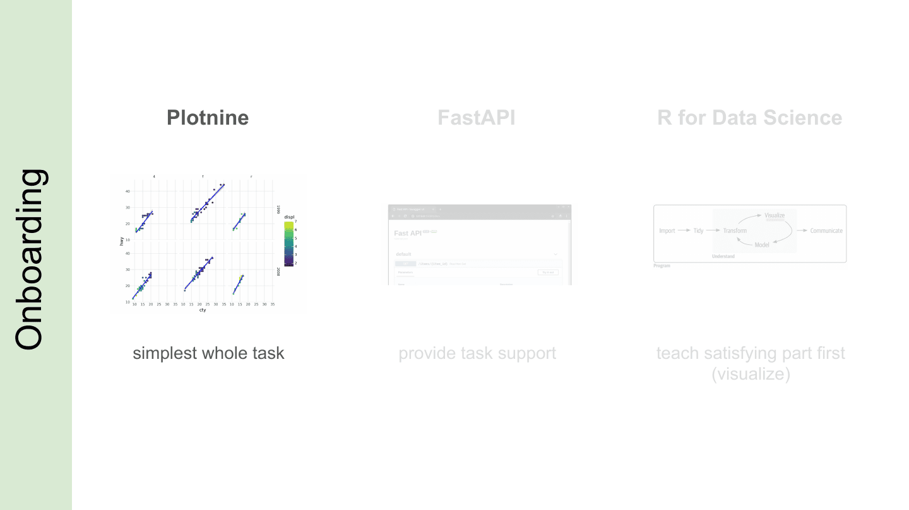

The first piece is **onboarding**. For example, with Plotnine we showed what I'd call a *simplest whole task*: what's the simplest whole plot we could show someone that's exciting, but also easy to break apart so they can get started with the pieces? I'll go through some other examples—FastAPI and a resource called [R for Data Science](https://r4ds.hadley.nz)—to flesh out the onboarding story.

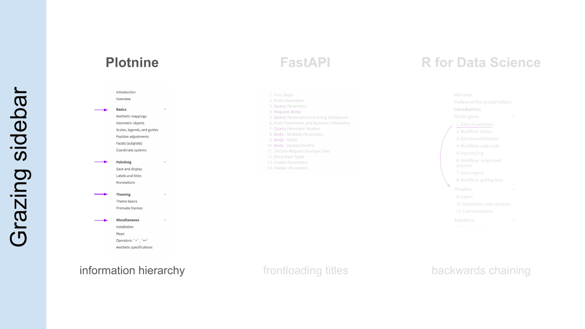

The second piece is **grazing**, and in this talk I'll use the sidebar as the example. Once you get through the simplest whole task, how do you keep going through a library from beginning to end? How do you get through prerequisites, but then come back as you take on different tasks and find the big pieces you need?

Again, I'll hit on FastAPI and R for Data Science to flesh out different focuses for sidebars and grazing—one I'll call *frontloading*, the other *backwards chaining*.

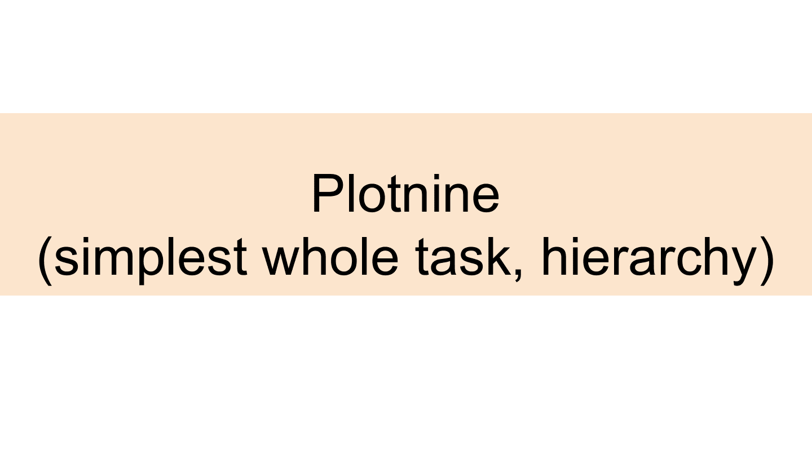

So I'm going to go down the line—Plotnine, then FastAPI, then R for Data Science—to highlight key focuses for onboarding and grazing. Starting with Plotnine, I want to focus on this idea of the simplest whole task, and having a good hierarchy to your user guide.

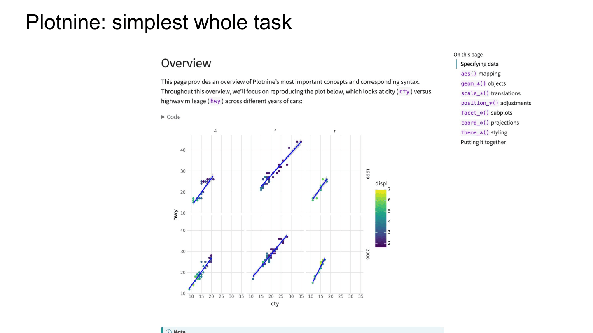

This is Plotnine's overview page—the starting page of the user guide—and how it carves up the simplest whole task. To start, it shows you the plot you'll be making, so you know what you're getting into. Hopefully it's something interesting that shows off why you might use Plotnine.

The floating table of contents helps show the structure: there are seven big categories the overview will emphasize. And interestingly, in Plotnine each category is a grouping of functions prefixed with the category name—geom functions all start with `geom_`.

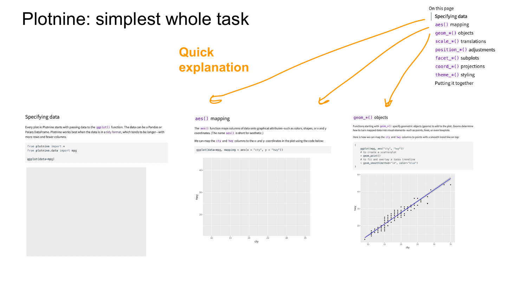

Each of these categories is previewed quickly: just a little bit of text—a couple of sentences—followed by a little code, and then the output of the code. People saw the original plot they'll be making, and then they see it being built step by step.

This is called a **worked example**. You're working through the process—you're not necessarily asking people to do things, but you're working it out and pointing their attention at the things they should care about in the outputs. These quick explanations let people see how the seven pieces fit together and do different parts of Plotnine.

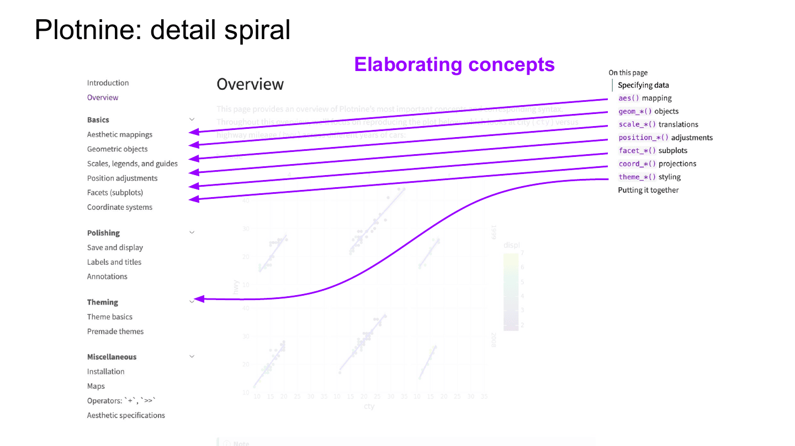

Zooming out, this is the sidebar—the chapters of the Plotnine guide. The pieces that were talked about in the overview are then covered in depth in a subsequent page. You can see `aes()`—short for aesthetic mapping—is covered in detail in the Basics section.

I call this a **detail spiral**: the overview page covers each of these things in brief, and then a subsequent section goes into detail on each piece in depth. This lets people get a broad sense for how to use your tool on a real task before diving deeper. It also helps with prerequisites: a lot of these pieces don't work in isolation—they depend on each other a little bit—so covering all of them up front gets some of the prerequisites out of the way.

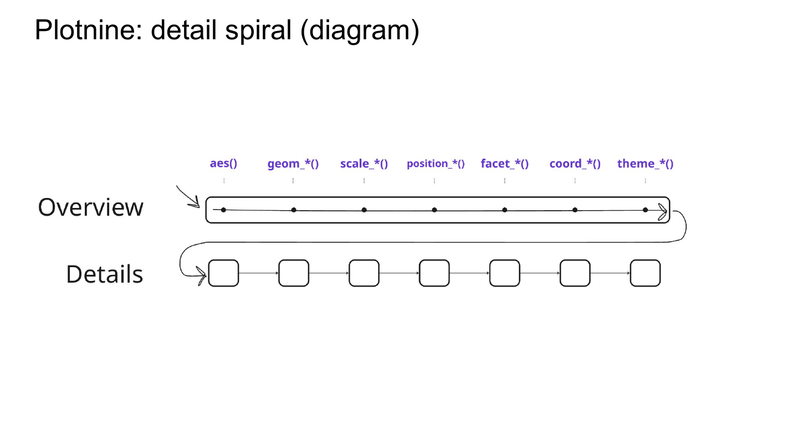

This is just the detail spiral shown a different way, diagramming where people go through the concepts. In the overview they do a broad pass over everything, and then they loop back and hit each one in depth.

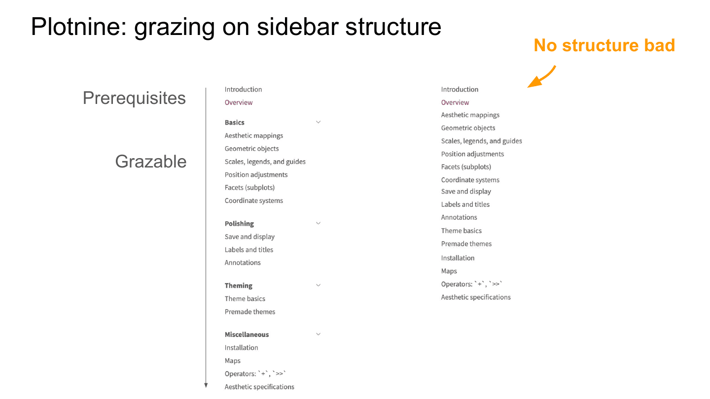

For the sidebar, the value goes from things that focus on prerequisites—things you need to know to get started—to things that are more *grazable*, things you can sample as you go. Once you get to about "Geometric objects", you can click around quite a bit. The hope is that the titles and sections make it easy for people to see different categories of things they might do, and quickly key into different activities.

And just to show the contrast: here it is without the sections. I find it pretty hard to read, and I see this a lot in guides—you just have twenty things in a flat list, and I find it incredibly overwhelming. A little bit of structure helps people navigate a user guide. It also puts names on activities, which makes them easier to talk about.

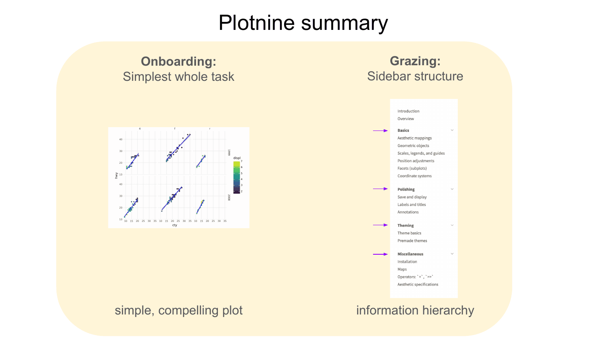

To summarize Plotnine: for onboarding, use a simplest whole task to get people familiar with key concepts. For grazing, structure your sidebar or chapters so they're easy to graze and it's easy to see how things are grouped.

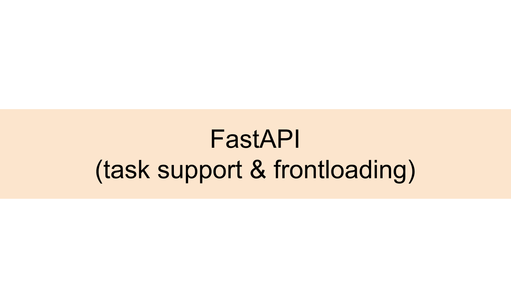

Next I'm going to look quickly at FastAPI, which is a really interesting tool with a really nice approach to user guides.

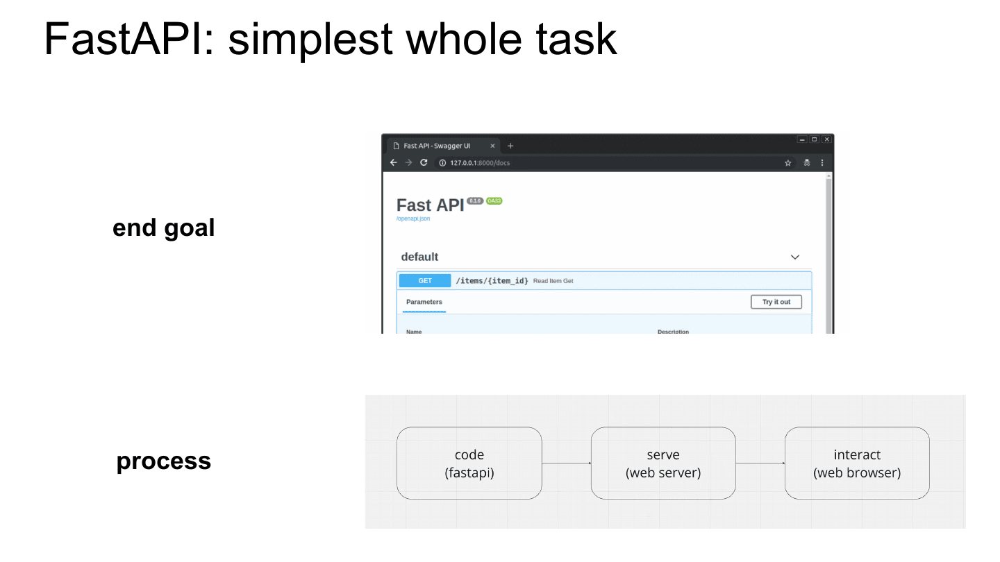

FastAPI is a web framework, so you can deploy web applications like the one shown in the browser here. The tricky thing with a web application is that there's often something in the middle. Usually the process is: you write some FastAPI code, then there's this middle piece called a web server—which is not necessarily FastAPI—and then you interact with it in the web browser.

So there's a lot of context you're working across. You might be in an IDE writing code, using something like—I've never said this word out loud—Gunicorn? Uvicorn? Well, one of those two is right—to serve it, and then you pop open your web browser to interact with it. FastAPI has a hard problem, because you could be in three different contexts when you're using it.

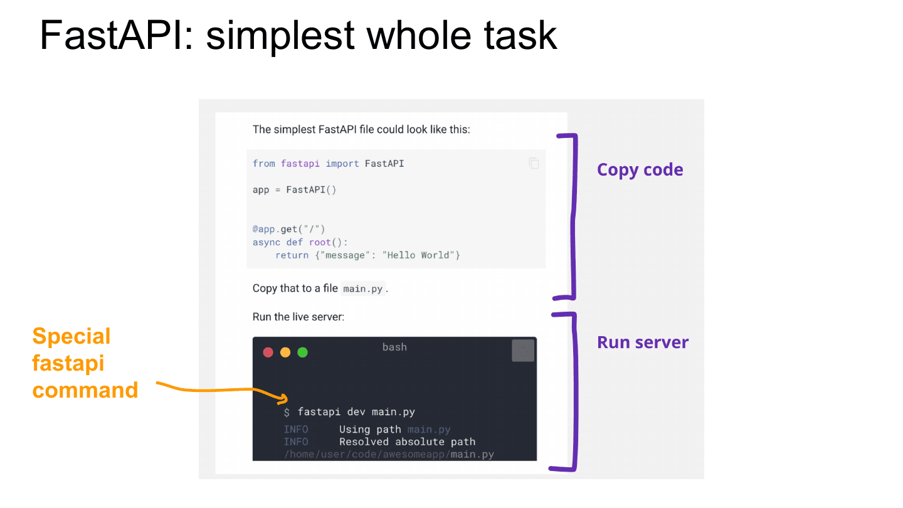

The way they handle this is that they give you a simplest whole task that is essentially doing all of this as fast as possible. They just hand you the code and say copy this into a file, and then they give you this special command—`fastapi dev`—which runs the web application. They lift you past the middle pieces so you can get into the web browser as fast as possible.

This is a real risk I see with these tools: some docs will instead tell you about the middle thing in depth. There are probably five different web servers you could use, and some docs take the chance to tell you about each one. FastAPI does a good job of telling you about *none* of them and getting you to the end product. You'll have time later to learn about the middle part, but FastAPI wants you to know what it does well for you.

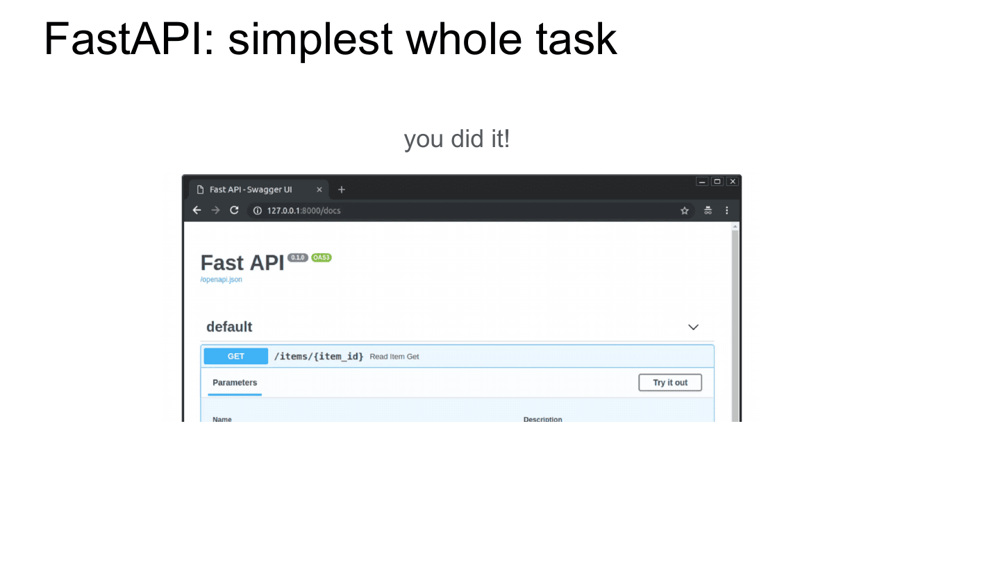

You did it! That's a ton of work FastAPI got you through. If you're new to programming, or new to web applications, they got you through a ton of stuff really fast.

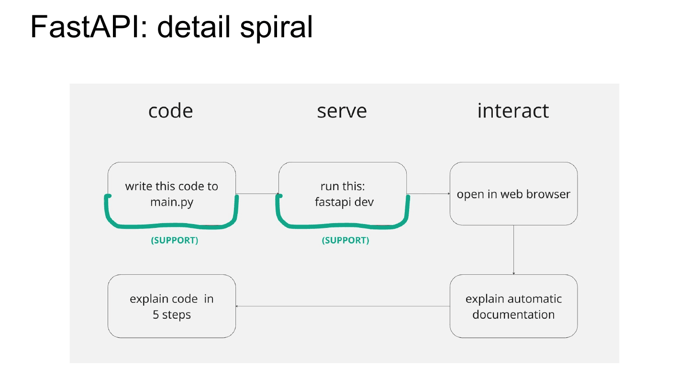

This is showing what FastAPI did there: they gave you task support. They handed you the code, they handed you the special command, and they got you to pop open a web browser.

The interesting thing is the next piece: they start to work backwards. Rather than diving into the code, they say, well, you've already got the web browser open, so why don't we just tell you about what we're giving you? And they explain special FastAPI features, like their automatic documentation. I think this is really neat—they've lifted you to the end product and they're explaining what it does. Then they loop back and explain the code in detail, after they've gotten you to appreciate what an end goal looks like.

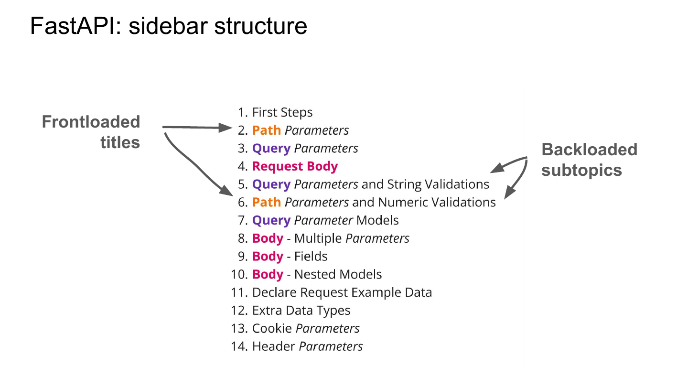

The other interesting thing is their sidebar structure. This is a bit in the weeds, but where Plotnine basically went in order—this is thing A, this is thing B, this is thing C—FastAPI does something interesting: they alternate through topics. They start with path parameters, query parameters, request body—the initial prerequisites—but then they start looping back to the things they think you'll want to use first. They don't do all the path stuff in depth up front.

The way they maintain a sense of structure is that they **frontload the titles**. Notice that "Path" starts chapters 2 and 6, and "Query" starts 3, 5, and 7. They use this to flag to you: hey, we're alternating through these things, but these are the three big things we care about. They also **backload subtopics**—chapters like "…and String Validations" and "…and Numeric Validations" weave the details in. I think they're really cleverly using frontloading and backloading to flag the structure to you.

(Someone asked: did you add the colors? Yeah, I added the colors, so I cheated. My hope is that if you stare at it long enough, it starts to make sense—but this is a talk, and we don't have time to really marinate in it.)

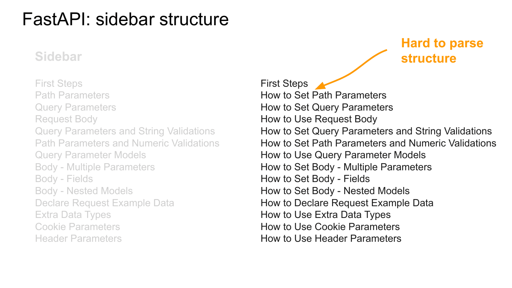

And because of that great question, here's the sidebar without coloring. As a cognitive psychologist, I want to acknowledge that I cheated by showing you colored things first—I've primed you to see it.

The thing I want to flag is that without frontloading—if you were to put something before the frontloaded topics—it could really make it hard to see the key topics. This is one of the challenges with giving titles. Frontloading really helps you see the structure of FastAPI; without something to distinguish the topics, everything starts to run together. Plotnine used sections, FastAPI used frontloading—but you want *something* to make it clear.

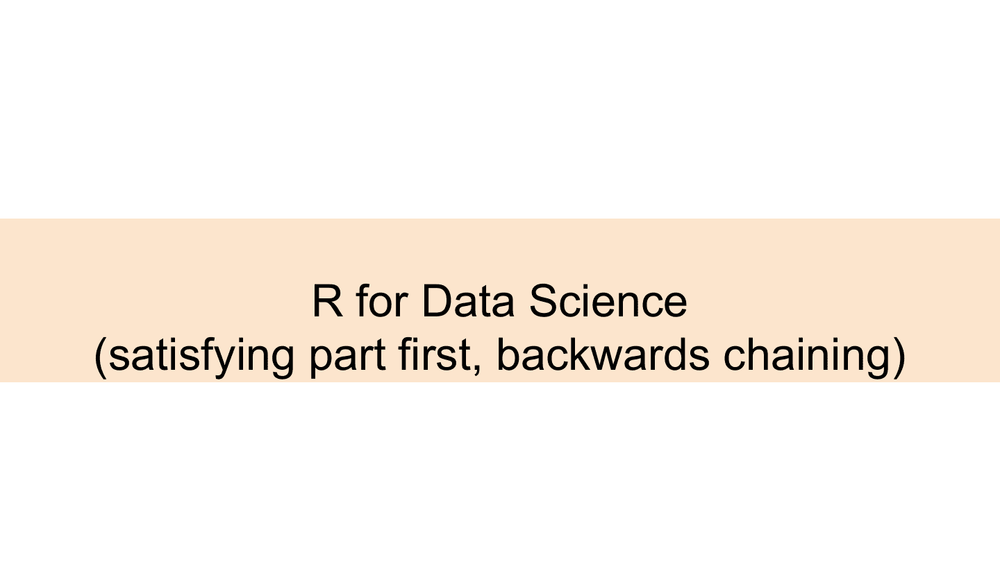

So for onboarding, FastAPI provides code and command-line support; for grazing, it uses frontloading to emphasize its structure. Now we're going to look at R for Data Science, which is a bit funny as a user guide—it's a book that's hundreds of thousands of words—but I think it's a good example of what is essentially a really large document.

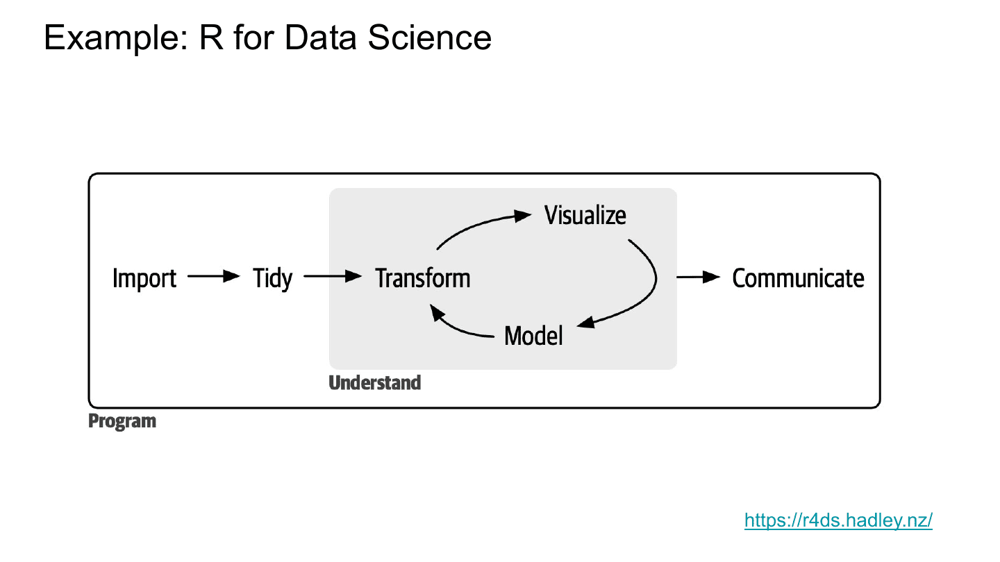

For a little background, R for Data Science is a book about using R for data science, and it centers on this diagram of the data science workflow. You start by importing some data—reading a CSV in. You tidy it up—maybe fix the column names or reshape it a bit. You then engage this cycle of transforming, visualizing, and modeling your data so you can understand it. And when you come to something really nice that you want to send your boss or a journal, you communicate it. The book is really structured around this life cycle.

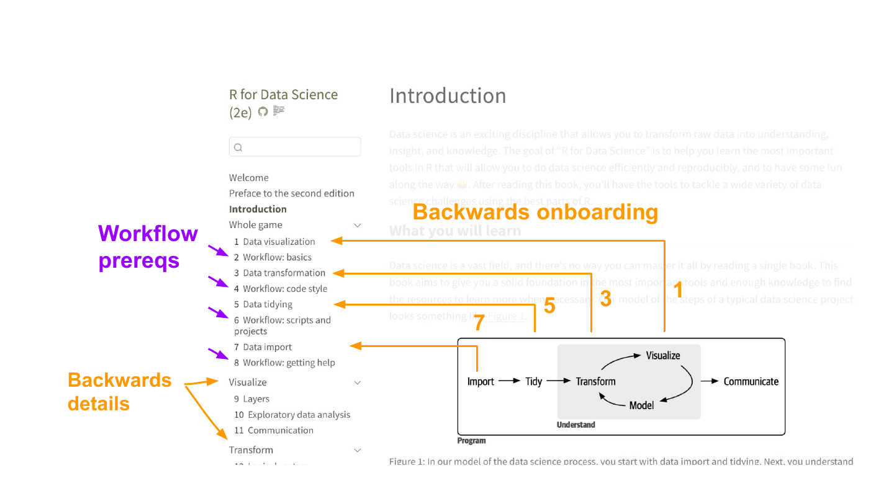

Here's the structure of the book. The thing I really want to flag is that it starts with this "Whole game" section designed to teach you the life cycle—and it starts with *visualize*. It doesn't start you from the beginning. The book is too big to do a single-chapter overview, so it has to break things up, and I think the real reason it starts with visualization is that visualization is really satisfying and pretty close to seeing an end product.

Then notice it keeps going backwards: back to transform, back to tidying, back to import. This is its way of handling a really big job—breaking it up, and chaining backwards from the most satisfying piece toward the beginning. The later sections follow this too: the first section after the "Whole game" onboarding is Visualize, followed by Transform. It's going backwards again to optimize for joy, I think.

Another interesting thing is that it peppers in prerequisites—the "Workflow" chapters, which are often coding knowledge you need for the book. It doesn't frontload all the coding pieces, because you would hate your life and you wouldn't be learning R for data science. It works them in right before the point you need them.

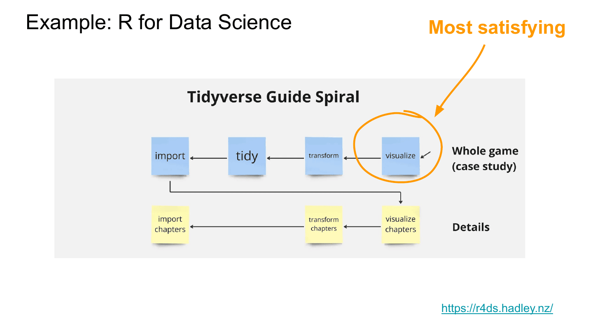

This is the spiral shown another way. I think this is a really neat way to tackle a really big problem: carve it up and work backwards. And just to emphasize—visualize is the door, because it's the most satisfying and it's close to an end product.

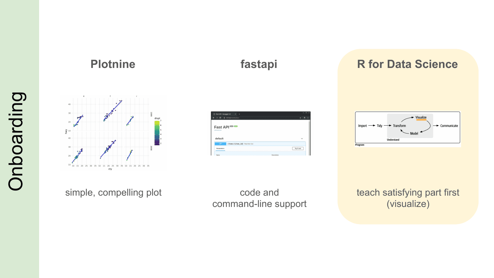

So, for **onboarding**: Plotnine uses a simple whole task, FastAPI supports people all the way to the end goal, and R for Data Science backwards chains and teaches the most satisfying thing first.

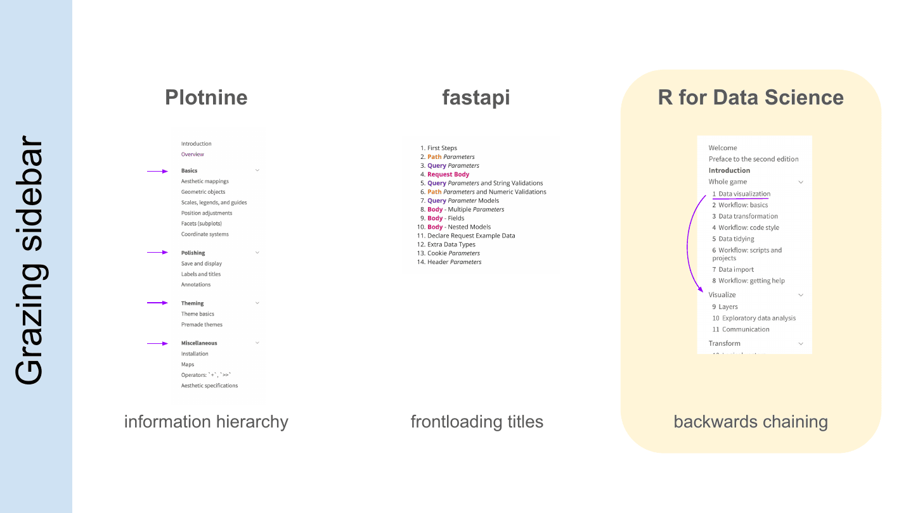

For **grazing**: you can break up your sidebar to create an information hierarchy, so people can see the parts and it doesn't all blend together. You can frontload to emphasize the structure. Or, like R for Data Science, if you have a really big job you can backwards chain—start with the end thing and work backwards.

I think these are really important, powerful moves, because tools are complicated and it's really hard to learn a new tool. People need all the help they can get, both to get started and to come back as they need things to handle new tasks. The more we can do to bring people in—and provide a structure that makes really clear how our tool fits the way we want them to think—the better people will be at using our docs through the whole life cycle of the task they're trying to do. Thanks a lot for listening!

## Q&A

There were some great questions afterwards. A few highlights:

**What about tools that auto-generate docstrings and documentation?** What if I told you I myself maintain a tool for generating API references? People always ask me about the API reference, but I've spent more time on the user guide than the API reference. Engineers always go API-reference first—I've never seen an engineer not do the API reference first—and my story is: user guide first. You can write docstrings, but you should pretend they don't exist until you have a user guide. That's what I like about FastAPI: they had a user guide before an API reference. It's a really good forcing function for thinking about the story you want to tell, rather than how each individual piece works.

**Will AI chatbots change the role of user guides?** I have no idea. But my guess is there's so much low-hanging fruit in writing user guides that it's probably safe to assume your improvements will also get picked up by AI, either as context or as training. Working out your sections is also a good way to build a controlled vocabulary—consistent words and categories—and I suspect AI will heartily take advantage of that.

**Is the spiral about keeping readers in the zone of proximal development?** Yeah, I think so—you're bringing down the difficulty by building their skill in the things they need.

**Should a user guide live in its own repo?** The Plotnine guide does—I own the repo. It's such a big job that I asked Plotnine's author, [Hassan](https://github.com/has2k1), to delegate running the guide to me. I needed to be fully immersed in it, because it's a job just as important as writing the Plotnine code.

**How do you keep docs up to date with the code in CI?** Quarto is really useful here (I'm biased—Quarto is developed by Posit, so take that with a grain of salt). For Great Tables, we do a lot of code in our documentation—simple markdown that gets executed—so our docs get regenerated on CI every time. If the code errors, the docs don't generate and we can't merge. We get really sad, but that's the right level of sadness—we feel it.

**How do you balance the time investment as APIs and user goals evolve?** It's kind of a product question—the fear that your user guide will need to change is sort of the fear that you've targeted the wrong audience or built the wrong thing. What a user guide gives you is the chance to run people through the core idea of your tool, look them in the eyes, and see if they look dead inside while they do it. That's my litmus test: I watch them skip parts of the guide, or die inside. You should see people die inside as you build your tool. It's a soul-enriching activity.
