This is an annotated version of my talk "Polars: laying the foundation of the pharmaverse-py", given at the PHUSE Single Day Event in New Jersey in July 2025. You can flip through the [original slides](https://docs.google.com/presentation/d/1kgD1fJpHJw7x1NEIwkpm8mTrzYPN0y73Yg8Tt0qj97w/). The talk is a short pitch to clinical statistical programmers: if the pharmaverse is going to be ported to Python, [Polars](https://pola.rs) should be the DataFrame library it's built on. (The [following year's talk](/posts/pypharma-phuse-nj/) at the same event picks up from a very different place.)

The takeaway: Polars is a **delightful** DataFrame library that **runs everywhere**. It takes the role that [dplyr](https://dplyr.tidyverse.org) plays for the R pharmaverse, and thanks to [narwhals](https://narwhals-dev.github.io/narwhals/), the same Polars code can run on pandas, DuckDB, Spark, or Snowflake. The talk makes the case in two parts: first, mapping the R pharmaverse's foundations (dplyr, gt, gtsummary) onto their Python counterparts (Polars, Great Tables, narwhals); then a quick walk through some Polars code, showing how swapping in narwhals lets that same analysis run on DuckDB.

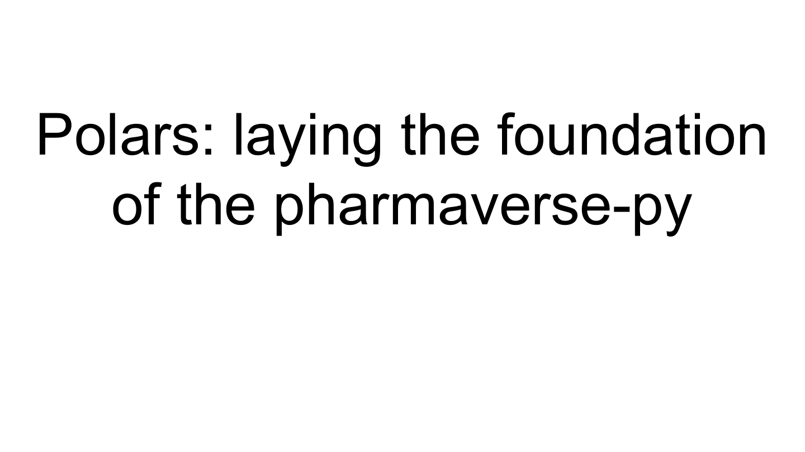

The title gives the pitch away: Polars as the foundation of a Python pharmaverse.

I'm Michael Chow. I have a PhD in cognitive psychology, and I work on open source at Posit, PBC, focused on Python tools like [Great Tables](https://posit-dev.github.io/great-tables/). Previously, I ported dplyr to Python as [siuba](https://siuba.org). I'm interested in open source in pharma, and more broadly in the idea of skill: what it means to have one, and how skills, strategies, and tools interact. I also have two cats, Bandit and Moondog.

In R, most people reach for one tool for working with data frames: dplyr. In Python you have a lot of options. [pandas](https://pandas.pydata.org) has been around for a long time. Polars is a similar DataFrame library and a fairly well established successor that offers a lot of benefits. There are also more SQL-like approaches like [DuckDB](https://duckdb.org), and tools like [PySpark](https://spark.apache.org/docs/latest/api/python/). [Ibis](https://ibis-project.org) is an interesting one: it's a DataFrame tool meant to fire on many backends (pandas, Polars, DuckDB, Spark).

My take is that Polars is a great tool today for working with data frames. The community has a motto: "come for the speed, stay for the API." It improves on a lot of the challenges of writing pandas code.

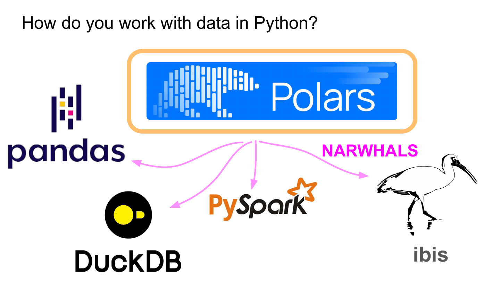

More importantly, you can use a tool called narwhals to write Polars code and execute it on any of the other frames on this slide: pandas, DuckDB, Spark, Ibis. I'll argue Polars and narwhals are the perfect combo for pharma, and specifically for porting the pharmaverse to Python.

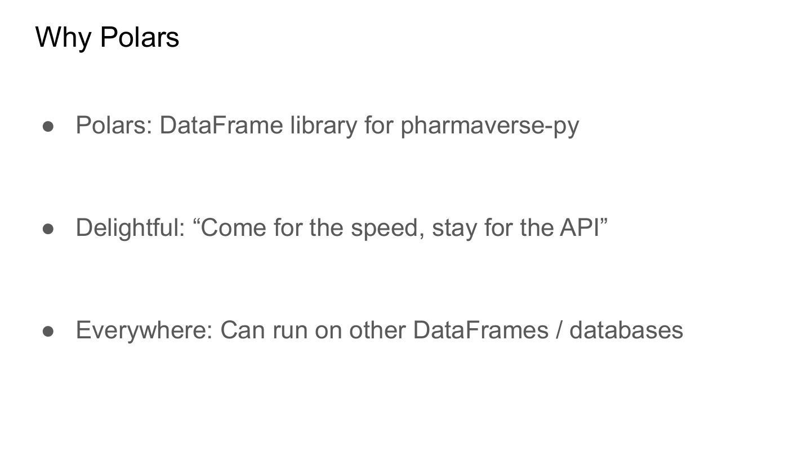

To summarize up front: I think Polars is the right choice of DataFrame library for the pharmaverse-py. It has an easy to use API and is built for speed. And tools like narwhals mean Polars code can run on many backend systems.

The rest of the talk digs into those two points. First, why Polars is the DataFrame for the pharmaverse-py. Then a brief example of Polars code, walking through some of its key features.

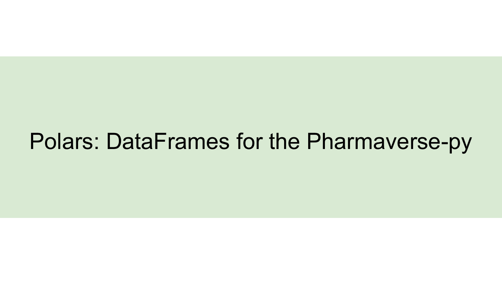

Part one: Polars as the DataFrame for the pharmaverse-py.

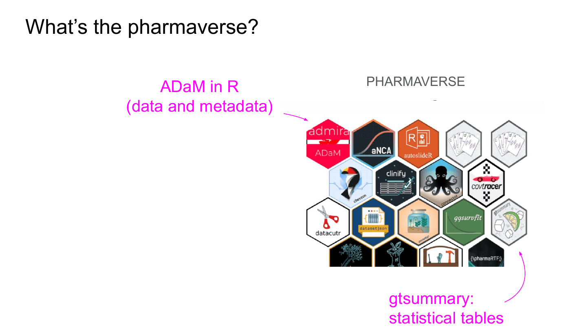

What's the [pharmaverse](https://pharmaverse.org)? It's a collection of R packages that enable the full clinical trial reporting process in R. It includes tools like [admiral](https://pharmaverse.github.io/admiral/) for producing ADaM data in R, and [gtsummary](https://www.danieldsjoberg.com/gtsummary/) for creating tables as part of TFLs (tables, figures, and listings).

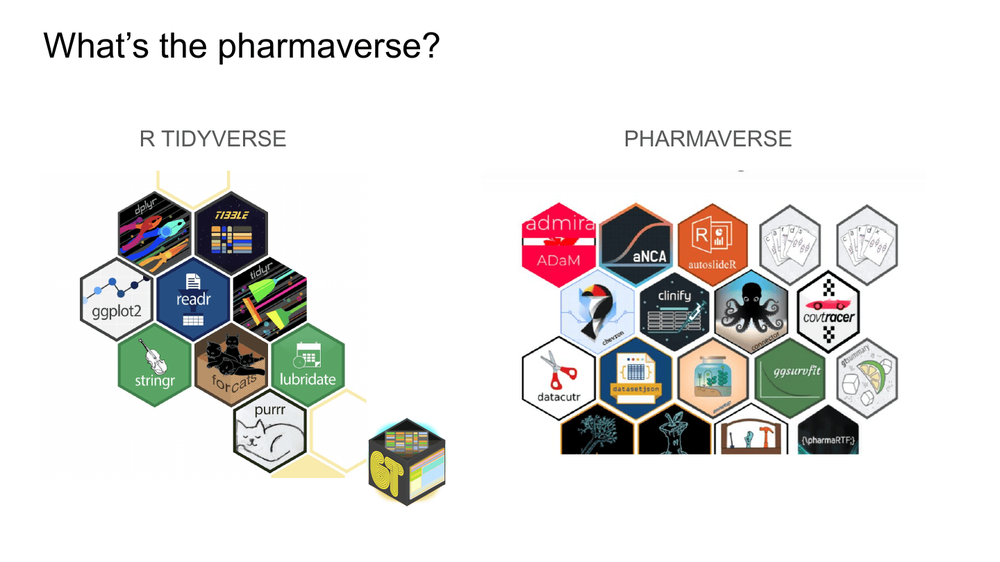

R's [tidyverse](https://www.tidyverse.org) is the foundation of many pharmaverse packages. On the left are key tidyverse packages like dplyr and ggplot2. I've also added [gt](https://gt.rstudio.com), an R package for making tables. It isn't part of the official tidyverse, but it's maintained by Posit.

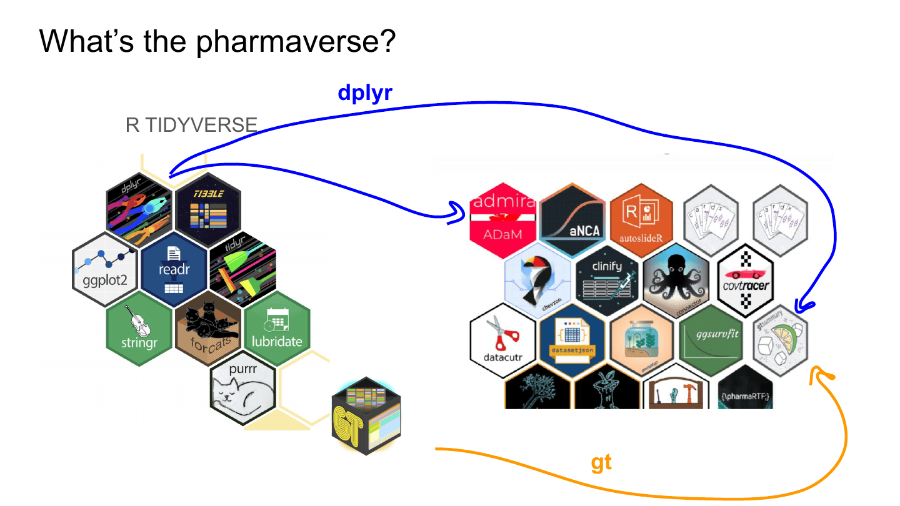

Tools like dplyr are used inside admiral, and both gt and dplyr are used inside gtsummary.

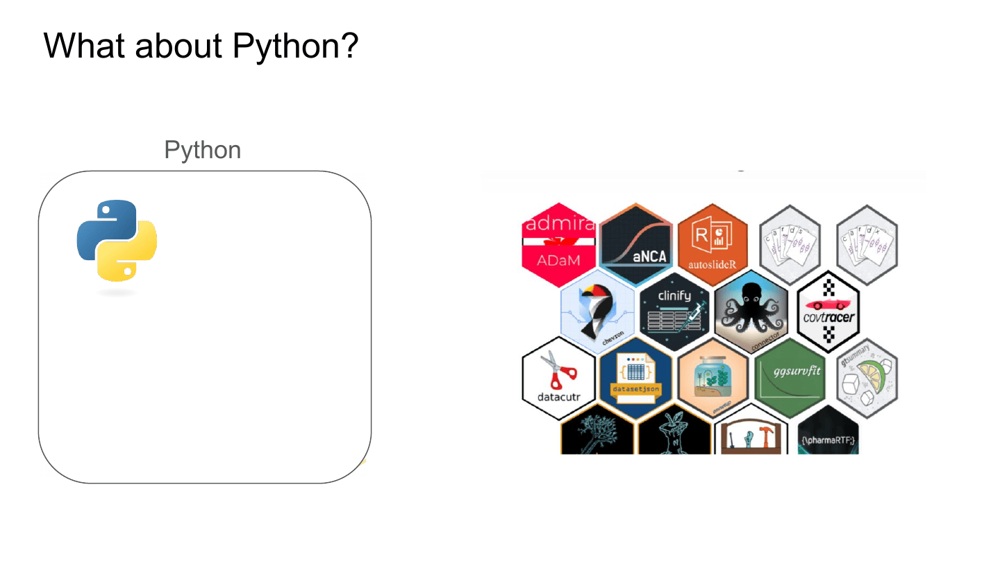

So what would this look like for Python?

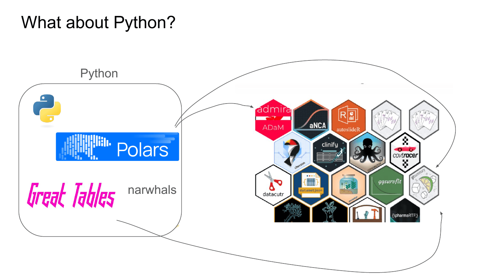

In my mind, Polars takes the role of dplyr, and gets used in a Python version of admiral. Great Tables, a port of gt to Python, could fill gt's role for something like gtsummary.

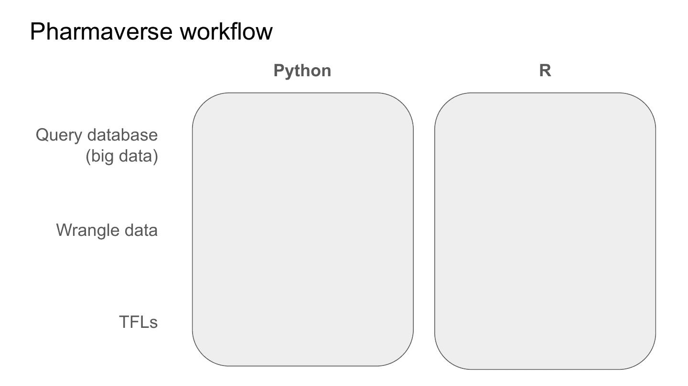

Here's the same relationship shown another way. Python and R side by side along the workflow of querying a database, wrangling the data, and producing TFLs.

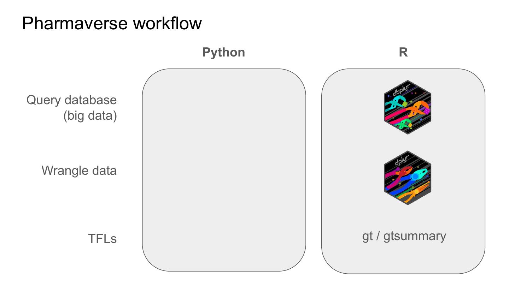

In R, [dbplyr](https://dbplyr.tidyverse.org) queries the database and collects the data, dplyr wrangles it, and gt and gtsummary produce the TFL (or at least the T).

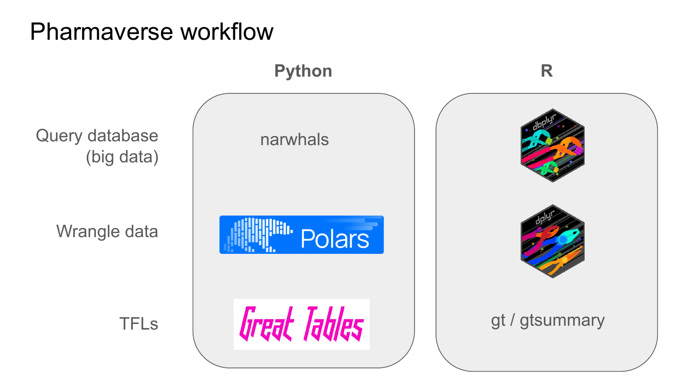

In Python, narwhals queries the database, Polars wrangles the data, and Great Tables could produce the TFL. This also highlights the need for something to fill the role of gtsummary, for example by building on top of Great Tables.

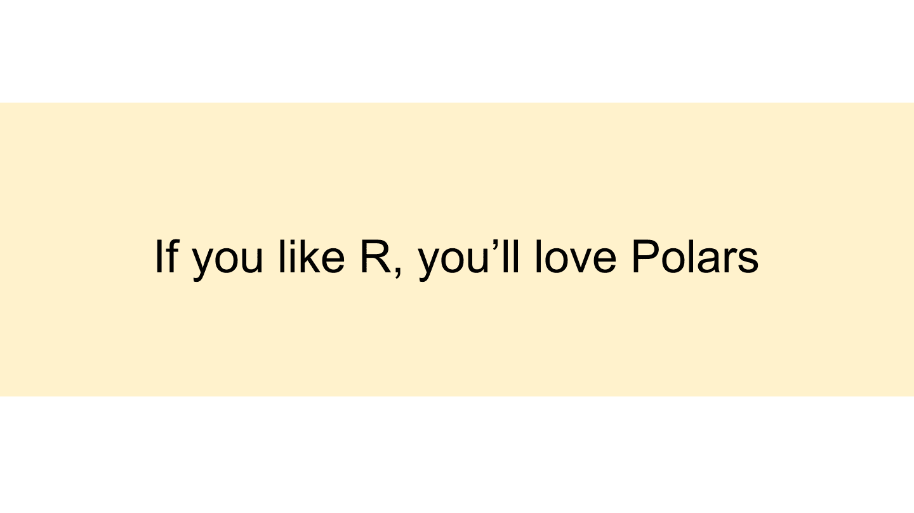

Part two: if you like R, you'll love Polars. In this section I walk through some simple Polars code and highlight key features. If you use R libraries like dplyr, you might notice a lot of similarities.

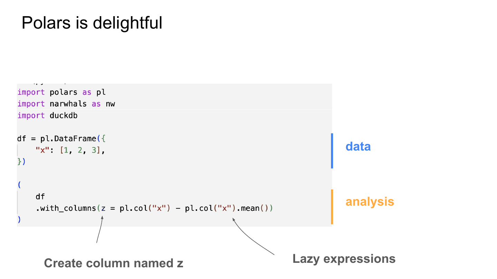

Here's some Polars code. At the top we import polars, narwhals, and duckdb (that last one is for later in the example). In the section marked *data*, we define a DataFrame with one column named `x`.

Then in the *analysis* section, we use `.with_columns()` to create a new column named `z`. Notice the special `pl.col("x")` syntax for referring to the `x` column. We compute `x - x.mean()`. These are called lazy expressions in Polars.

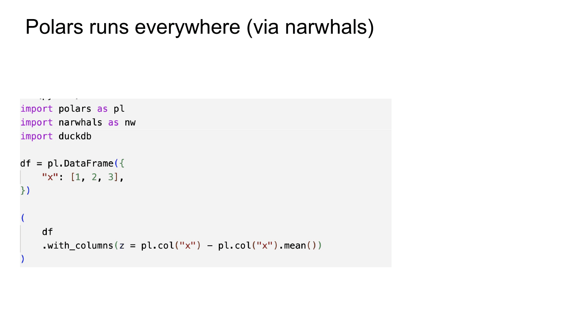

Polars runs everywhere, via narwhals. So I'm going to take this same code and show how you'd swap narwhals in.

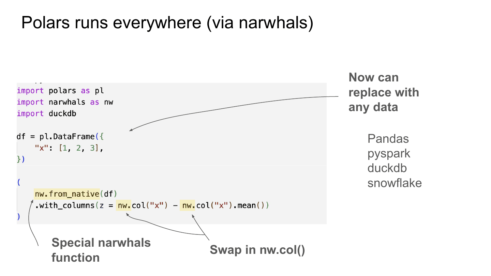

Essentially we used a special `nw.from_native()` function to wrap our DataFrame, then swapped in `nw.col()` where we had `pl.col()`. That's it! This is a boring example, because it's narwhals running on Polars. But narwhals could run on things like pandas, DuckDB, and Snowflake. On the next slide we'll show it with DuckDB.

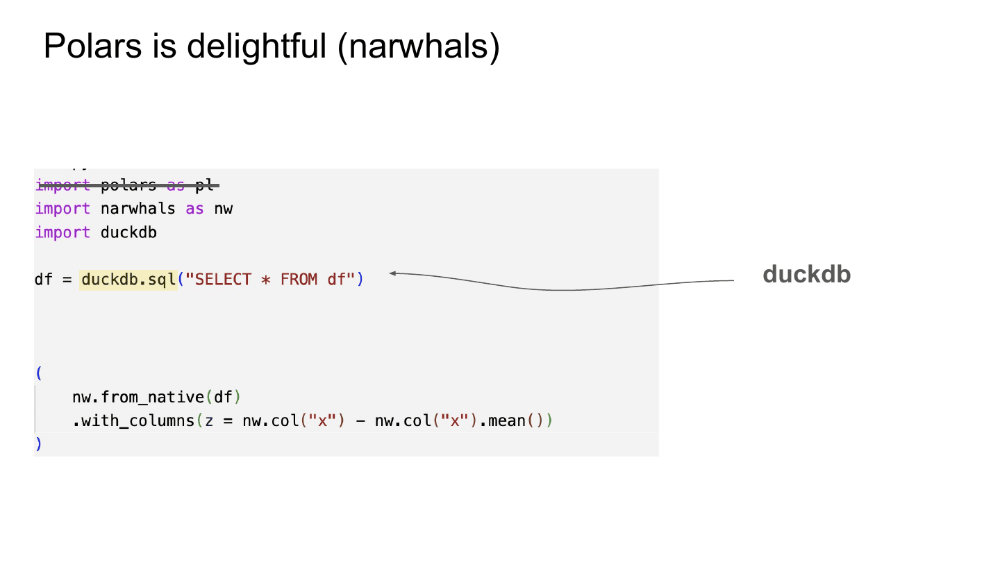

With DuckDB, we can delete the line importing polars, and replace the Polars DataFrame with a DuckDB one. That's it! The same analysis code still works.

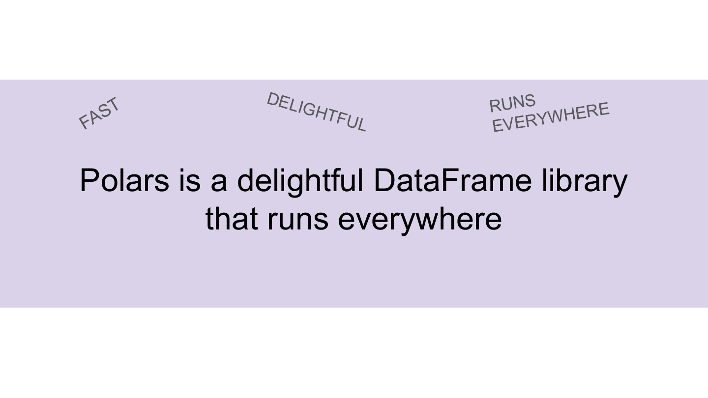

So to summarize: Polars is a delightful DataFrame library that runs everywhere (thanks to narwhals). I'm a huge Polars fan, and excited for the option it opens up: a really nice foundation for building pharmaverse packages in Python.

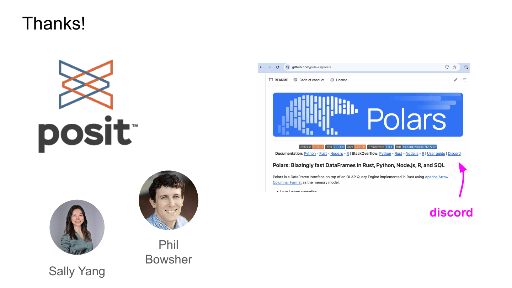

Thanks for your time. And a shoutout to my colleagues at this conference, Phil Bowsher and Sally Yang. If you want to learn more about Polars, I strongly recommend joining its [Discord community](https://discord.gg/4UfP5cfBE7), linked from the [Polars README](https://github.com/pola-rs/polars).
