This is an annotated version of my talk "The Curse of Documentation", given at posit::conf(2025) in Atlanta in September 2025. You can watch the [video](https://youtu.be/ML8z8xkqIA0) or flip through the [original slides](https://docs.google.com/presentation/d/1Qyh5cl339Sjgyn0mPo3rWh3EvTB7a0A3oK7JTVgnfkg/). The talk is about why documentation sites so often have tons of information but not the information you need—and how a good user guide breaks that curse.

The takeaway: docs become cursed when there's nothing between one polished example and an API reference of 105 tiny functions—and a user guide is the thing that fills that middle layer. The talk builds this up through three activities a user guide performs—**strategy** (naming mid-sized concepts, like structure, format, and style in Great Tables), **induction** (using concrete examples to teach general ideas), and **task sequencing** (choosing what a newcomer should meet first)—and then walks through five steps for creating one.



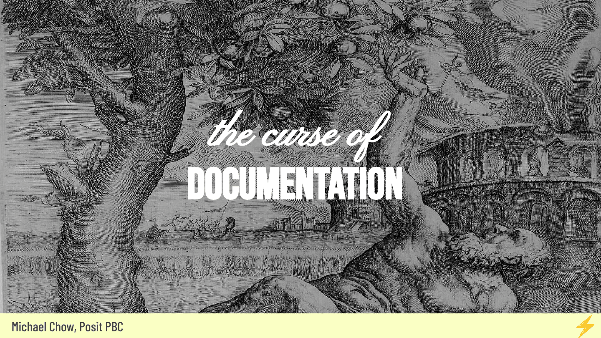

I'm Michael Chow, a software engineer at Posit PBC, and I'm excited to talk about how documentation is **cursed**. I'm really interested in documentation for open source tools—and as we go, I'd like you to think about documentation you've looked at for tools you were interested in. Have you ever looked at a documentation site and felt like it's loaded up with information, but it's not really the information you need? I'd say that documentation site is cursed.

To dive into what that means, we have to go back 2,500 years to the Greek myth of Tantalus, who was cursed to stand under a tree where branches of fruit hung right above his head, with water at his feet. When he reached up to grab the fruit, it blew beyond his grasp; when he went to drink the water, it receded so he couldn't reach it. What he needed was forever at arm's length.

Cursed documentation is worse than merely bad documentation, because it **tantalizes** you with the promise of the answers you need. You can see the docs, but it's really hard to figure out how everything fits together.

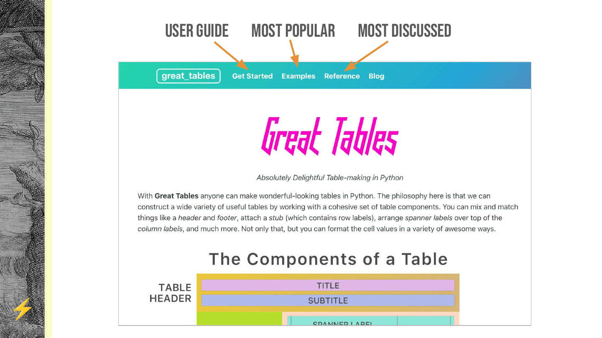

I think in 99% of cases, the solution is a really good **user guide**. So I want to cover what a user guide is and does, and then five steps for creating one.

I'll use [Great Tables](https://posit-dev.github.io/great-tables/) as the example—it's really hard, I think, to do a good user guide here. The Great Tables docs have two really recognizable pieces: an [examples gallery](https://posit-dev.github.io/great-tables/examples/), which is the most popular page on the site, and an API reference, which is all the little pieces laid out. But the piece we probably spent the most time teasing out is the user guide.

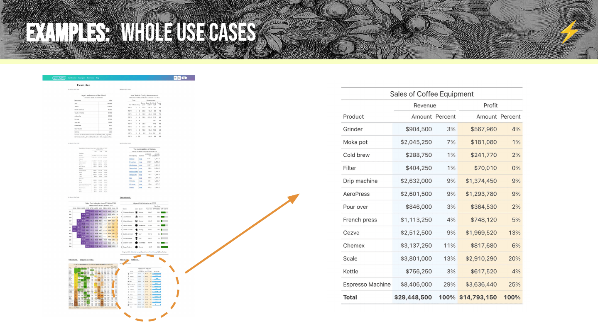

To show what a user guide is and does, let's go through the examples and reference as if they were the only documentation we had. Say you're looking at Great Tables for the first time and you pop open the examples page. It's the most popular page because it shows real-life use cases at a glance—it really highlights why you'd use Great Tables and realistic things you could do with it. Maybe you pick out this coffee table, which represents the sales of a fictitious coffee equipment supplier. It shows off a lot of nice things: elements like a title, filled backgrounds, and styling like bolded text.

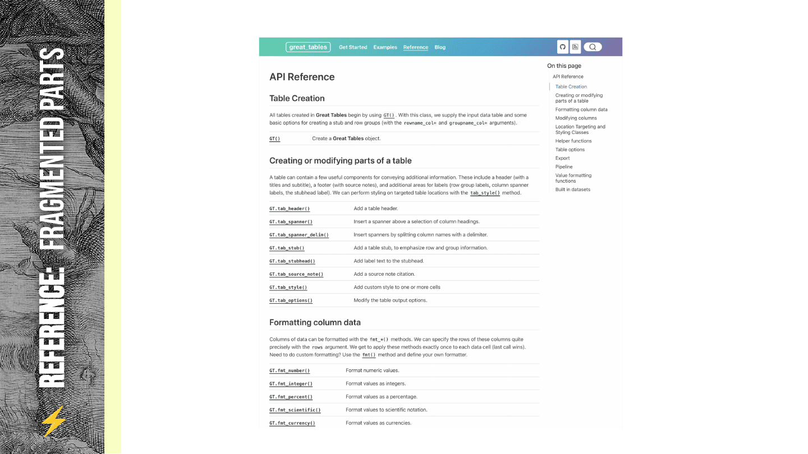

Say you want to take that table and adapt it, so you dig deeper and open the API reference. What the API reference is, basically, is a big list of functions, categorized a little bit, with a lot of pages that just go into detail on all these tiny pieces.

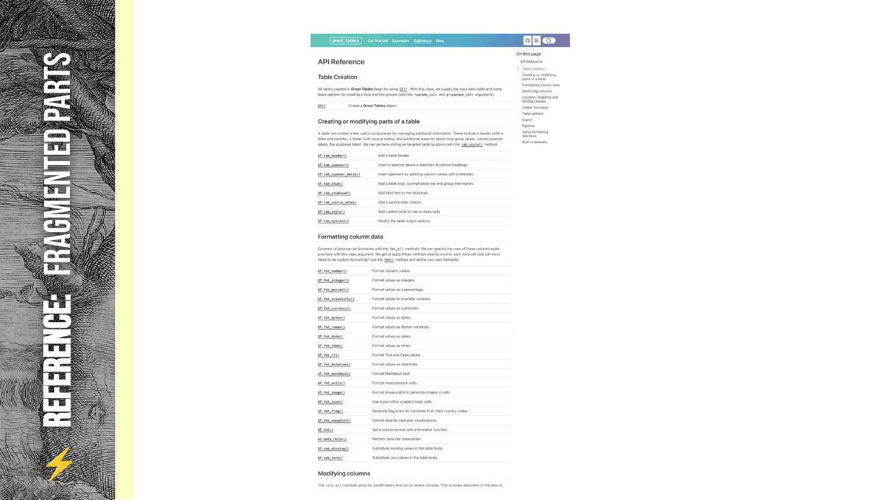

But what I'm showing here is not the full story. As it turns out, API references are pretty big—even this isn't quite it.

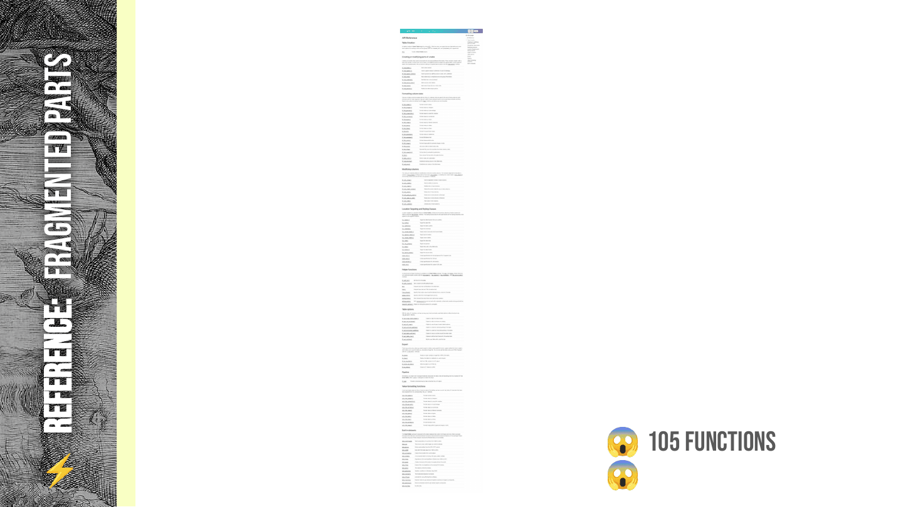

It's something more like this. So you've got one neat example in your hand, and you've got **105 functions**. At this point, I think you're a little bit cursed.

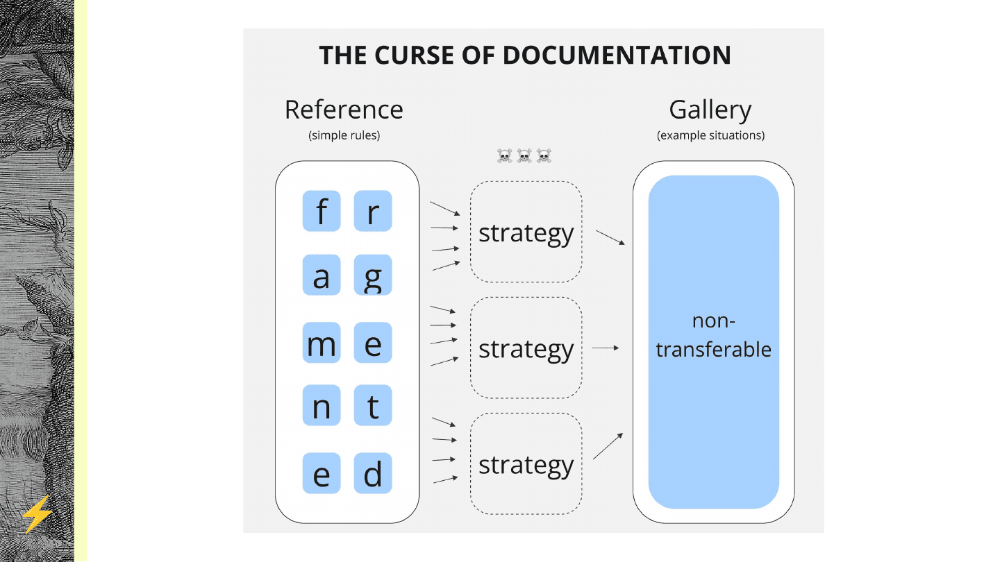

What you're missing is the middle-sized chunks: the **strategies** to break examples down into the tiny pieces, and to know how to remix things for your own problems. And that's exactly what a user guide does.

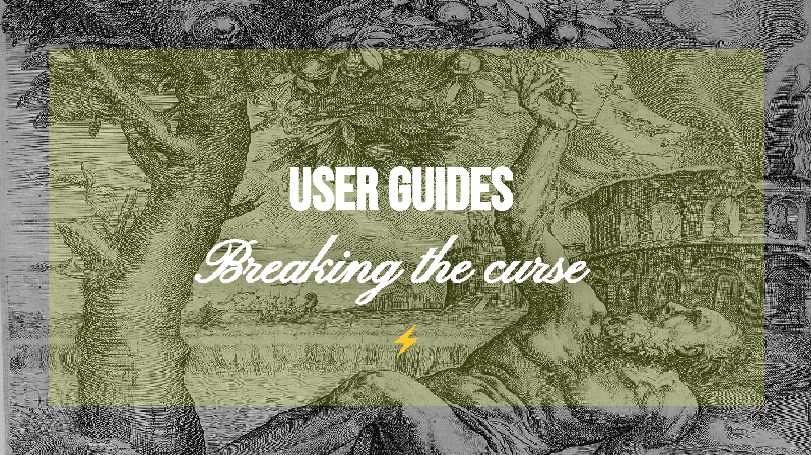

So how can we break the curse? If I have one really neat example in my hand and the absolute deluge of 105 little tiny functions, how can I find what I need?

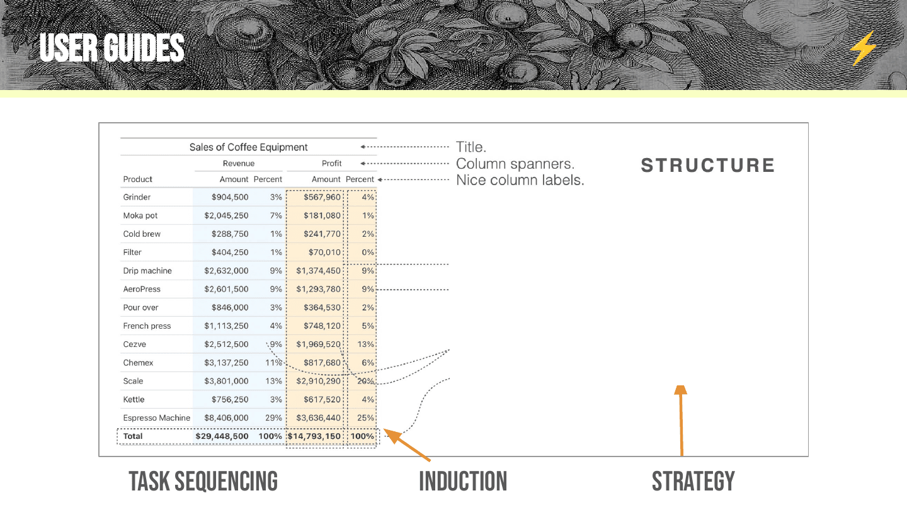

The key is that a user guide can really help you understand the big structure of examples and the big pieces for your problems. If we're onboarding you to this example, we might flag a key piece called **structure**: things like the title, the column spanners, or the fact that you can clean up column names. We might also point out **formatting**—taking values and turning them into currencies or percentages—and **styling**, like coloring the background of a column or bolding a row of text.

The point is that we've flagged three big activities that sit in between the tiny chunks and the examples. I'll call these **strategic components**. This is also a really good use of **induction**: using a case study, a concrete example, to teach general ideas. The other challenge for user guides is **task sequencing**: it's super hard to figure out which example to even start with, and how to weave through an example to break it down for people.

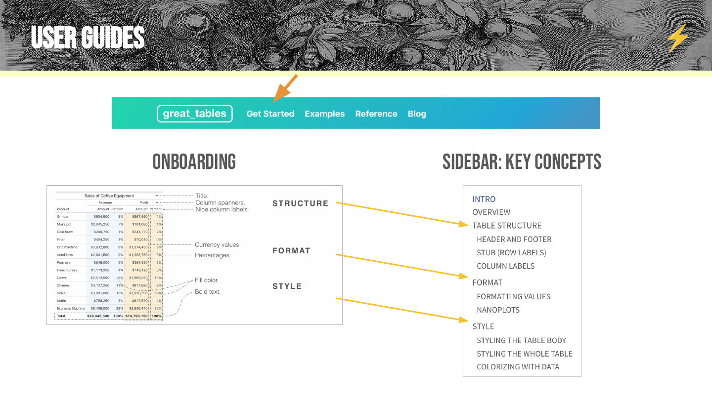

This is the crux of what a user guide is and does: getting a really good onboarding, so someone has an end-to-end example—and then, instead of flagging 105 functions, flagging something like 10 to 15 big concepts you want people to know. That gives them a digestible way to break stuff down.

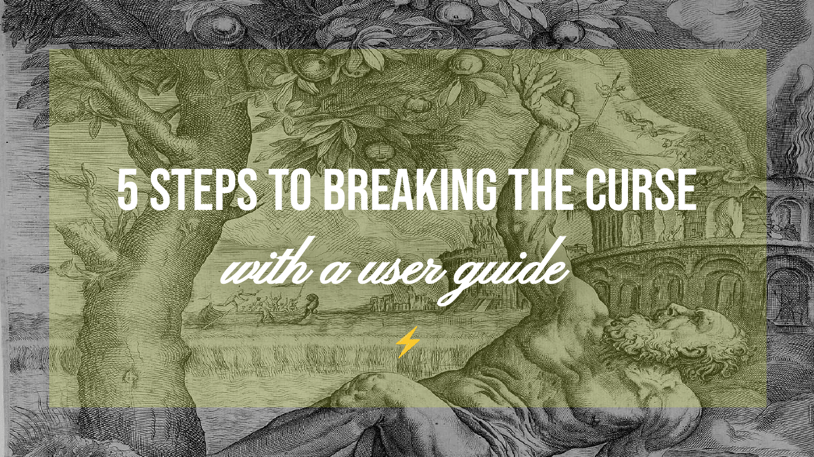

I want to spend the rest of my time on five steps I think are important to breaking the curse—how I would approach designing a user guide. I find user guides really tricky.

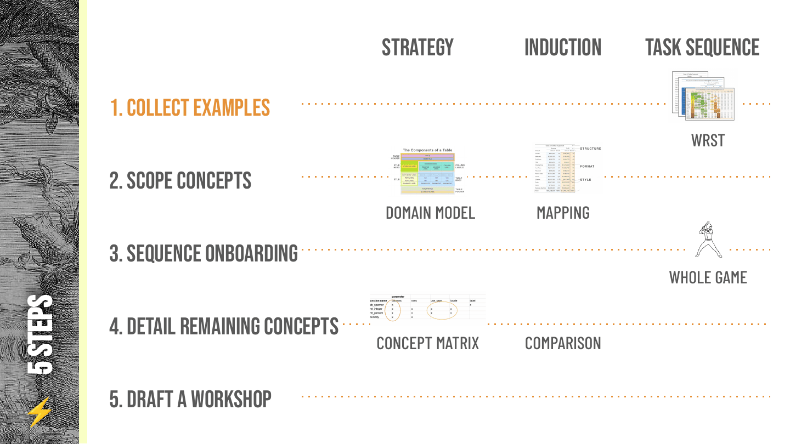

Working with [Rich Iannone](https://github.com/rich-iannone) on Great Tables and [Pointblank](https://posit-dev.github.io/pointblank/), one interesting thing was that Rich had worked a lot with these libraries, and I came in with no idea what they did. So Rich just had to hit me with example after example—beat me over the head with examples—until some idea of the pieces came out. This five-step process emerged from me trying to figure out how to pull a user guide out of libraries I had never used before:

1. **Collect examples**
2. **Scope concepts** — break the examples apart
3. **Sequence onboarding** — figure out how you'd get a new person to understand the crux of what your library does
4. **Detail remaining concepts** — the big pieces left over
5. **Draft a workshop** — which I think of as the documentation form of touching grass: being sure your documentation is meant for humans, and seeing when they have a bad time or a good time with it. (I hope they have a good time, but usually they have a bad time when I run workshops.)

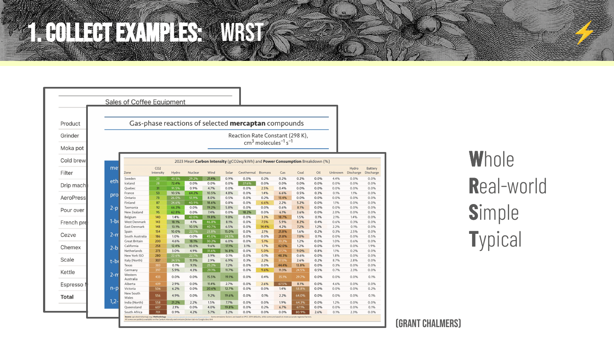

The first step is collecting examples, and the key is to get the *worst* examples—**WRST**: **W**hole, **R**eal-world, **S**imple, **T**ypical. You want a real, complete example you might see in the wild, that's not too bananas to hit people with, and that someone doing this type of thing would do. One challenge you've probably seen in docs is lots of examples that are little tiny pieces, where the pieces don't add up. Ensuring examples are whole and real-world makes sure you're tackling real problems, and simplicity is all about making sure a newcomer can digest it.

We settled on these three tables as reference points. Rich created the one on chemical compounds—he has a PhD in chemistry, so it's a table that's real to him, and it was useful for seeing some of the additional things you can do with Great Tables. The carbon emissions table we pulled off social media from Grant Chalmers. One neat thing about it is that it's a blend between a table and a heat map, so it introduces really interesting concepts: how do you create a heat map table, make sure the columns are the same width, and so on.

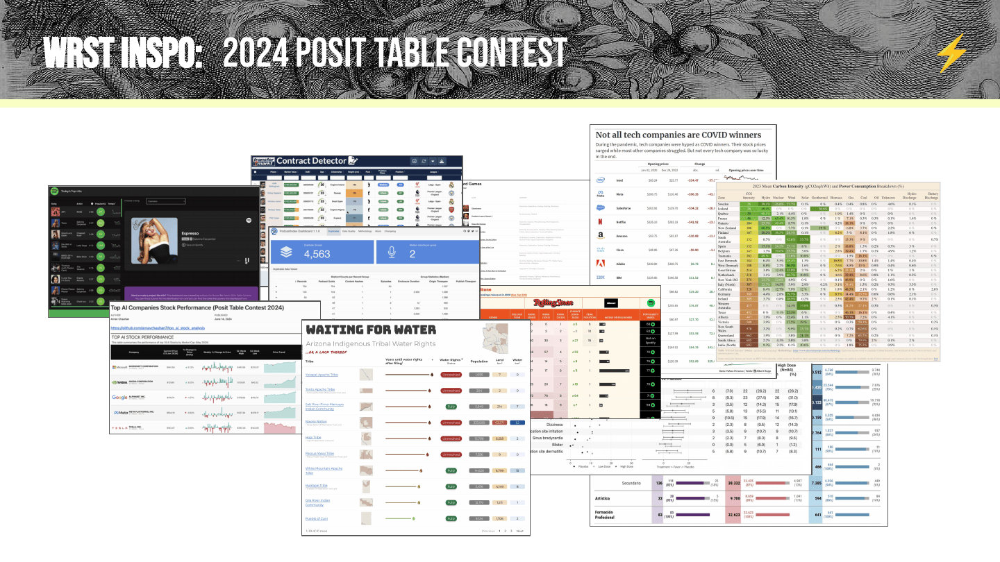

And we had really great inspiration: the [2024 Posit table contest](https://posit.co/blog/announcing-the-2024-table-contest/). Rich and Curtis Kephart have run the contest for the last few years to collect people's neatest, worst-iest examples. It was a great way to see the range of things people might do, and the variation across real use cases.

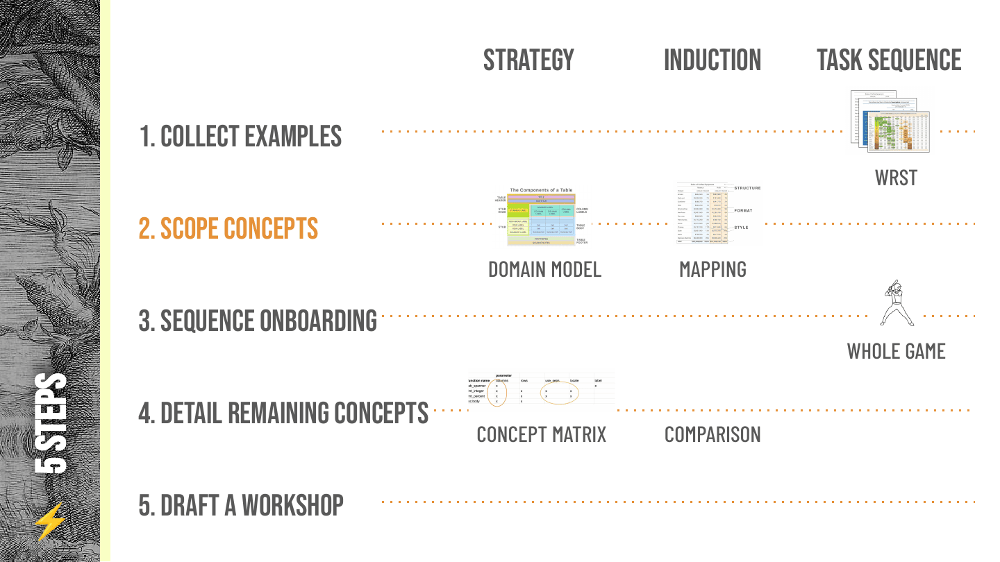

That's collecting examples and doing your worst. Next is scoping concepts: breaking the examples apart.

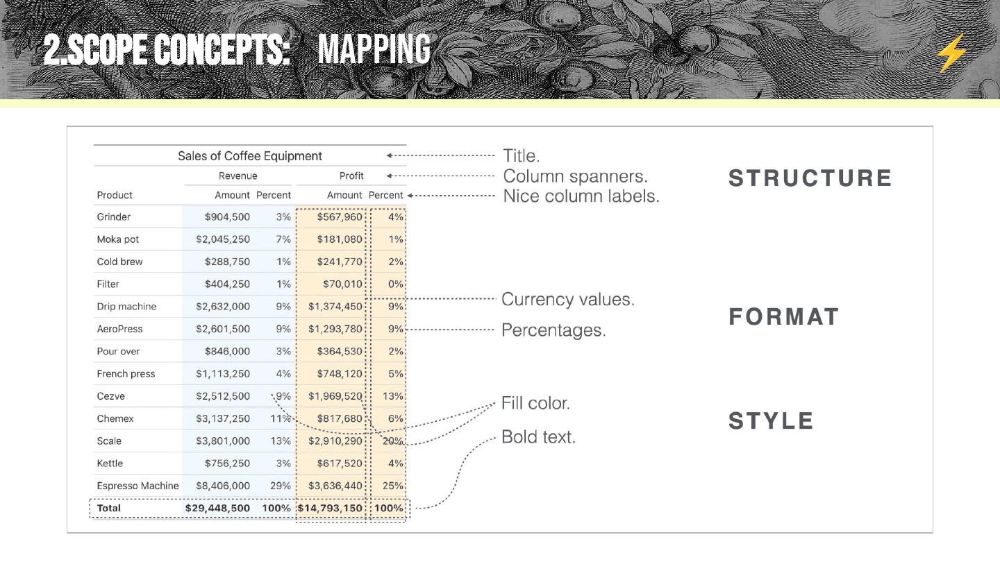

The key thing I want to emphasize here is that **mapping concepts** is so important. As Rich produced example after example, we had them in whiteboarding software and were just marking them up like crazy. This idea of structure, format, and style has caught on a bit—we've seen people use it when teaching workshops, and it's been really helpful for structuring our docs—but I can't emphasize enough that when we started this task, we didn't know these were the concepts we'd use. We had to do tons of diagramming over examples to figure out we might use them.

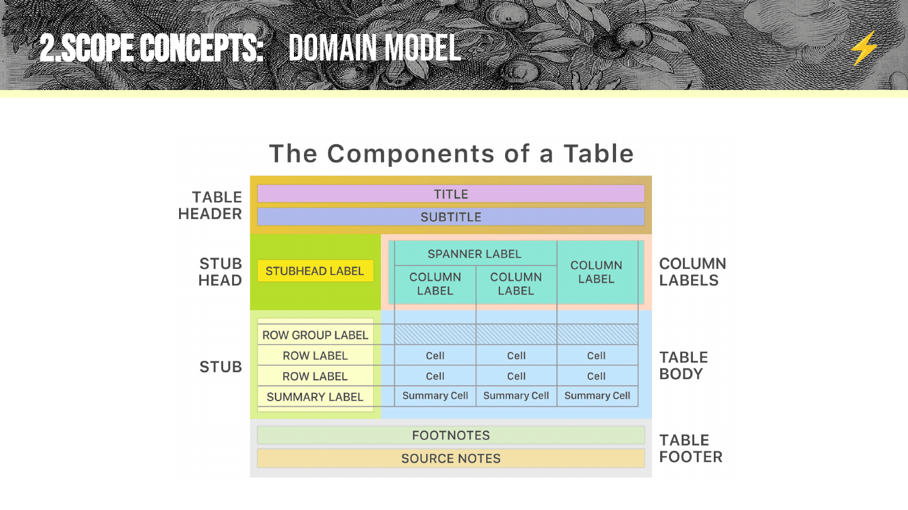

Rich also produced this really great **domain model**. He dove into the idea of table structure and made a diagram of all the different parts you might customize in a table. It's a really neat way to emphasize core pieces of strategy, and it bubbles up into a kind of cheat sheet that people can reference and use to understand your tools.

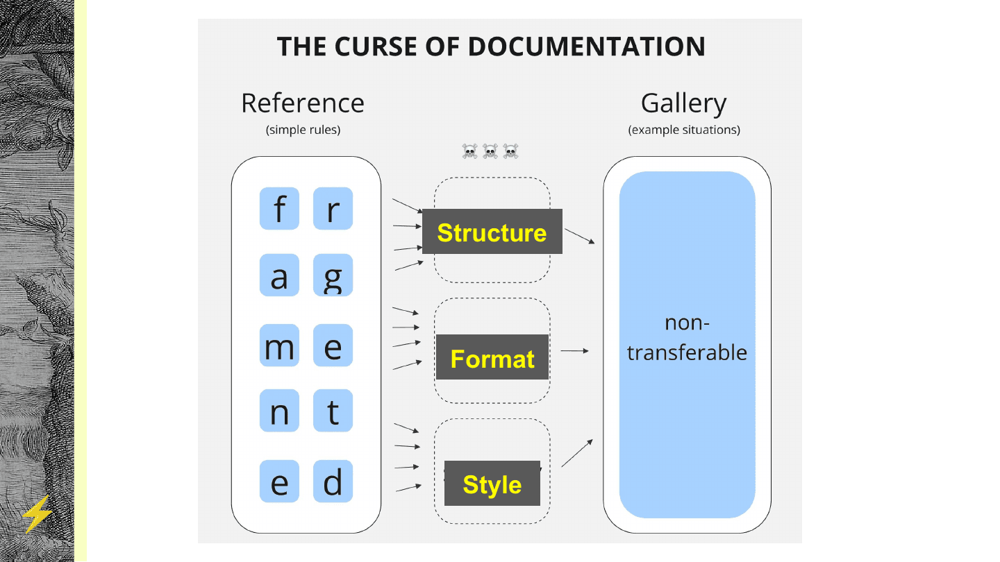

What all this adds up to, for breaking the curse, is filling in those missing pieces. For us, structure, format, and style are really nice things to hang our hats on—they're just a good size for explaining things. You can pull up any example and ask: what are the structure, format, and style pieces? We even organize our code using these concepts.

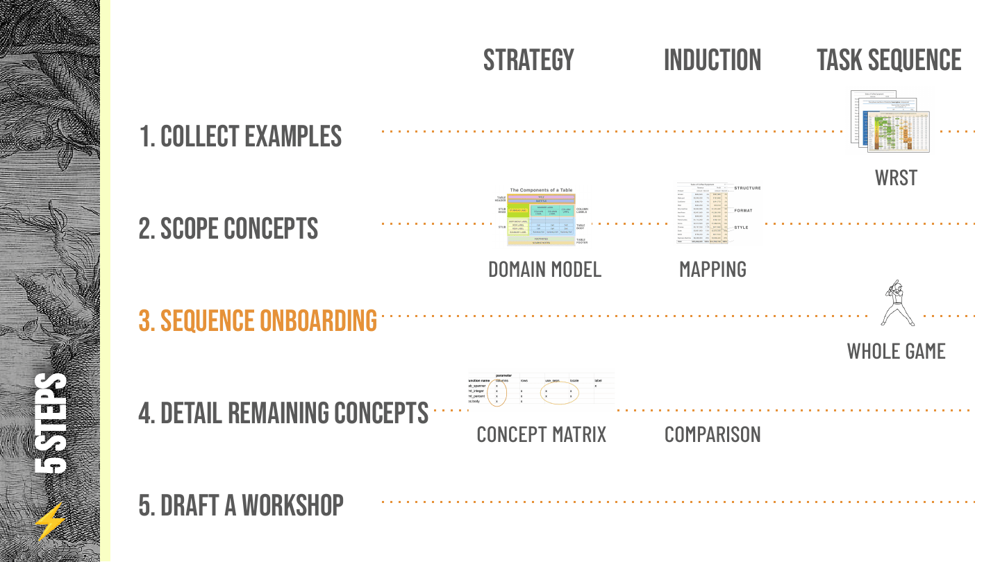

Once you have the examples broken apart into concepts, you're in a good place to sequence an onboarding. I won't go into detail on onboardings—and I'll note that immediately after this, I have a PR to open on the Great Tables docs, because I've cheated. It turns out library maintainers are not great with their docs all the time, and that includes this guy. I need to really flesh out the Great Tables onboarding; I feel like this talk was the inspiration I needed.

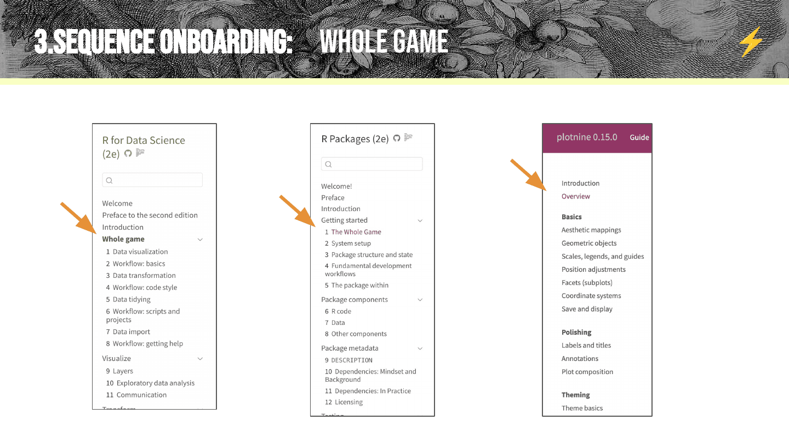

Onboarding has been discussed a lot, and there are a lot of really nice examples out there: [R for Data Science](https://r4ds.hadley.nz), the book [R Packages](https://r-pkgs.org), and [plotnine](https://plotnine.org)—another guide I've worked on—all have really thorough onboardings you can use and reference. I'm not going into detail because this topic is basically its own whole talk, but in general, a lot of these great user guides emphasize the concept of the **whole game**: teach the whole end-to-end picture, so people have the big pieces and a sense of the big game before you go into the individual bits. Take your favorite worst-iest example and basically turn it into an onboarding.

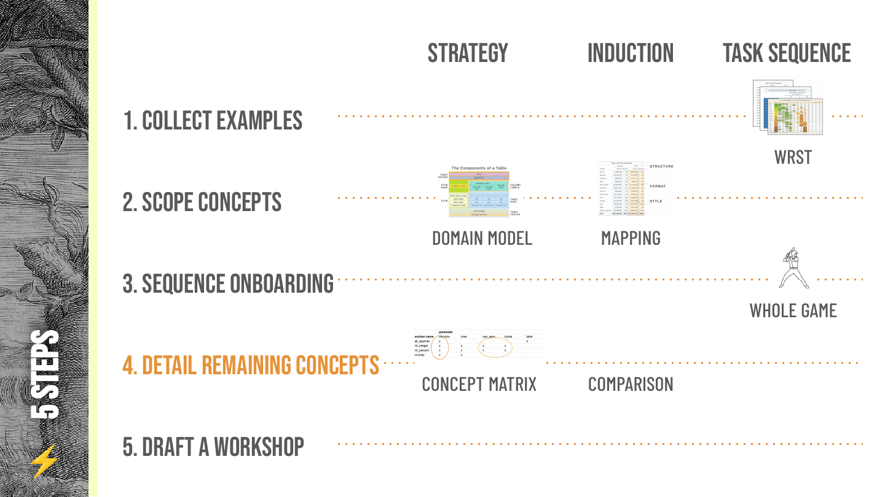

The last steps are detailing the remaining concepts and drafting a workshop. Detailing remaining concepts is one of my favorite topics, because I think most people can get to an onboarding pretty quickly—but there's this kind of "now what?" sense sometimes after you give people their first onboarding piece.

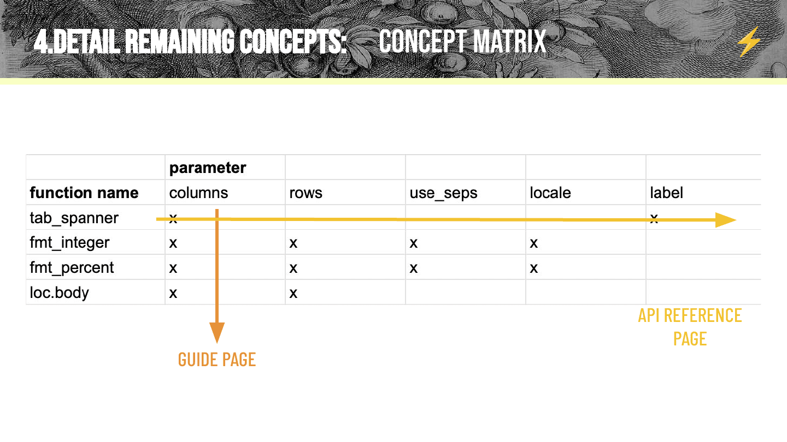

One neat technique I've used is the idea of a **concept matrix**—there are hidden concepts in your documentation. What I do sometimes is put the function names on rows, and the different parameters things can take on columns, just to emphasize shared structure across the package. An API reference usually goes *horizontal*: it takes one function and describes it in detail. What I like about the concept matrix is that it flags where there should be guide pages. Guide pages should be *vertical*: slices that emphasize structure shared across functions—pieces you might not otherwise see in the docs.

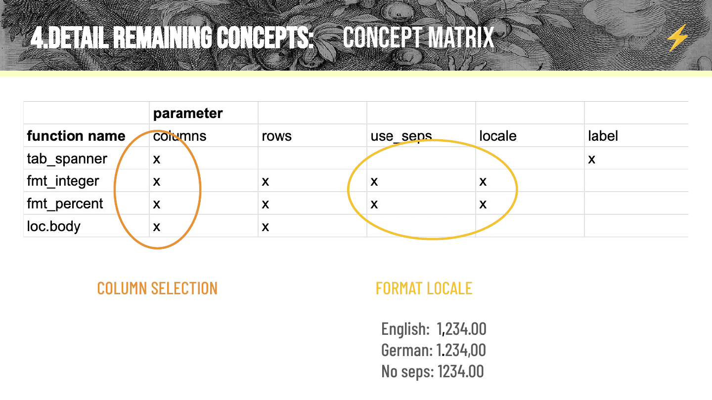

For example, we have a page on column selection. We noticed that functions across the categories—structure, format, style—can all select columns of a table to work on, and there are quite a few options for selecting columns. So it was nice to put it in its own page, where we could flag to users that this is an activity, and even point out some of the functions to show the different places you might end up doing it.

Another interesting one is a formatting pattern: the parameters `use_seps` and `locale` (a word I'd never said out loud before this talk, but have thought a lot) are shared by most of the format functions, and locale sometimes interacts with other parameters. Take the number 1,234: in English you might separate the one and the two with a comma. In German you might use a period—and then a comma where the English period was. And with no seps, you might not have a comma at all. Essentially, locale determines how numbers get formatted, and it interacts with other things. A user clicking through your reference is just going to hit the definition of locale over and over and over. Instead, one guide page can surface this dynamic across a bunch of different functions and show you where it comes up.

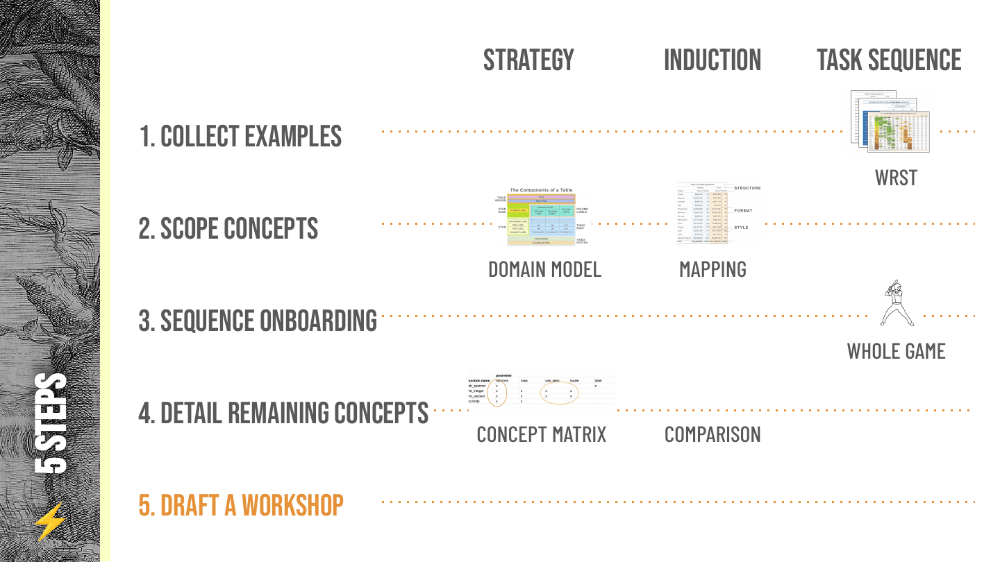

I'll go quickly on the very last piece: the workshop.

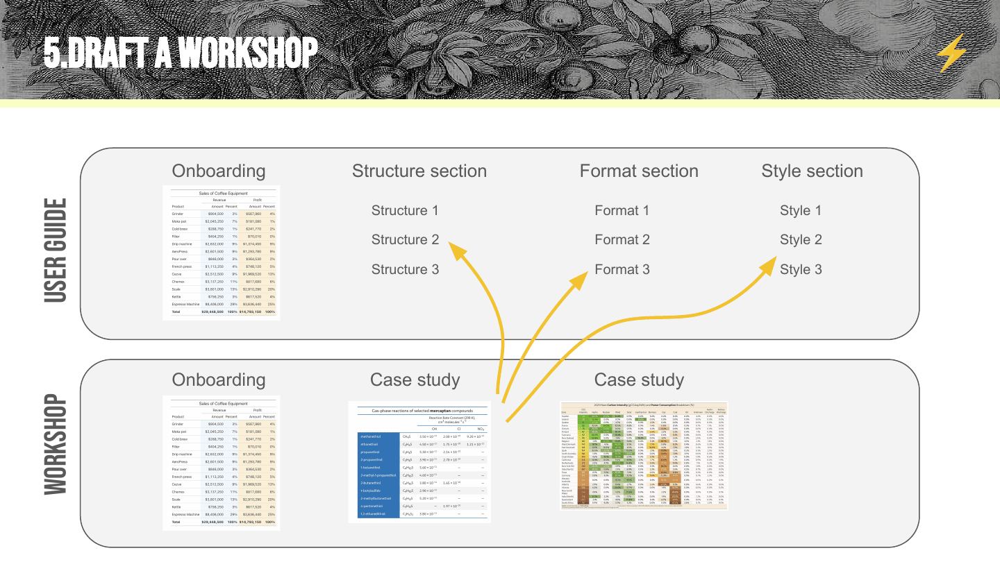

For the user guide, we usually break things down by topic. For the workshop, we go by case study—and the case studies are usually able to link back into the guide. This has been really helpful for us, because people can graze the user guide, and then we use the case studies to say: here's the slice across topics you need to do the next most interesting thing.

So that's the whole idea of the five steps. If you find any cursed docs, please send them to me—I'm an avid collector.

(In the Q&A afterwards, someone asked: how much documentation is too much documentation? I don't think you can have too much—but I do think the odds of it becoming cursed grow the more documentation you have.)
