This is an annotated version of my talk "PyPharma: Modernising Clinical Data Transformation", given at the PHUSE Single Day Event in West Windsor, NJ in July 2026. Last year at the same event I talked about building the pharmaverse in Python with polars. This year's talk picks up from a very different 2026: the year AI shook up how tools get built—including for the people who built the Python data stack. It's about what "agentic engineering" means for a room full of clinical statistical programmers, and why I think their QC culture is the scarce skill, not any particular language.

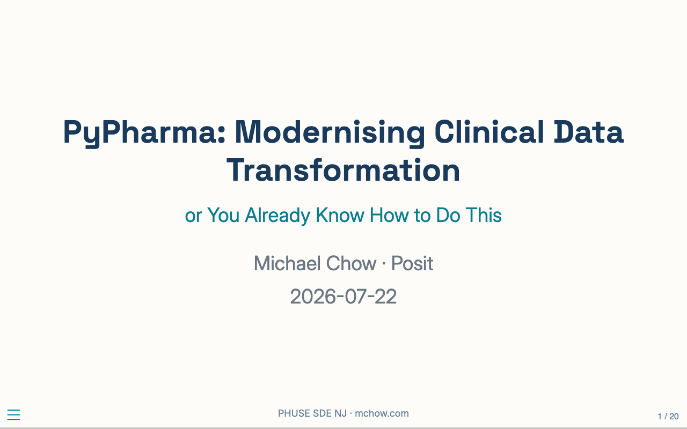

The subtitle gives away the thesis up front: *or, You Already Know How to Do This*.

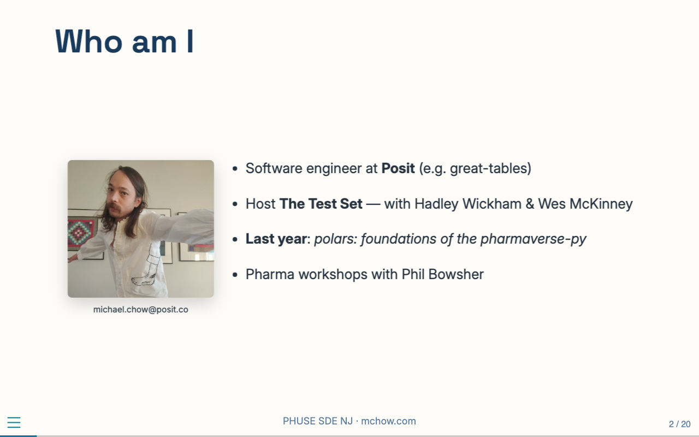

I'm a software engineer at Posit, where I work on tools like [Great Tables](https://posit-dev.github.io/great-tables/). I also host [The Test Set](https://thetestset.co), a podcast with Hadley Wickham and Wes McKinney—which turned out to be a front-row seat for everything in this talk. Last year I stood in this same room giving a "here is a Python tool" talk about polars. This year I want to talk about what's happening to the *tool builders*, because I think it changes what talks like last year's mean today.

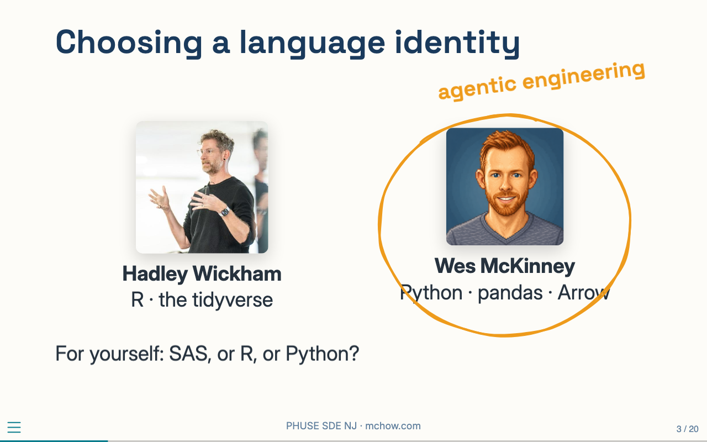

If you're in clinical programming, you've probably faced the challenge of picking a language—or of switching from a language like SAS that you've used for a very long time. For about fifteen years, the data world organized itself around person-language pairs: Hadley *is* R, Wes *is* Python. Our industry has its own version, where careers are built as SAS programmers or R programmers. The language is the identity.

But it's 2026, and that might not be true anymore. Which brings me to what Wes has been up to.

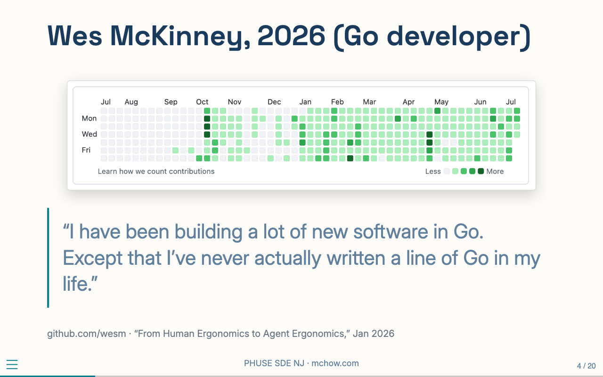

This is Wes's GitHub commit calendar, July to July. Around October he started using AI coding agents, and his open source commits exploded. This is the creator of some of the most popular Python libraries—now programming almost entirely in Go, a language he'd never used before. It's not that he's left Python. It's that language has become an implementation detail to him.

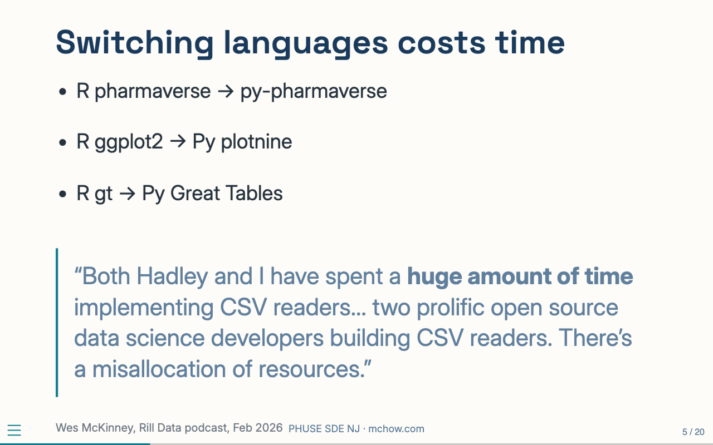

Why does switching languages normally cost so much? Every tidyverse tool needed a pandas twin, and vice versa—ggplot2 begat [plotnine](https://plotnine.org), [gt](https://gt.rstudio.com) begat Great Tables, and a pharmaverse-py would mean redoing the pharmaverse. Our industry knows this pain intimately: think how much effort went into making [admiral](https://pharmaverse.github.io/admiral/) exist because SAS macros couldn't cross over. Even the best people in the field spent years paying this tax—two prolific tool builders independently writing CSV readers. (The work is a lot less time-consuming now, which is where this is heading.)

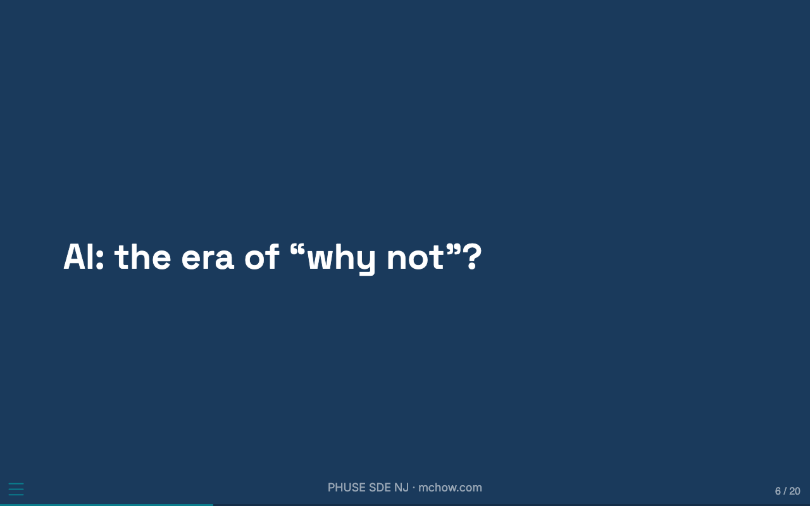

Wes calls this the era of "why not?" He switched to Go, a language he'd never written. Why not?! It's a thrilling idea—and it poses exactly the question the second half of this talk worries about.

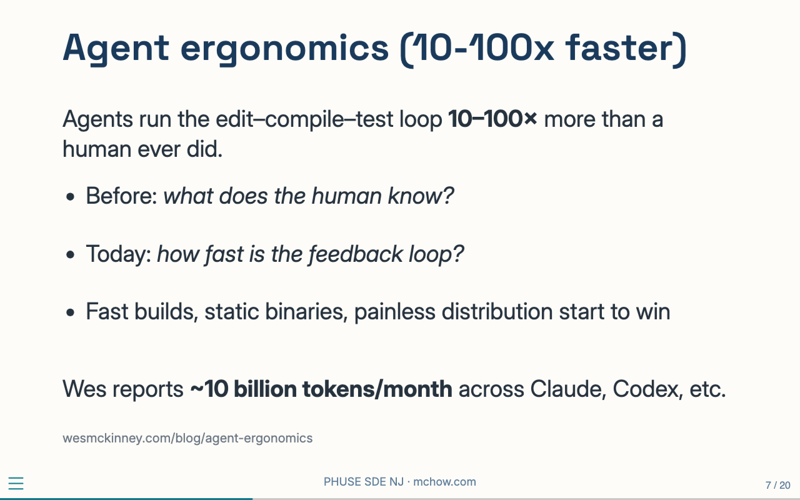

Why Go, specifically? Wes's claim is that when agents do the writing, "human ergonomics in programming languages matters much less." What matters is how fast the edit–compile–test loop runs—agents run it ten to a hundred times more than a human ever did, and Wes reports burning around ten billion tokens a month. The language gets chosen less for familiarity and more for fit to the problem at hand.

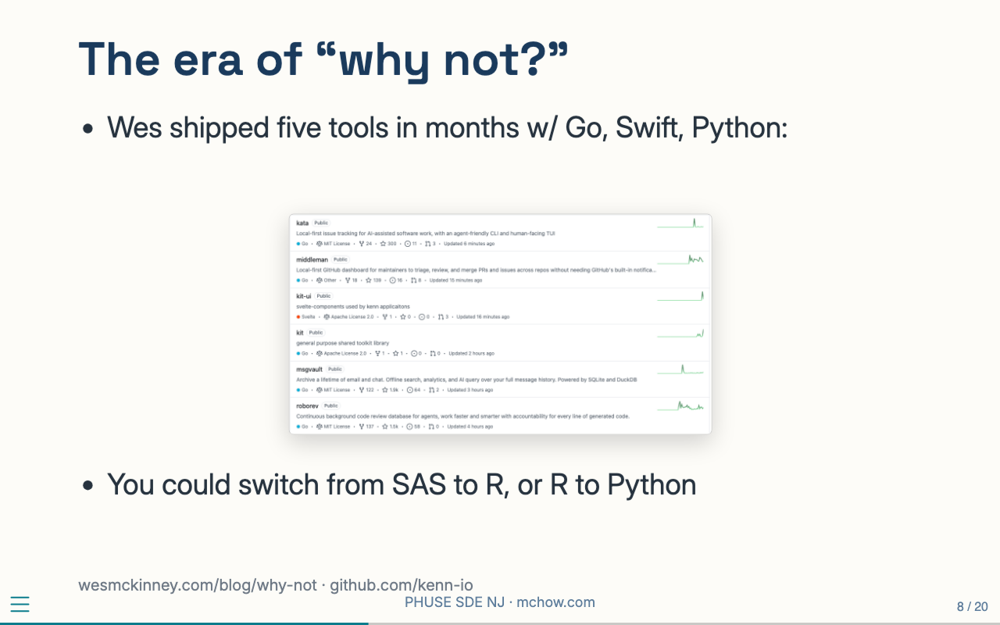

The flip side is that skill gaps stop being career boundaries. Wes shipped five tools in months—the Kenn Software GitHub org is Go, Go, Go, and one Svelte. For this room: why not the R programmer producing a polars pipeline, or the SAS programmer shipping a Shiny app? You could switch from SAS to R, or R to Python.

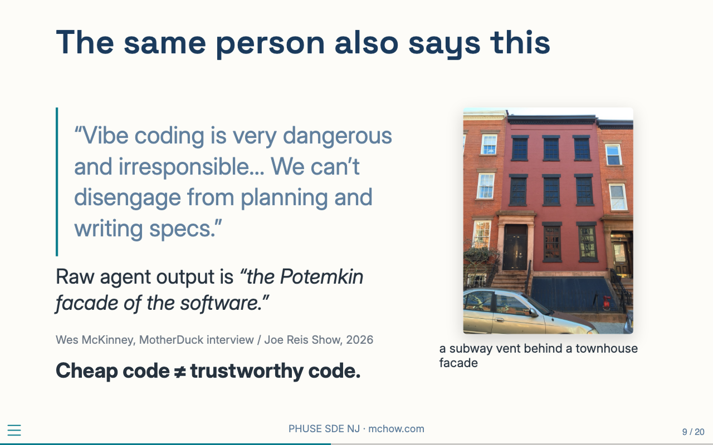

But here's the tension. Wes is all-in on agentic engineering, and he's also the loudest about the risks: "vibe coding is very dangerous and irresponsible," and raw agent output is "the Potemkin facade of the software." If you don't pay attention to the process or the resulting code, you can end up with something that looks great and is total garbage—like this Brooklyn townhouse, which is a subway vent wearing a facade. Cheap code is not trustworthy code.

And paying attention doesn't necessarily mean *reading* all the code. Which brings us to the question at the center of the talk.

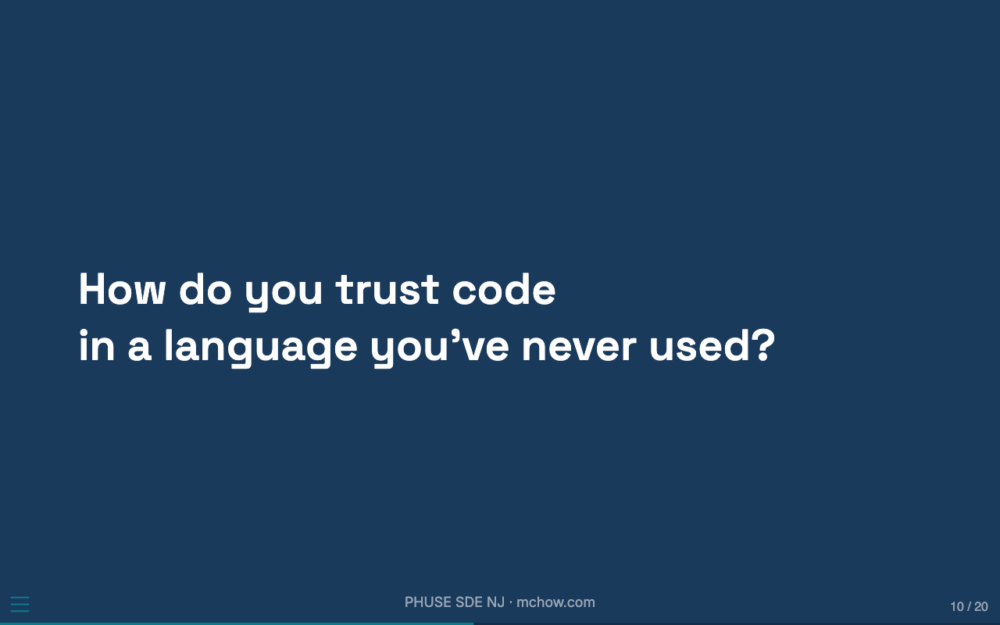

Wes can't review Go the way he reviews Python—he says so himself: "I'm definitely less effective manually reviewing languages I never used pre-AI." So what does he do instead?

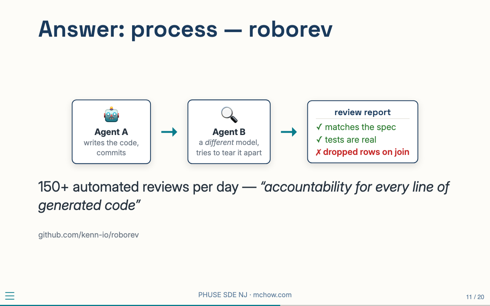

His answer wasn't to study Go. It was **process**. His tool [roborev](https://github.com/kenn-io/roborev) hooks every commit and has a *different* model—deliberately not the one that wrote the code—try to tear it apart, over 150 automated reviews a day. That's agents running independent QC. That's double programming. He hit the same trust problem this industry codified decades ago.

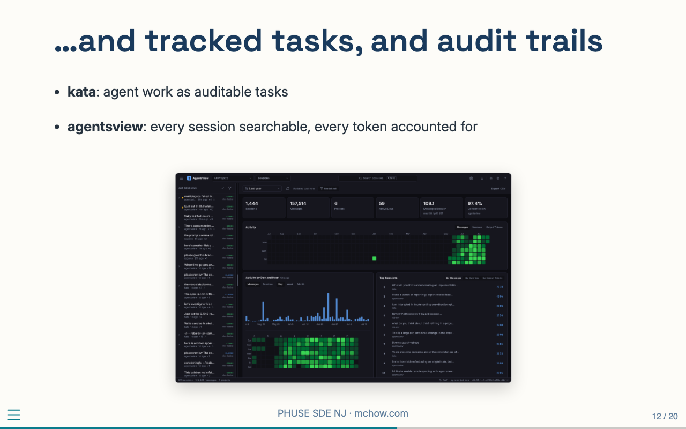

The rest of his stack fills in the picture. kata means no agent work happens outside a tracked task: the agent claims an issue, works it, closes it, all on record. agentsview is what you're looking at here—every session searchable after the fact, every token accounted for. (And if you're running lots of kata tasks and roborev reviews, you generate a *lot* of sessions.)

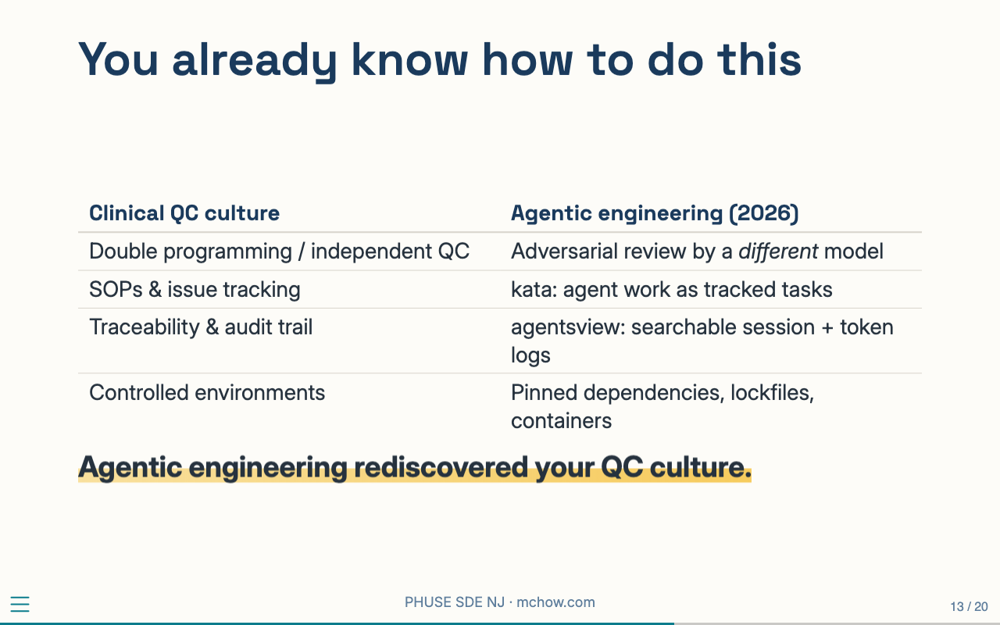

Line them up. Double programming next to adversarial review by a different model. SOPs and issue tracking next to kata. Traceability and audit trails next to agentsview. Controlled environments next to lockfiles and containers. The practices the fastest AI adopters are converging on are the practices this room has refined for decades—because you never trusted single-author code either.

**Agentic engineering rediscovered your QC culture.** You're not behind on AI; the industry's newest discipline is in your wheelhouse. (I'm not a validation expert, and I won't pretend this table is a GxP framework—this is my naive software engineer take.)

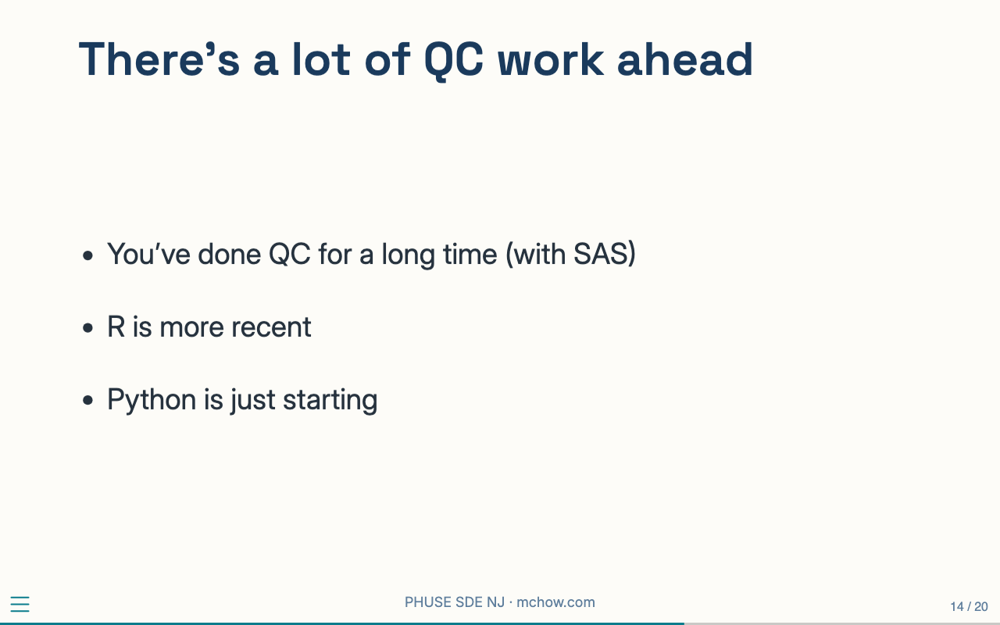

And there's a lot of QC work ahead. You've been doing QC with SAS for a very long time. R's QC story is more recent. Python's is just starting.

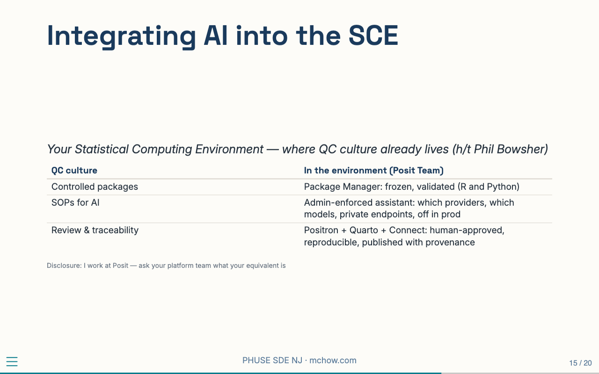

Where does that work happen? Wes built roborev and agentsview because he had no SCE—he had to construct governance from scratch. You have one, and the environment where your QC culture already lives is growing the AI-era controls in place: package repos that are frozen and validated (for Python too, not just R), AI assistant guardrails that are admin-enforced settings (which providers, which models, private endpoints like Bedrock, off entirely in prod), and a review-and-publish chain that stays human-approved and reproducible. The big question for your IT team becomes "which models, from which endpoint, logged how."

Full disclosure: I work at Posit, so ask your platform team what your equivalent is. Credit to Phil Bowsher for this connection—and fittingly, the slides for this talk were served off Posit Connect.

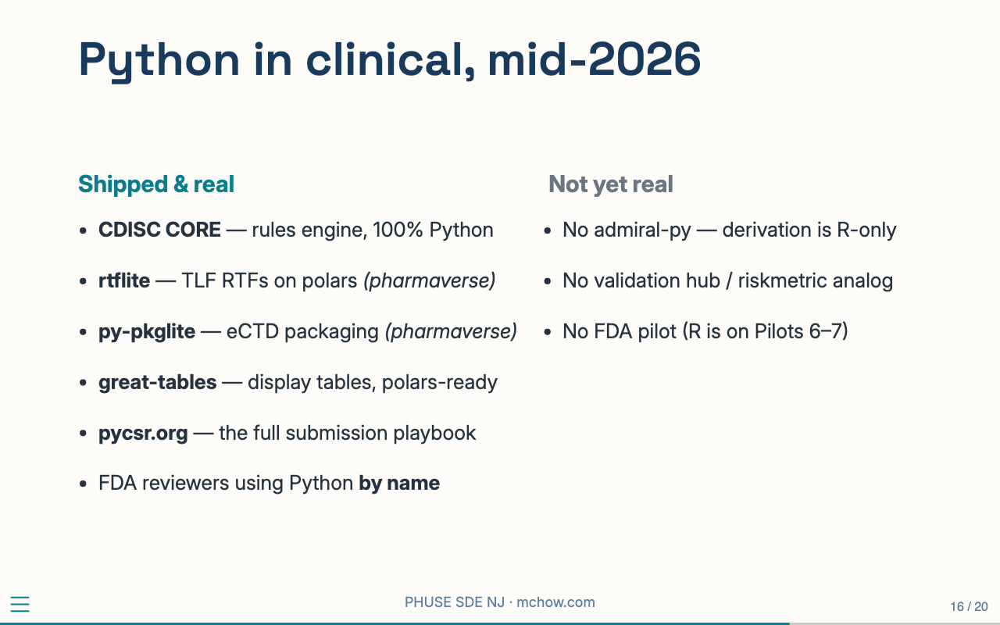

There's been real movement on the Python side of clinical. CDISC CORE—the conformance rules engine—is pure Python. rtflite builds TLF RTFs on polars, py-pkglite handles eCTD packaging, and pycsr.org is a full submission playbook. FDA reviewers have used Python by name: in the [2023 briefing document for Intercept's NDA 212833](https://www.fda.gov/media/168215/download) (p. 69, Figure 10), FDA review staff made a Kaplan-Meier plot themselves, sourced as "FDA Review staff analysis using Applicant-submitted data adsl.xpt … in Python (Ver. 3)". But honest accounting matters too: there's no admiral-py, no Python validation hub, and no Python FDA submission pilot (R is on Pilots 6 and 7).

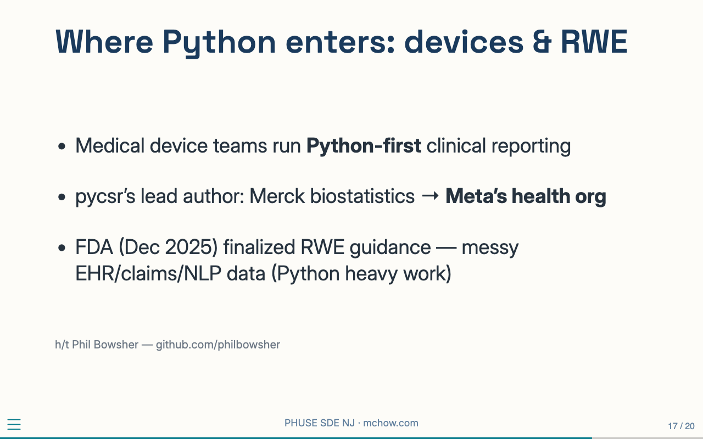

Phil Bowsher keeps making this point: Python doesn't enter submissions through biostatistics departments—it enters through medical devices and real-world evidence, where Python is already the native language. One of the pycsr authors is a good reflection of this, moving from Merck biostatistics to Meta's health org.

There's a regulatory tailwind here too. In December 2025, FDA finalized its [device RWE guidance](https://www.fda.gov/media/190201/download), which drops the requirement to always submit identifiable participant-level data—aggregate and privacy-preserving access models are now acceptable. That favors studies built on EHR and claims data, and the guidance explicitly anticipates algorithms over unstructured clinical notes. The "Python heavy work" label on the slide is my read of where that kind of data work happens, not FDA's.

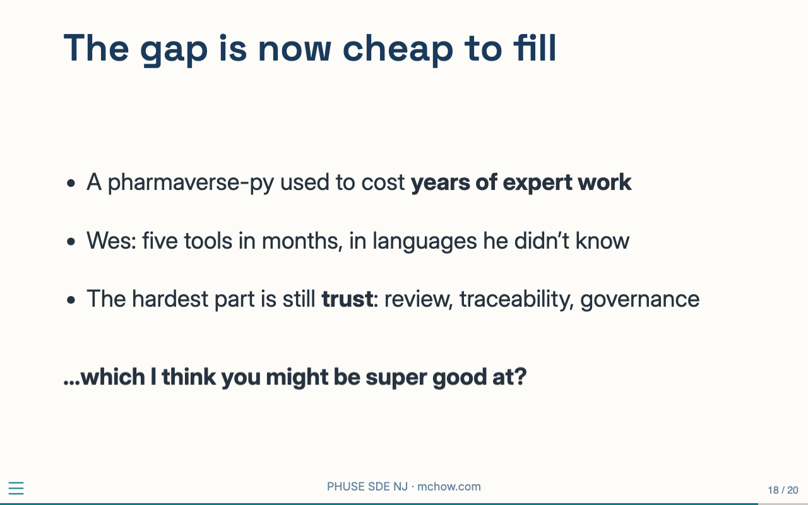

Put the code half and the trust half together. An admiral-py might be very quick to build today. But there's a mountain of trust and compliance work that goes with it—and with any other library that gets ported. The choke point isn't the code anymore; it's trust and governance.

...which I think you might be super good at?

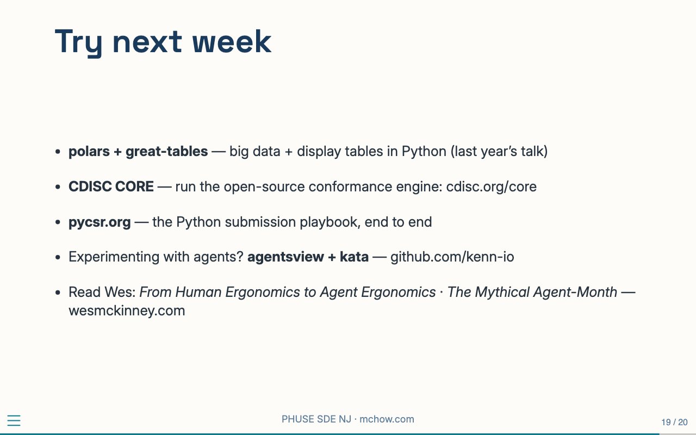

Things you can try next week:

- **polars + Great Tables** — big data and display tables in Python (last year's talk)
- **CDISC CORE** — run the open-source conformance engine: [cdisc.org/core](https://www.cdisc.org/core)
- **pycsr.org** — the Python submission playbook, end to end
- Experimenting with agents? **agentsview + kata** — [github.com/kenn-io](https://github.com/kenn-io)
- Read Wes: [*From Human Ergonomics to Agent Ergonomics*](https://wesmckinney.com/blog/agent-ergonomics/) and [*The Mythical Agent-Month*](https://wesmckinney.com/blog/mythical-agent-month/)

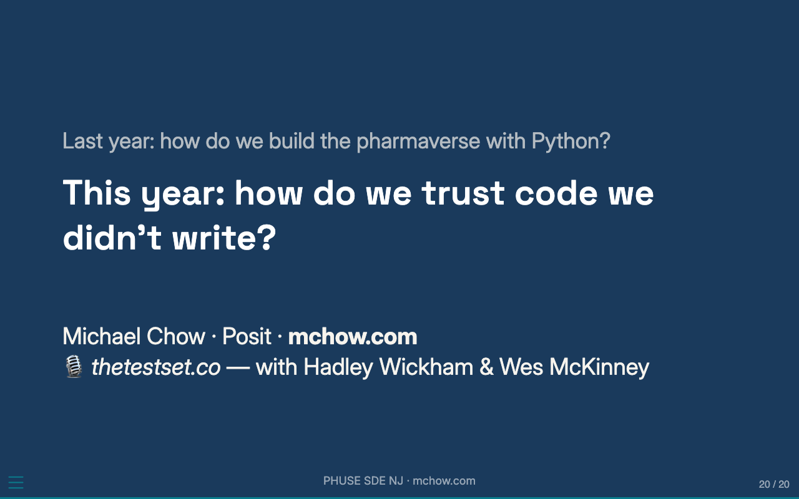

Last year I pitched how to build the pharmaverse in Python. Then 2026 turned out to be a real shake-up—including for the person who built so much of the Python data stack. So this year the question changed: how do we trust code we didn't write? My case in this talk is that you answer it the way you already do—review, tracked work, audit trails. There's a big opportunity to take the lessons coming out of agentic engineering, and this room is unusually well-prepared for them.

## Sources

- Wes McKinney — [*From Human Ergonomics to Agent Ergonomics*](https://wesmckinney.com/blog/agent-ergonomics/), [*Why Not?*](https://wesmckinney.com/blog/why-not/), [*The Mythical Agent-Month*](https://wesmckinney.com/blog/mythical-agent-month/)
- [Rill Data podcast](https://wesmckinney.com/transcripts/2026-02-10-rill-data-podcast) (Feb 2026) and [Joe Reis Show](https://wesmckinney.com/transcripts/2026-04-08-joe-reis-ai-agents-mythical-agent-month) (Apr 2026) transcripts
- Kenn Software — [kenn.io](https://kenn.io) · [github.com/kenn-io](https://github.com/kenn-io)
- Posit blog — [*The Prolific Output of Wes McKinney in the Age of Agentic Engineering*](https://posit.co/blog/the-prolific-output-of-wes-mckinney-in-the-age-of-agentic-engineering)
- pharmaverse Python — [pharmaverse.org/e2eclinical/python](https://pharmaverse.org/e2eclinical/python/) (rtflite, py-pkglite)
- CDISC CORE — [github.com/cdisc-org/cdisc-rules-engine](https://github.com/cdisc-org/cdisc-rules-engine) · [cdisc.org/core](https://www.cdisc.org/core)
- pycsr — [pycsr.org](https://pycsr.org) (Zhang & Xiao) · [FDA Python mentions](https://github.com/philbowsher/Use-of-Python-in-regulatory-submission-related-work)
- [FDA briefing document, Intercept NDA 212833](https://www.fda.gov/media/168215/download) (2023) — Figure 10 by FDA review staff in Python
- [R Submissions Pilots 6–7](https://r-consortium.org) (Feb 2026) · [R Validation Hub](https://pharmar.org)
- FDA — [*Use of Real-World Evidence to Support Regulatory Decision-Making for Medical Devices*](https://www.fda.gov/media/190201/download), final guidance (Dec 18, 2025; supersedes 2017)
