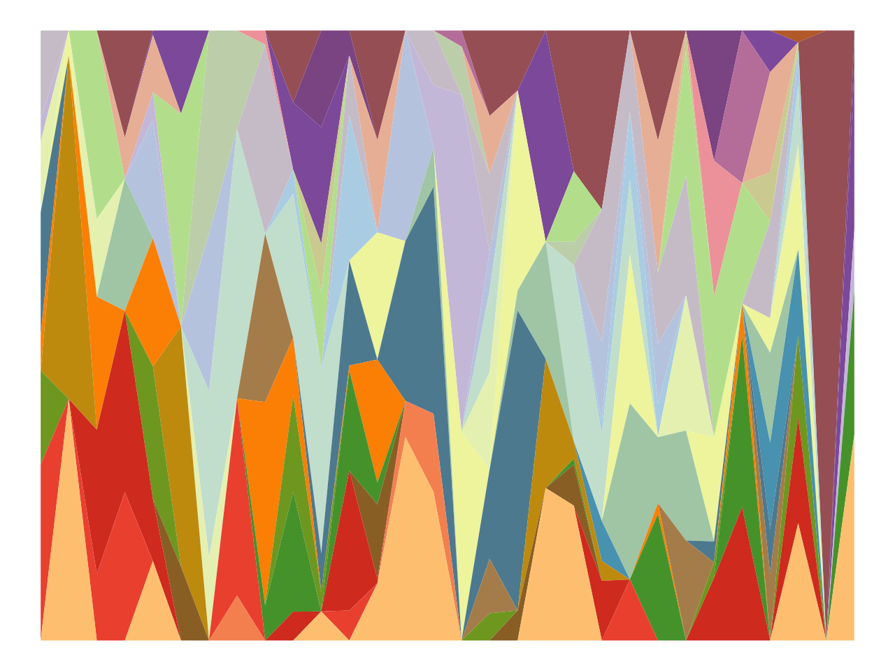
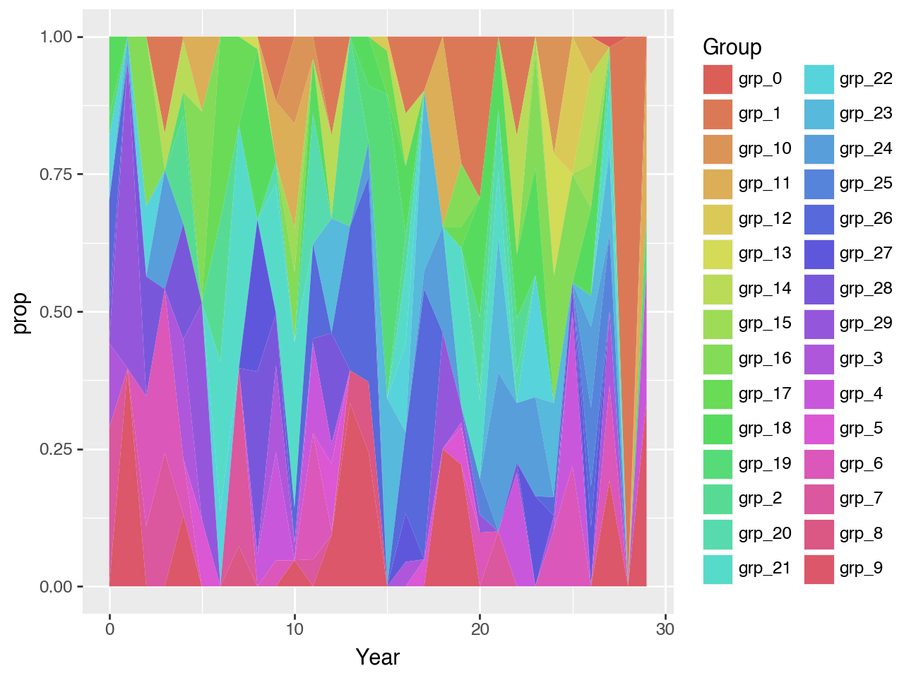
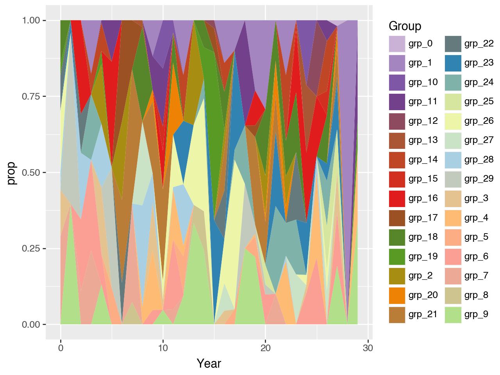
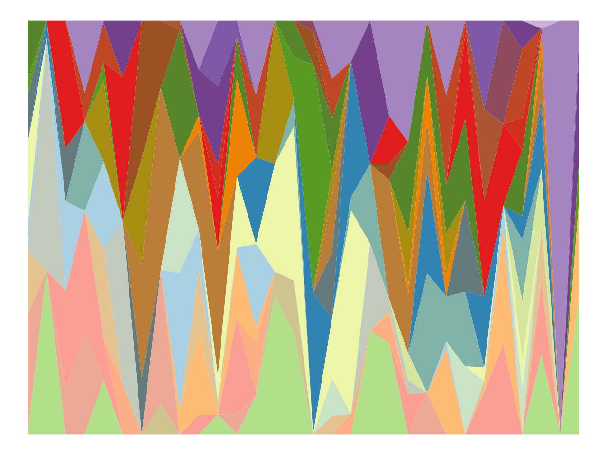

Recently, I've been helping the plotting library plotnine---a port of ggplot2 to Python.
plotnine normally is used to make plots for data analysis. But what if I told you there is another option: cobbling up generative art.

In this post I'll walk through the basics of using plotnine to create generative art. I'll look at three pieces:

-   plotting art data
-   removing unecessary `theme()` elements (like axis ticks)
-   examples of folks making generative art

If you're curious about plotnine and generative art, this is a great opportunity to submit something artsy to the [2024 Plotnine Contest](https://github.com/has2k1/plotnine/discussions/788) (deadline is 26 July 2024).

<details class="code-fold">
<summary>Show Code</summary>

``` python
import polars as pl
import numpy as np

from plotnine import *
from mizani.palettes import brewer_pal, gradient_n_pal

np.random.seed(345678)

# generate random areas for each group to fill per year ---------
# Note that in the data the x-axis is called Year, and the
# filled bands are called Group(s)

opts = [0] * 100 + list(range(1, 31))
values = []
for ii in range(30):
    values.extend(np.random.choice(opts, 30, replace=False))


# Put all the data together -------------------------------------
years = pl.DataFrame({"Year": list(range(30))})
groups = pl.DataFrame({"Group": [f"grp_{ii}" for ii in range(30)]})

df = (
    years.join(groups, how="cross")
    .with_columns(Values=pl.Series(values))
    .with_columns(prop=pl.col("Values") / pl.col("Values").sum().over("Year"))
)

df.write_csv("plot-data.csv")

# Generate color palette ----------------------------------------
# this uses 12 colors interpolated to all 30 Groups
pal = brewer_pal("qual", "Paired")

colors = pal(12)
np.random.shuffle(colors)

all_colors = gradient_n_pal(colors)(np.linspace(0, 1, 30))


# Plot ---------------------------------------------------------
(
    df
    >> ggplot(aes("Year", "prop", fill="Group"))
    + geom_area()
    + scale_fill_manual(values=all_colors)
    + theme(
        axis_text=element_blank(),
        line=element_blank(),
        title=element_blank(),
        legend_position="none",
        plot_margin=0,
        panel_border=element_blank(),
        panel_background=element_blank(),
    )
)
```

</details>



(Note that this plot is based on this [r-graph-gallery post](https://r-graph-gallery.com/137-spring-shapes-data-art.html))

## Fetching data

In order to focus on plotting, I'll use `polars` to import the data used to create the plot above.

``` python
import polars as pl

df = pl.read_csv("https://mchow.com/posts/plotnine-art/plot-data.csv")
```

The data is 30 Groups (filled bands) across 30 Years (x-axis), making 900 rows in total:

``` python
df.head()
```

    shape: (5, 4)
    ┌──────┬───────┬────────┬──────────┐
    │ Year ┆ Group ┆ Values ┆ prop     │
    │ ---  ┆ ---   ┆ ---    ┆ ---      │
    │ i64  ┆ str   ┆ i64    ┆ f64      │
    ╞══════╪═══════╪════════╪══════════╡
    │ 0    ┆ grp_0 ┆ 0      ┆ 0.0      │
    │ 0    ┆ grp_1 ┆ 0      ┆ 0.0      │
    │ 0    ┆ grp_2 ┆ 0      ┆ 0.0      │
    │ 0    ┆ grp_3 ┆ 16     ┆ 0.153846 │
    │ 0    ┆ grp_4 ┆ 0      ┆ 0.0      │
    └──────┴───────┴────────┴──────────┘

<br>

The height of the band is decided by the `prop` column, which is more likely than not to be 0. This makes the bands often cinch down to nothing and then expand again.

## Plotting art data

In order to plot the data, we'll import `plotnine`, and use the `geom_area()` function, with `Year` on the x-axis, and `prop` on the y-axis.

``` python
from plotnine import *

(df >> ggplot(aes("Year", "prop", fill="Group")) + geom_area())
```



Notice that this produced roughly the original art plot, but with two differences:

-   The color palette is still the default
-   There are extra elements, like a legend and axis text

In order to customize the fill colors, we can use some helper functions from the `mizani` library. `mizani` is used behind the scenes by `plotnine`. In the code below, we'll create a 12-color brewer palette, and then interpolate between those colors to be able to fill in all 30 groups.

``` python
import numpy as np
from mizani.palettes import brewer_pal, gradient_n_pal

pal = brewer_pal("qual", "Paired")

colors = pal(12)
np.random.shuffle(colors)

all_colors = gradient_n_pal(colors)(np.linspace(0, 1, 30))
```

Notice that there are two big steps for defining colors:

-   `pal = brewer_pal("qual", "Paired")` gets the full color brewer palette, and `pal(12)` gets 12 colors from that palette.
-   `gradient_n_pal()` takes those colors, and let's us interpolate between them.

With custom colors in hand, we can manually set the fill values in `plotnine`:

``` python
(
    df
    >> ggplot(aes("Year", "prop", fill="Group"))
    + geom_area()
    + scale_fill_manual(values=all_colors)
)
```



This is looking much closer, but still has extra plotting elements (like a legend). In the next section, we'll remove these to create a beautiful blank canvas.

## Removing unnecessary elements

In order to remove unecessary elements, we'll use the `theme()` function.
This function allows you to customize various elements (like increasing the size of x- or y-axis ticks). For our purposes, we'll use it to hide most elements.

``` python
(
    df
    >> ggplot(aes("Year", "prop", fill="Group"))
    + geom_area()
    + scale_fill_manual(values=all_colors)
    + theme(
        axis_text=element_blank(),
        line=element_blank(),
        title=element_blank(),
        legend_position="none",
        plot_margin=0,
        panel_border=element_blank(),
        panel_background=element_blank(),
    )
)
```



Notice everything outside the `geom_area()` fills is now hidden. We also set `plot_margin=0`, so that there wouldn't be an extra band around the plot.

## Putting it all together

Here's all the code in one place, so it's easier to copy and paste.

``` python
import polars as pl
import numpy as np

from mizani.palettes import brewer_pal, gradient_n_pal

df = pl.read_csv("https://mchow.com/posts/plotnine-art/plot-data.csv")

pal = brewer_pal("qual", "Paired")

colors = pal(12)
np.random.shuffle(colors)

all_colors = gradient_n_pal(colors)(np.linspace(0, 1, 30))

(
    df
    >> ggplot(aes("Year", "prop", fill="Group"))
    + geom_area()
    + scale_fill_manual(values=all_colors)
    + theme(
        axis_text=element_blank(),
        line=element_blank(),
        title=element_blank(),
        legend_position="none",
        plot_margin=0,
        panel_border=element_blank(),
        panel_background=element_blank(),
    )
)
```

## Learning more

-   [Making art in Python with plotnine by Nicole Rennie](https://nrennie.rbind.io/blog/making-art-python-plotnine/)
-   [plotnine.org docs](https://plotnine.org/)
-   [Getting started with generative art in R](https://towardsdatascience.com/getting-started-with-generative-art-in-r-3bc50067d34b)
-   [Generative work by Thomas Lin Pedersen, ggplot2 maintainer](https://thomaslinpedersen.art/work/)

## In conclusion

Generative art is a neat area, and we have just scratched the surface---by looking at how to represent data art using `plotnine`. If you want to try your hand at generating art in `plotnine`, please consider submitting to the [2024 Plotnine Contest](https://github.com/has2k1/plotnine/discussions/788) (deadline 26 July 2024)!
